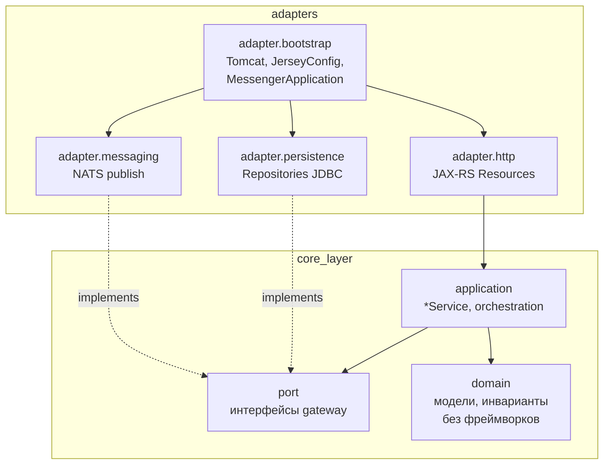

# Границы пакетов ядра (`core-api`)

Цель: постепенно отделить **домен и сценарии использования** от **HTTP (Jersey)**, **Tomcat**, **JDBC** и **NATS**, не ломая один модуль Gradle. Полный вынос в отдельный артефакт `core-domain.jar` — опциональный этап после стабилизации пакетов.

## Целевая схема (ports & adapters)

### Правила зависимостей

| Пакет | Может зависеть от | Не должен зависеть от |
|--------|-------------------|------------------------|
| `core.domain` | только стандартная библиотека / `java.time` / value types | JDBC, Jersey, NATS, MinIO, Servlet |
| `core.application` | `core.domain`, `core.port` | JAX-RS, `javax.sql`, конкретные клиенты |
| `core.port` | `core.domain` (типы в сигнатурах) | реализаций адаптеров |
| `core.adapter.*` | всё выше + инфраструктура | — |
| Текущий `api.*` (переходный) | смешанный слой до миграции | новый код по возможности класть сразу в `core.*` |

## Соответствие текущему коду (`com.avandocmsg.messenger.api`)

| Сейчас | Целевой пакет (после миграции) |
|--------|--------------------------------|
| `*Resource.java` | `core.adapter.http` (или подпакеты `http.chats`, `http.messages`) |
| `*Repository.java` | `core.adapter.persistence` |
| `*Service.java` (оркестрация) | `core.application` |
| DTO для JSON API | остаются рядом с HTTP или `core.adapter.http.dto`; общие контракты с клиентом — не путать с доменными сущностями |
| `MessengerApplication`, `JerseyConfig`, `*Config`, фильтры | `core.adapter.bootstrap` |
| Публикация в NATS из сервисов | **`NatsOutboundPort`** + **`NatsConnectionOutbound`** (см. фаза 1); прочие NATS-вызовы при появлении — по тому же принципу |
| `UuidParams`, exception mapper’ы | `adapter.http` или `adapter.bootstrap` (общие для ресурсов) |

**`modules/common`** остаётся транспортным контрактом (NATS DTO). Ядро не обязано зависеть от него в `domain`; зависимость допустима в `adapter.messaging` и в точках сериализации.

## Фазы миграции (рекомендуемый порядок)

1. **Фаза 0 (сделано):** якорные пакеты `com.avandocmsg.messenger.core.*` с `package-info.java` и этот документ — без переноса классов.
2. **Фаза 1 (расширено):** **`NatsOutboundPort`** + **`NatsConnectionOutbound`** + **`NatsConnectionStatus`**; **`Clock`** и **`UuidGenerator`** из **`MessengerApplication`** → HK2, **`TokenValidator`**, **`AuthService`**, сервисы (**`ChatService`**, **`MessageService`**, **`ExportResource`**, **`FileService`**, **`FileResource`**) и репозитории (**`ChatRepository`**, **`MessageRepository`**, **`OrganizationRepository`**, **`FilePublicLinkRepository`**, **`ChatBanRepository`**, **`KeyPackageRepository`**, **`SessionRepository`**, **`ConferenceRepository`**) вместо разрозненных **`Instant.now()` / `UUID.randomUUID()`** там, где это влияет на доменные ответы и id.
3. **Фаза 2 (Phase 2a Chat — done):** `Chat`, `ChatId`, `ChatRepositoryPort`, `JdbcChatRepositoryAdapter`, `ChatApplicationService`, `CoreModule`; `ChatResource.getById` ACL via port. Phases 2b+ — Message, User, File aggregates.
4. **Фаза 3 (опционально):** Gradle-подпроект `core-domain` / `core-application` с зависимостью `core-api` только на адаптеры — если понадобится переиспользование домена в воркерах без Jersey.

## Что не трогать в первую очередь

- **`MessengerApplication`**: остаётся composition root до появления отдельного модуля `bootstrap`.
- **Flyway / миграции**: остаются в `core-api` ресурсах рядом с runtime.
- **OpenAPI / Swagger-аннотации**: логично держать на классах ресурсов в `adapter.http`.

## Контрольный вопрос перед переносом класса

«Этот класс можно скомпилировать и протестировать без Tomcat и без in-memory HTTP?» Если да — кандидат в `domain` или `application` + `port`. Если нет — адаптер.
