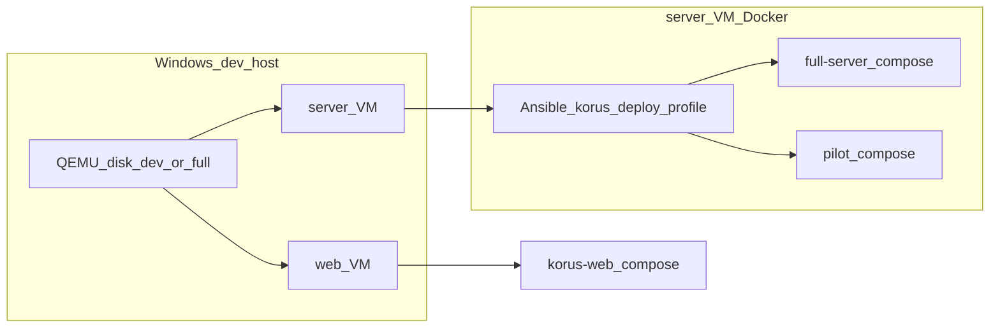

# Профили стендов и развёртывания

**Назначение:** единый справочник для разработчиков и агентов — чем отличаются **QEMU dev/full**, **deploy-профили** (pilot/standard), **compose-стеки** (full-server, pilot, dev-min) и **режимы Keycloak**.

Связанные документы: [`deploy/qemu/README.md`](../deploy/qemu/README.md), [`deploy/qemu/RESOURCES.md`](../deploy/qemu/RESOURCES.md), [`docs/PRODUCT_PRESENTATION.md`](PRODUCT_PRESENTATION.md) §10–12, [`docs/plans/2026-06-15-infra-optimization-design.md`](plans/2026-06-15-infra-optimization-design.md).

---

## 1. Три независимые оси (не путать)

В репозитории три понятия **ортогональны** — их смешивание — частая причина путаницы.

| Ось | Что задаёт | Примеры значений | Вопрос, на который отвечает |
|-----|------------|------------------|----------------------------|
| **A. QEMU disk profile** | Какие qcow2 и workflow на Windows | `dev`, `full` | *Как я разрабатываю на QEMU?* |
| **B. Deploy profile (Ansible)** | Какой server compose поднять в guest | `standard`, `pilot`, `enterprise` | *Какой Docker-стек на server VM?* |
| **C. Product tier (ТЗ)** | Целевой масштаб и sizing в проде | Pilot, Standard, Enterprise | *На сколько пользователей и RAM в production?* |



**Web-слой** (ось A) почти не зависит от pilot: и dev, и full QEMU используют `korus-web` + опциональный hotswap overlay.

---

## 2. Ось A — QEMU disk profile (Windows)

Профиль дисков: `deploy/qemu/run/stack-profile.txt` → `dev` или `full`. Одновременно активен **только один** (общие порты `18080` / `19088`).

| Профиль | Диски | Назначение | Типичная команда |
|---------|-------|------------|------------------|
| **dev** | `server-dev.qcow2`, `web-dev.qcow2` | Ежедневная разработка: warm boot, sync-ui, hotswap | `qemu-dev-mode.ps1 -Mode warm` |
| **full** | `server-full.qcow2`, `web-full.qcow2` | Acceptance, outer Playwright gate, полный стек «из коробки» | `qemu-full-stack-up.ps1` |

### Что одинаково в dev и full

- Две VM (`korus-server`, `korus-web`), порты на хосте `18080` (API), `19088` (UI).
- Web: `korus-web/docker-compose.yml` + при hotswap — `docker-compose.qemu-hotswap-overlay.yml`.
- Скрипты `sync-api`, `sync-api-core`, `sync-workers`, `sync-web`, `sync-ui`, `playwright-dev-loop.ps1`.

### Чем dev отличается от full

| | **QEMU dev** | **QEMU full** |
|---|--------------|---------------|
| **Смысл** | Быстрый цикл: поднять то, что уже на диске | Явно развернуть полный стек + hotswap для gate |
| **Server compose** | То, что задеплоено Ansible **последним** (см. ось B) | Всегда `full-stack-up.sh` → `docker-compose.full-server.yml` |
| **Cold wipe** | `qemu-up` без `-KeepDisks` (только dev qcow2) | `qemu-full-stack-up.ps1 -FreshDisks` |
| **Outer gate** | Не обязателен | `qemu-plan-orchestrator.ps1 -SkipVmUp` на full-дисках |

> **Важно:** QEMU **dev** — это не «облегчённый стек», а **режим работы** (диски + DX). Состав контейнеров на server dev-диске определяется **deploy profile** (ось B), а не именем `dev`.

**Рекомендация для Windows:** ежедневно — **dev** диски; для sign-off — **full** диски с `qemu-full-stack-up.ps1`.

---

## 3. Ось B — Deploy profile (Ansible, server guest)

Переменная: `korus_deploy_profile` в Ansible (`deploy/ansible/group_vars/korus_server.yml`, override в `inventory/*/group_vars/`).

Роль `korus_server` выбирает скрипт:

| `korus_deploy_profile` | Скрипт | Compose |
|------------------------|--------|---------|
| **`standard`** (default) | `scripts/full-stack-up.sh` | `docker/docker-compose.full-server.yml` |
| **`pilot`** | `scripts/pilot-stack-up.sh` | `docker-compose.full-server.yml` + `pilot-overrides.yml` + `keycloak-prod.yml` |
| **`enterprise`** | `scripts/enterprise-stack-up.sh` | `docker-compose.full-server.yml` + `docker-compose.scale.yml` (+ optional `docker-compose.replica.yml`) |

Compose overlays Wave 2 (guest / CI lab):

| Overlay | Назначение |
|---------|------------|
| **`docker/docker-compose.scale.yml`** | 2× message-pipeline, 2× ws-gateway, `API_REPLICAS=2` |
| **`docker/docker-compose.replica.yml`** | lab read-replica URL (тот же `postgres-hot` для smoke routing) |

Sticky WS при 2× gateway: см. **`korus-web/README.md`** (`ip_hash` на `/ws`).

### QEMU inventory (Windows)

По умолчанию **не переопределяет** deploy profile → **`standard`** (full-server). Для пилота у заказчика явно задайте в `inventory/qemu/group_vars/all.yml`:

```yaml
korus_deploy_profile: pilot
```

### Pilot vs standard (full-server) — состав

| Компонент | **standard** (full-server) | **pilot** |
|-----------|---------------------------|-----------|
| Контейнеров (core) | **14** | **8** (+ optional profiles) |
| postgres-hot | ✓ | ✓ |
| postgres-archive | ✓ | profile `archive` |
| redis, nats, minio | ✓ | ✓ |
| zoo + solr | ✓ | — (поиск SQL) |
| keycloak | `start-dev` (~640 MB) | `start --optimized` (~335 MiB RSS) |
| core-api, ws-gateway, message-pipeline | ✓ | ✓ |
| push, retention | ✓ | profiles `push`, `retention` |
| archiver, deep-archiver, indexer, export-replay | ✓ | profile `compliance` |
| Env поиска | Solr | `SEARCH_MODE=sql` |

Подробный sizing: [`deploy/qemu/RESOURCES.md`](../deploy/qemu/RESOURCES.md).

---

## 4. Ось C — Product tier (ТЗ §10–12)

Продуктовые профили **не совпадают 1:1** с именами compose, но связаны с deploy profile.

| Product tier | RU (зарег.) | Пик онлайн | Пик msg/s | RAM prod (цель) | Deploy / compose |
|--------------|-------------|------------|-----------|-----------------|------------------|
| **Pilot** | до **10k** | ~750 | ~8–15 | **12–16 GB** | `pilot` compose |
| **Standard** | **10k–100k** | до ~4 800 @100k | ~57–120 | **120–160 GB** | `standard` + scale (Wave 2+) |
| **Enterprise** | 100k–1M | до 20k+ | до ~4000 (ТЗ-max) | **0,9–1,2 TB** | full stack + sharding |

### full-server в репозитории vs prod sizing

| Контекст | Масштаб | RAM |
|----------|---------|-----|
| **Compose `full-server.yml`** (функции) | Полный набор сервисов для **10k tier** (все воркеры, Solr, compliance) | — |
| **QEMU guest** (лаборатория) | Dev / smoke, не load test | **~6,4–10 GB** server VM |
| **ТЗ §10.2 строка 10k** (production baseline) | 10k RU, полный функционал | **~64 GB** суммарно |

**Pilot** и **full-server** на **одинаковый номинал ~10k RU**, но pilot **убирает** Solr и cold-path воркеры ради **12–16 GB** prod; full-server **сохраняет все фичи** и в проде требует **~64 GB** (baseline ТЗ).

---

## 5. Docker compose вне QEMU (Linux / CI)

На **Windows host** эти стеки **запрещены** (см. [`.cursor/rules/qemu-host-isolation.mdc`](../.cursor/rules/qemu-host-isolation.mdc)).

| Стенд | Файл / скрипт | Назначение | Отличие от full-server |
|-------|---------------|------------|------------------------|
| **Full server** | `docker-compose.full-server.yml`, `full-stack-up.sh` | CI, Linux all-in-one, two-host server | Baseline «всё включено» |
| **Pilot** | `full-server.yml` + `pilot-overrides.yml`, `pilot-stack-up.sh` | Пилот / филиал, guest smokes | Без Solr; Keycloak prod; без `--profile full` |
| **Dev-min infra** | `docker-compose.dev-min.yml`, `dev-infra-up` | Только инфра | Без Java-сервисов |
| **Dev-min + web** | profile `web` в dev-min | Локальный `:run` core-api на хосте | Без archiver, indexer, export, deep-archiver |
| **Korus-web** | `korus-web/docker-compose.yml` | UI отдельно | API через attach или `host.docker.internal` |

### Dev-min vs pilot vs full-server

| | **dev-min** | **pilot** | **full-server** |
|---|-------------|-----------|-------------------|
| Платформа | Linux / CI (не Windows host) | Guest / Linux deploy | Guest / CI / prod-like |
| Java в Docker | опционально (profile `web`) | core path всегда | все воркеры |
| Solr | есть в dev-min infra | нет | есть |
| Archive / compliance | нет (в базовом dev-min) | profiles | всегда |
| Цель | Gradle `:run`, быстрый локальный цикл | Экономный пилот ≤10k | Полный parity + smokes |

---

## 6. Keycloak: dev vs prod mode

| Режим | Command | RAM (ориентир) | Где |
|-------|---------|----------------|-----|
| **Dev** | `start-dev --import-realm` | ~640 MB | `full-server`, QEMU standard, CI |
| **Pilot prod** | `start --optimized` | ~256–512 MB heap, RSS ~335 MiB | `docker-compose.keycloak-prod.yml`, pilot |
| **Standard HA** | 2× `start` + external DB | 2×512 MB+ | ≥50k RU (вне Wave 1) |

Строка ТЗ «Keycloak 8 GB» — **production HA**, не dev/pilot.

---

## 7. Матрица «что выбрать»

| Задача | QEMU disk | Deploy profile | Compose |
|--------|-----------|----------------|---------|
| Ежедневная разработка UI/backend на Windows | **dev** | **standard** | full-server на server (по умолчанию) |
| Playwright outer gate / Solr / compliance smokes | **full** | **standard** | full-server |
| Пилот у заказчика ≤10k, минимум RAM | guest / Linux | **pilot** | pilot + keycloak-prod |
| Gradle `:run` на Linux без полного стека | — | — | dev-min (+ profile `web`) |
| CI `buildIntegrity` + unit | host | — | без live stack |
| Stage/prod two-host | — | **standard** → Enterprise | Ansible `site.yml` |

---

## 8. Частые ошибки

| Ошибка | Правильно |
|--------|-----------|
| «QEMU dev = pilot» | dev — **диск/workflow**; pilot — **deploy profile** |
| «full-server = 100k пользователей» | full-server compose = **все фичи**; 100k — **Standard tier** с другим железом |
| `full-stack-up.ps1` на Windows host | Только в **QEMU guest** или Linux; на Windows — `qemu-full-stack-up.ps1` |
| Pilot без Solr = «сломан поиск» | Ожидаемо: **SQL fallback**; полнотекст — Standard + Solr |
| Переключить dev ↔ full без `qemu-down` | Нельзя — конфликт портов; сначала `qemu-down` |

---

## 9. Переключение deploy profile на существующем QEMU dev-диске

1. Задать `korus_deploy_profile` в inventory или `group_vars`.
2. `qemu-dev-mode.ps1 -Mode sync-api` / `sync-api-core` (только core-api) / `sync-workers` (pipeline, indexer, deep-archiver) или `qemu-redeploy.ps1 -ServerOnly` (при смене pilot ↔ standard может понадобиться `-Rebuild`).
3. Для pilot вручную на guest: `scripts/pilot-stack-up.sh --down-full-first`.
4. Smoke: `scripts/smoke-pilot-stack.sh` (pilot) или smokes из [`scripts/SMOKE_INDEX.md`](../scripts/SMOKE_INDEX.md) (full).

---

*Последнее обновление: 2026-06-15 — spec 006 complete (T311), sync-workers, enterprise profile.*
