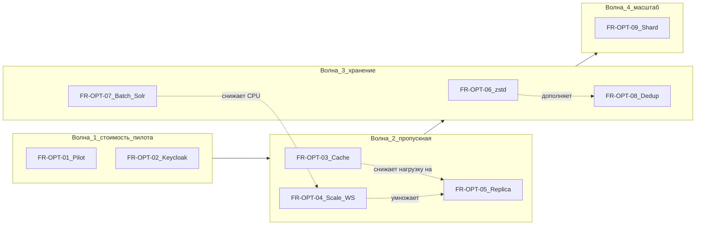

# Продуктовая презентация: Korus Messenger (AvandocMsg)

**Версия документа:** 1.5 (исходник для сборки HTML)  
**Публикация для заказчика:** [`product_presentation.html`](../product_presentation.html) **v2.2** — презентация продукта (не техническое ТЗ).  
**Дата:** 2026-06-15  

---

## Легенда статусов

| Статус | Значение |
|--------|----------|
| **Реализовано** | Доступно пользователям или администраторам в текущей версии продукта |
| **Частично** | Функция есть, но с ограничениями или ожидает ops/product sign-off |
| **Запланировано** | Зафиксировано в дорожной карте или исходном ТЗ, разработка не завершена |
| **Вне репозитория** | Планируется как отдельный продукт (мобильные клиенты и т.п.) |

**Содержание:** [1](#1-резюме-для-руководства) · [2](#2-для-кого-этот-продукт) · [3](#3-словарь-простыми-словами) · [4](#4-возможности-системы) · [5](#5-кейсы-использования) · [6](#6-роли-и-права-упрощённая-матрица) · [7](#7-надёжность-безопасность-и-соответствие) · [8](#8-сравнение-с-исходным-тз-traceability) · [9](#9-возможности-развития) · [10](#10-ресурсы-серверов-и-пропускная-способность) · [11](#11-критерии-приёмки-продукта-бизнес-язык) · [12](#12-требования-к-оптимизации-инфраструктуры) · [13](#13-интеграции-и-экосистема) · [14](#14-комплаенс-персональные-данные-и-юридические-требования) · [15](#15-доступность-sla-и-непрерывность-работы) · [16](#16-профили-развёртывания-и-ограничения-для-пользователя) · [17](#17-приложения)

---

## 1. Резюме для руководства

**Korus Messenger (AvandocMsg)** — корпоративный мессенджер для организаций, которым нужны переписка, обмен файлами, видеозвонки, управление сроками хранения данных и инструменты для комплаенса. Продукт рассчитан на работу в изолированных контурах (госструктуры, крупные компании, проектные команды).

### Что уже работает

- Вход и регистрация пользователей, безопасный выход и продление сессии.
- Личные и групповые чаты: отправка, редактирование, удаление, пересылка, реакции, закрепление, ответы, сообщения с автоудалением.
- Мгновенная доставка сообщений в браузере без обновления страницы; восстановление после обрыва связи.
- Контакты, поиск коллег и поиск по тексту переписки.
- Файлы и вложения: загрузка, просмотр, скачивание, публичные ссылки с отзывом.
- Личное «Хранилище» для сохранённых сообщений.
- Экспорт переписки чата в архив (JSON/ZIP) для пользователя и администратора.
- Видеозвонки и конференции из чата или по ссылке; демонстрация экрана.
- Админ-консоль: организации, политики хранения, legal hold, журнал аудита, статус фоновой очистки.
- Интерфейс на русском и ещё пяти языках (en, be, kk, zh, ko).
- Сквозное шифрование (E2EE) — инженерно реализовано; включение в production требует formal sign-off.

### Что требует доработки перед промышленным запуском

- Защищённое соединение (HTTPS/WSS) на stage/prod и хранение секретов в vault.
- Формальное одобрение E2EE (Product/Security/Ops) перед массовым включением MLS.
- Production-инфраструктура Web Push (уведомления в браузере).
- Сервер TURN для стабильных звонков за сложным NAT/firewall.
- Полная политика полноты export-пакета под GDPR и региональные требования.

---

## 2. Для кого этот продукт

### Целевые организации

- Корпорации и холдинги с требованиями к хранению переписки.
- Государственные и окологосударственные структуры.
- Проектные и распределённые команды (удалённая работа, видеосвязь).
- Организации, которым нужен контроль над данными на своих серверах (on-premise / частное облако).

### Роли пользователей

| Роль | Задачи |
|------|--------|
| **Сотрудник** | Переписка, файлы, звонки, настройки приватности |
| **Руководитель команды** | Группы, модерация, закрепления, встречи |
| **IT-администратор** | Организации, политики хранения, пользователи, мониторинг |
| **Служба безопасности / комплаенс** | Аудит, экспорт, legal hold, проверка удаления |
| **Оператор инфраструктуры** | Развёртывание, резервное копирование, масштабирование |

### Границы текущей поставки

| Компонент | Статус |
|-----------|--------|
| Веб-клиент (браузер, PWA) | **Реализовано** |
| Сервер и фоновые службы | **Реализовано** |
| Мобильные приложения (iOS/Android) | **Запланировано** / вне текущего репозитория |
| Desktop-клиент | **Запланировано** |
| Bot API (интеграции, боты) | **Запланировано** |
| Прямые эфиры (Live-streaming, RTMP/HLS) | **Запланировано** (исходное ТЗ §28) |

---

## 3. Словарь простыми словами

| Термин | Объяснение |
|--------|------------|
| **Чат** | Переписка между двумя людьми или в группе |
| **Группа** | Чат с несколькими участниками, ролями и модерацией |
| **«Хранилище»** | Личный чат-склад: сюда можно сохранять важные сообщения и файлы |
| **Read receipt** | Отметка «кто прочитал» конкретное сообщение (с учётом настроек приватности) |
| **Ретенция** | Правила, как долго хранить переписку и когда её архивировать или удалять |
| **Legal hold** | Заморозка удаления данных по юридическому требованию |
| **Экспорт** | Выгрузка переписки в файл для расследования или архива |
| **E2EE (сквозное шифрование)** | Сообщения шифруются на устройстве отправителя; сервер не видит текст |
| **Организация (tenant)** | Логическое подразделение пользователей одной компании/ведомства |
| **Админ-консоль** | Веб-панель для администраторов: org, политики, аудит |
| **TTL сообщения** | Автоудаление или скрытие сообщения через заданное время |
| **Публичная ссылка на файл** | Ссылка для скачивания без входа в систему (с возможностью отзыва) |

---

## 4. Возможности системы

| Домен | Примеры возможностей | Статус |
|-------|---------------------|--------|
| Вход и сессия | Регистрация, вход, выход, автопродление сессии | Реализовано |
| Чаты и сообщения | 1:1, группы, edit/delete/forward/pin/reactions/TTL, история правок | Реализовано |
| Realtime | Мгновенная доставка, «печатает…», переподключение | Реализовано |
| Контакты и поиск | Список контактов, импорт, поиск людей и сообщений | Реализовано |
| Профиль и настройки | Имя, статус, приватность, язык, устройства | Реализовано |
| Файлы | Загрузка, превью, скачивание, публичные ссылки | Реализовано |
| Экспорт чата | Заказ архива, статус, отмена, скачивание JSON/ZIP | Реализовано |
| Звонки | Видео из чата, комната по ссылке, screen share | Частично (TURN за NAT) |
| E2EE | Legacy + MLS в браузере | Частично (prod gate) |
| Push / PWA | Web push, установка как приложение | Частично |
| Админка | Org, ретенция, legal hold, аудит, E2EE dashboard | Реализовано |
| Ретенция и архив | Dual-TTL, deep-archive, purge | Реализовано (backend) |
| Локализация | ru, en, be, kk, zh, ko | Реализовано |
| Read receipts | По сообщению, с privacy | Реализовано |
| Bot API | Webhook/long-poll боты | Запланировано |
| Live-streaming | RTMP/SRT, HLS, до 10k зрителей | Запланировано |
| Мобильные клиенты | iOS/Android | Запланировано / вне репо |
| Prod HTTPS + vault | Защищённый доступ, секреты не в git | Частично (scaffold готов) |

---

## 5. Кейсы использования

Формат: **Роль → Ситуация → Действия → Результат**

### 5.1 Сотрудник

#### КУ-01: Начать переписку с коллегой

- **Ситуация:** Нужно обсудить задачу с коллегой из другого отдела.
- **Действия:** Найти коллегу через поиск → открыть личный чат → написать сообщение.
- **Результат:** Сообщение доставлено мгновенно; коллега видит его без обновления страницы.
- **Статус:** Реализовано

#### КУ-02: Создать проектную группу

- **Ситуация:** Запуск проекта на 8 человек.
- **Действия:** Создать групповой чат → пригласить участников → задать название.
- **Результат:** Все участники видят общую ленту и могут обмениваться сообщениями и файлами.
- **Статус:** Реализовано

#### КУ-03: Отправить файл внешнему партнёру

- **Ситуация:** Нужно передать PDF контрагенту без аккаунта в системе.
- **Действия:** Прикрепить файл в чат → создать публичную ссылку → отправить ссылку партнёру.
- **Результат:** Партнёр скачивает файл по ссылке; при необходимости ссылку можно отозвать.
- **Статус:** Реализовано

#### КУ-04: Сохранить важное сообщение в «Хранилище»

- **Ситуация:** В групповом чате появился регламент, который нужно сохранить лично.
- **Действия:** Переслать сообщение в «Хранилище» (личный чат-склад).
- **Результат:** Копия сохранена; даже если оригинал удалят в группе, копия остаётся.
- **Статус:** Реализовано

#### КУ-05: Сообщение с автоудалением

- **Ситуация:** Передача одноразового кода или временной информации.
- **Действия:** Отправить сообщение с таймером (TTL).
- **Результат:** После истечения времени сообщение исчезает из ленты у участников.
- **Статус:** Реализовано

#### КУ-06: Узнать, кто прочитал объявление

- **Ситуация:** Руководитель отправил важное объявление в группу.
- **Действия:** Открыть сообщение → посмотреть список прочитавших (если приватность позволяет).
- **Результат:** Видно, кто ознакомился с текстом.
- **Статус:** Реализовано

#### КУ-07: Работа после обрыва Wi‑Fi

- **Ситуация:** Сотрудник ехал в метро, связь пропала и восстановилась.
- **Действия:** Открыть мессенджер после восстановления сети.
- **Результат:** Сессия восстанавливается автоматически; новые сообщения подгружаются.
- **Статус:** Реализовано

#### КУ-08: Видеозвонок из группового чата

- **Ситуация:** Нужно быстро обсудить вопрос голосом и показать экран.
- **Действия:** Нажать «Звонок» в группе → включить камеру/микрофон → при необходимости — демонстрацию экрана.
- **Результат:** Участники подключаются к конференции; за сложным NAT может потребоваться TURN-сервер.
- **Статус:** Частично

#### КУ-09: Сменить язык интерфейса

- **Ситуация:** Сотрудник предпочитает казахский или китайский интерфейс.
- **Действия:** Настройки → язык → выбрать нужный.
- **Результат:** Интерфейс и сообщения об ошибках переключаются; выбор синхронизируется с сервером.
- **Статус:** Реализовано

#### КУ-10: Заблокировать назойливого пользователя

- **Ситуация:** Нежелательные сообщения от стороннего контакта.
- **Действия:** Настройки → заблокированные → добавить пользователя.
- **Результат:** Заблокированный не может писать; учитывается при поиске и чатах.
- **Статус:** Реализовано

### 5.2 Руководитель команды

#### КУ-11: Закрепить регламент в группе

- **Ситуация:** В группе нужно, чтобы все видели правила проекта.
- **Действия:** Закрепить сообщение с регламентом.
- **Результат:** Закреплённое сообщение отображается в шапке чата.
- **Статус:** Реализовано

#### КУ-12: Исключить нарушителя из группы

- **Ситуация:** Участник нарушает правила группы.
- **Действия:** Назначить модератора (при необходимости) → исключить (ban) с указанием причины.
- **Результат:** Исключённый не может писать и читать группу.
- **Статус:** Реализовано

#### КУ-13: Встреча по ссылке для внешних

- **Ситуация:** Совещание с подрядчиками без аккаунтов в системе.
- **Действия:** Создать конференцию → скопировать ссылку на комнату → разослать.
- **Результат:** Внешние участники входят по ссылке (гостевой режим).
- **Статус:** Реализовано

#### КУ-14: «Не беспокоить» для рабочего чата

- **Ситуация:** Группа активна, но руководителю не нужны уведомления ночью.
- **Действия:** Отключить уведомления (mute) для конкретного чата.
- **Результат:** Сообщения приходят, push/звук не беспокоят.
- **Статус:** Реализовано

### 5.3 IT-администратор

#### КУ-15: Создать организацию и назначить пользователей

- **Ситуация:** Подключено новое подразделение.
- **Действия:** Админ-консоль → организации → создать → назначить пользователей.
- **Результат:** Пользователи привязаны к org; политики org применяются к их данным.
- **Статус:** Реализовано

#### КУ-16: Настроить срок хранения переписки

- **Ситуация:** Регламент: переписка подразделения хранится 3 года.
- **Действия:** Админ-консоль → ретенция → задать политику для org или чата.
- **Результат:** Фоновые службы архивируют и очищают данные по правилам.
- **Статус:** Реализовано

#### КУ-17: Legal hold по запросу юристов

- **Ситуация:** Расследование — нельзя удалять переписку конкретного чата.
- **Действия:** Включить legal hold на org или chat.
- **Результат:** Автоматическое удаление заморожено до снятия hold.
- **Статус:** Реализовано

#### КУ-18: Журнал аудита

- **Ситуация:** Нужно узнать, кто менял политики или запускал экспорт.
- **Действия:** Админ-консоль → аудит → фильтры по действию/ресурсу.
- **Результат:** Хронология действий администраторов и системы.
- **Статус:** Реализовано

#### КУ-19: Мониторинг фоновой очистки

- **Ситуация:** Проверка, что purge выполняется штатно.
- **Действия:** Панель ретенции → статус purge / hot-row cleanup.
- **Результат:** Видны этапы и ошибки фоновой обработки.
- **Статус:** Реализовано

#### КУ-20: Миграция чатов на усиленное шифрование

- **Ситуация:** Организация переходит на MLS-шифрование.
- **Действия:** E2EE dashboard → статус групп → batch migrate.
- **Результат:** Чаты постепенно переводятся на новую схему; prod — после sign-off.
- **Статус:** Частично

### 5.4 Служба безопасности / комплаенс

#### КУ-21: Выгрузка переписки для расследования

- **Ситуация:** Запрос на предоставление переписки по инциденту.
- **Действия:** Запрос export (пользователь или admin flow) → дождаться готовности → скачать ZIP/JSON.
- **Результат:** Архив с сообщениями и вложениями (состав — см. политику полноты).
- **Статус:** Реализовано (полнота GDPR — Частично)

#### КУ-22: Проверка удаления по политике

- **Ситуация:** Убедиться, что удалённые по TTL данные недоступны в UI.
- **Действия:** Проверить чат после истечения срока; сверить с audit/purge status.
- **Результат:** Сообщения не отображаются; метаданные могут оставаться в архиве по политике.
- **Статус:** Реализовано

#### КУ-23: Аудит действий администраторов

- **Ситуация:** Расследование несанкционированного доступа.
- **Действия:** Журнал аудита с фильтрами.
- **Результат:** Кто, когда, что изменил.
- **Статус:** Реализовано

#### КУ-24: Готовность prod TLS

- **Ситуация:** Перед выводом в интернет — проверка HTTPS.
- **Действия:** Ops checklist: DNS, vault, smoke TLS redirect.
- **Результат:** Пользователи подключаются по HTTPS/WSS.
- **Статус:** Частично (scaffold готов, real host pending)

### 5.5 Запланированные сценарии (из исходного ТЗ)

#### КУ-25: Бот Service Desk

- **Ситуация:** Сотрудник создаёт заявку через чат-бота.
- **Действия:** Написать боту → бот создаёт тикет во внешней системе.
- **Результат:** Интеграция без ручного копирования.
- **Статус:** Запланировано (Bot API, §17 tz_full)

#### КУ-26: All-hands на 500+ зрителей

- **Ситуация:** Гендиректор выступает перед всей компанией онлайн.
- **Действия:** Запустить live-стрим → зрители смотрят через HLS.
- **Результат:** Масштабируемая трансляция с задержкой 2–5 сек.
- **Статус:** Запланировано (§28 tz_full)

#### КУ-27: Вход через корпоративный Google/LDAP

- **Ситуация:** SSO без отдельного пароля в мессенджере.
- **Действия:** «Войти через Google» / корпоративный IdP.
- **Результат:** Единый вход через Keycloak federation.
- **Статус:** Запланировано ([`tz_revision_proposal.md`](../tz_revision_proposal.md))

---

## 6. Роли и права (упрощённая матрица)

| Действие | Пользователь | Модератор группы | Админ org | Системный админ |
|----------|:------------:|:----------------:|:---------:|:--------------:|
| Писать в чатах, где участник | ✓ | ✓ | ✓ | ✓ |
| Создавать группы | ✓ | ✓ | ✓ | ✓ |
| Закреплять сообщения | ✓ | ✓ | ✓ | ✓ |
| Назначать модераторов | — | — | ✓* | ✓ |
| Исключать (ban) из группы | — | ✓ | ✓ | ✓ |
| Mute / personal filter | ✓ | ✓ | ✓ | ✓ |
| Экспорт своего чата | ✓ | ✓ | ✓ | ✓ |
| Управлять org и политиками | — | — | — | ✓ |
| Legal hold, purge status | — | — | — | ✓ |
| Журнал аудита (полный) | — | — | — | ✓ |
| E2EE batch migrate | — | — | — | ✓ |

\* Зависит от роли owner/admin в группе.

---

## 7. Надёжность, безопасность и соответствие

### Разделение данных

Пользователи организованы по **организациям (tenant)**. Политики хранения и legal hold задаются на уровне org и при необходимости — отдельного чата.

### Журнал аудита

Все значимые административные действия (смена политик, экспорт, legal hold) фиксируются с указанием кто, когда и что сделал.

### Защита от злоупотреблений

- Ограничение частоты попыток входа (защита от перебора паролей).
- Доступ к чатам только участникам.
- Блокировки пользователей учитываются при поиске и доставке.

### Хранение данных (аналогия)

Представьте **картотеку** (оперативная база — последние сообщения, быстрый доступ), **архивное помещение** (полная история метаданных) и **склад** (сжатые архивы старых тел сообщений и файлов). Система автоматически переносит данные между «этажами» по правилам, которые задаёт администратор.

### Сквозное шифрование (E2EE)

- **Без E2EE:** сервер хранит текст сообщений (в зашифрованном виде на диске, но может прочитать при запросе).
- **С E2EE (MLS):** текст шифруется на устройстве пользователя до отправки; сервер видит только «конверт» (ciphertext).
- **Статус:** инженерно работает в dev/QEMU; **production enable** — после formal sign-off Product/Security/Ops.

### Что ещё pending перед prod

| Требование | Статус |
|------------|--------|
| HTTPS/WSS для всех пользователей | Частично |
| Секреты (пароли БД) не в git — Ansible Vault | Частично |
| Formal E2EE sign-off | Частично |
| Полная GDPR-политика состава export | Запланировано |

---

## 8. Сравнение с исходным ТЗ (traceability)

| Раздел tz_full | Тема | Статус | Комментарий |
|----------------|------|--------|-------------|
| §7 | Регистрация, auth, устройства | Реализовано | Keycloak + JWT; OTP из ТЗ — не primary |
| §8 | Приватность, online, hidden mode | Реализовано | Presence, privacy settings |
| §9 | Контакты, импорт, поиск | Реализовано | |
| §10 | Блокировки | Реализовано | Ban + personal filter/mute |
| §11 | Чаты, роли, инвайты | Реализовано | |
| §12 | Сообщения, TTL, версии | Реализовано | Dual-TTL, edit history |
| §13 | Hot/Archive/Deep tiers | Реализовано | Workers + admin API |
| §14 | Поиск Solr | Реализовано | Indexer worker |
| §15 | Файлы, MinIO, публичные ссылки | Реализовано | File proxy resize — planned |
| §16 | Превью ссылок | Частично | Preview worker не в prod compose |
| §17 | Bot API | Запланировано | NATS subject есть |
| §18 | Push mobile/web/desktop | Частично | Web push UI; mobile — planned |
| §19 | WebSocket, presence, typing | Реализовано | |
| §20 | NATS JetStream | Реализовано | |
| §21 | Аудит | Реализовано | |
| §22 | Prometheus, observability | Реализовано | Zabbix — не в scope |
| §23 | Админ, multi-tenant org | Реализовано | |
| §24 | Безопасность | Частично | Timing audit scaffold |
| §25 | Dev-стенды | Реализовано | Docker, Ansible, QEMU |
| §26 | Prod sizing 1M users | Модель §10 | Load test не проводился |
| §28 | Live-streaming | Запланировано | |
| §29 | Аудио/видео звонки | Частично | WebRTC mesh; SFU — planned |
| §30 | «Хранилище» | Реализовано | |
| §6.X | Core + Peripheral split | Частично | Hotplug ADR; prod sign-off pending |

---

## 9. Возможности развития

### Ближайший горизонт (3–6 месяцев)

| Направление | Бизнес-ценность | Зависимости |
|-------------|-----------------|-------------|
| Prod TLS + Ansible Vault | Безопасный доступ для всех пользователей | Real stage/prod host, DNS |
| Formal E2EE prod enable | Конфиденциальность переписки на уровне Signal/WhatsApp | Security review 8/8 |
| Web Push production | Уведомления без постоянно открытой вкладки | VAPID, push-worker |
| TURN для звонков | Стабильные звонки за NAT/firewall | coturn deploy |
| GDPR completeness export | Юридически полная выгрузка | Согласование с юристами |

### Средний горизонт (6–12 месяцев)

| Направление | Бизнес-ценность | Зависимости |
|-------------|-----------------|-------------|
| Bot API | Service Desk, опросы, автоматизация | Webhook infra |
| OpenMLS / external interop | Совместимость с другими MLS-клиентами | Library decision |
| Hotplug worker split | Независимое масштабирование поиска/ретенции | ADR sign-off |
| File Proxy (resize) | Быстрая отдача превью без нагрузки на API | Отдельный сервис |
| Auth Provider Layer (Google/LDAP/OIDC) | SSO для enterprise | Keycloak federation config |

### Долгий горизонт (12+ месяцев)

| Направление | Бизнес-ценность | Зависимости |
|-------------|-----------------|-------------|
| Live-streaming (RTMP/HLS) | All-hands, обучение, трансляции | Media stack, SFU/ingest |
| Нативные мобильные клиенты | Push, офлайн, привычный UX | Отдельные команды/репо |
| SFU для звонков >20 участников | Крупные совещания | Media server |
| Proxy/VPN/tunnel modes | Работа в закрытых сетях | Client + infra |

### Инфраструктура и стоимость владения (§12)

| Направление | Бизнес-ценность | Статус |
|-------------|-----------------|--------|
| Профили Pilot / Standard / Enterprise | Платить за нужный масштаб, не за «full stack» с первого дня | Запланировано (ТЗ §12) |
| Оптимизация RAM и пропускной способности | Больше пользователей на том же железе | Запланировано |
| Сжатие архива и dedup файлов | Длинная история без линейного роста дисков | Запланировано |

Детали: §12, приложение E, [`2026-06-15-infra-optimization-design.md`](plans/2026-06-15-infra-optimization-design.md).

---

## 10. Ресурсы серверов и пропускная способность

> **Важно:** все цифры ниже — **ориентиры для планирования**. Формальный load test (k6, Locust, JMeter) в репозитории **не проводился**. Перед prod sizing sign-off рекомендуется validation phase на целевом железе.

### 10.1 Методология расчёта

**Базовые формулы (профиль «корпоративный мессенджер»):**

```
DAU = RegisteredUsers × K_activity
PeakOnline = DAU × K_peak
MessagesPerDay = DAU × K_msg
AvgMsgRate = MessagesPerDay / 86400
PeakMsgRate ≈ AvgMsgRate × 3.5
DiskMessagesGB/year ≈ MessagesPerDay × 365 × 2 KB × retention_factor
DiskFilesGB/year ≈ RegisteredUsers × GB_per_user_per_year
```

**Коэффициенты:**

| Параметр | 10 000 | 100 000 | 500 000 | 1 000 000 |
|----------|--------|---------|---------|-----------|
| K_activity (доля DAU) | 50% | 40% | 30% | 25% |
| K_peak (пик онлайн / DAU) | 15% | 12% | 10% | 8% |
| K_msg (сообщений / DAU / день) | 40 | 35 | 30 | 25 |
| Средний размер сообщения | 2 KB | 2 KB | 2 KB | 2 KB |
| Файлы (GB / пользователь / год) | 0,5 | 0,4 | 0,3 | 0,25 |

**Расчётные нагрузки (корпоративный профиль):**

| Метрика | 10k | 100k | 500k | 1M |
|---------|-----|------|------|-----|
| DAU | 5 000 | 40 000 | 150 000 | 250 000 |
| Пик онлайн | 750 | 4 800 | 15 000 | 20 000 |
| Сообщений / день | 200 000 | 1 400 000 | 4 500 000 | 6 250 000 |
| Средний msg/s | ~2,3 | ~16 | ~52 | ~72 |
| Пик msg/s (×3,5) | ~8 | ~57 | ~182 | ~253 |

**Профиль исходного ТЗ для 1M пользователей:** 100 000 000 сообщений/день (~1 157 msg/s сред., ~4 000 msg/s пик) — верхняя граница проектирования для массового consumer-сценария.

**Лабораторный минимум (не prod):** один dev-стек ~6,4 ГБ RAM (server) + ~1,8 ГБ (web) — см. [`deploy/qemu/RESOURCES.md`](../deploy/qemu/RESOURCES.md).

### 10.1.1 Профили развёртывания (Pilot / Standard / Enterprise)

Оптимизация инфраструктуры описана в [`docs/plans/2026-06-15-infra-optimization-design.md`](plans/2026-06-15-infra-optimization-design.md).

| Профиль | Масштаб | RAM (цель) | Состав (упрощённо) |
|---------|---------|------------|-------------------|
| **Pilot** | до 10k RU | **12–16 GB** | hot DB, redis, nats, minio, keycloak (prod), core-api, ws, pipeline; **без Solr** (SQL search) |
| **Standard** | 10k–100k | **120–160 GB** | Pilot + Solr, retention, indexer, read replica, 2–3× scale hot path |
| **Enterprise** | 100k–1M | **900 GB–1,2 TB** | Full stack, sharded DB, SolrCloud, hot-plug workers, geo MinIO |

### 10.2 Сравнительная таблица конфигураций

| Параметр | 10 000 пользователей | 100 000 | 500 000 | 1 000 000 |
|----------|---------------------|---------|---------|-----------|
| **Архитектура** | 2 сервера (two-host) | Малый кластер | Средний кластер | Распределённый кластер |
| **Зарегистрировано** | 10k | 100k | 500k | 1M |
| **DAU (оценка)** | 5k | 40k | 150k | 250k |
| **Пик онлайн (одновременно)** | 750 | 4 800 | 15 000 | 20 000 |
| **Сообщений / день** | 200k | 1,4M | 4,5M | 6,25M / **100M (ТЗ-max)** |
| **Пик сообщений / сек** | ~8 | ~57 | ~182 | ~253 / **~4 000 (ТЗ-max)** |
| **Сервер приложений** | 1× 8 vCPU, 32 GB | 2–3× 16 vCPU, 64 GB | 4–6× 16 vCPU, 64 GB | 8–12× + балансировщик |
| **Web + балансировщик** | 1× 4 vCPU, 8 GB (2 реплики) | 2× 8 vCPU, 16 GB | 3–4× | 6–8× |
| **БД оперативная (hot)** | 1× 8 vCPU, 32 GB, 500 GB SSD | primary + replica | кластер 3 узла | sharded / multi-primary |
| **БД архивная** | совмещена или 16 GB | 32 GB отдельно | 64 GB кластер | 128 GB+ кластер |
| **Кэш сессий (Redis)** | 1× 4 GB | 16 GB или cluster 3 | cluster 3× 16 GB | cluster 6× 16 GB |
| **Очередь событий (NATS)** | 1× 8 GB | 3× 16 GB | 3× 32 GB | 5× 64 GB |
| **Файловое хранилище (MinIO)** | 1× 1 TB | 3× 5 TB | 6× 20 TB | 12× 50 TB+ |
| **Поиск (Solr + ZK)** | 1× 16 GB (lite опция) | 3× 32 GB | 5× 64 GB | 9+ узлов SolrCloud |
| **Аутентификация (Keycloak)** | 1× 8 GB | 2× 8 GB HA | 3× 16 GB | 3× 16 GB + replica DB |
| **Фоновые службы** | по 1 экз. | по 2 на hot path | 3–4 + queue groups | 5+ hot-plug split |
| **TURN (звонки)** | 1× 4 vCPU | 2× | 4× | 8× + geo |
| **SFU (>10 участников)** | — | опционально 1× | 2× | 4× (planned) |
| **Суммарно RAM** | **~64 GB** | **~256 GB** | **~768 GB** | **~1,5–2 TB** |
| **Суммарно vCPU** | **~32** | **~96** | **~256** | **~512+** |
| **Диск (1 год, с файлами)** | **~8 TB** | **~50 TB** | **~180 TB** | **~350 TB+** |
| **Сеть (пик)** | 200 Mbps | 1 Gbps | 5 Gbps | 10 Gbps+ |
| **RPO / RTO (ориентир)** | 24h / 4h | 8h / 2h | 1h / 30m | 15m / 15m |
| **Ограничения** | Single point of failure | Solr — узкое место | Нужен load test | Dedicated ops team |

### 10.2.1 Оптимизированные конфигурации (целевые, после roadmap)

См. design [`2026-06-15-infra-optimization-design.md`](plans/2026-06-15-infra-optimization-design.md). Цифры — **цели** после этапов 1–9 (load test обязателен).

| Параметр | 10k | 100k | 500k | 1M |
|----------|-----|------|------|-----|
| **Профиль** | Pilot | Standard | Standard+ | Enterprise |
| **RAM (цель)** | **~14 GB** | **~140 GB** | **~450 GB** | **~900 GB–1,2 TB** |
| **Пик msg/s (цель)** | **~15** | **~120** | **~400** | **~600** (corp) / path to **4000** (ТЗ-max) |
| **Диск 1 год (цель)** | **~5 TB** | **~30 TB** | **~110 TB** | **~200 TB** |
| **Ключевые меры** | lite compose, SQL search | Redis cache, 3× ws/pipeline, replica | batch Solr, zstd archive | sharding, async P2 |

> **Keycloak sizing:** QEMU/dev и `full-server` используют `start-dev` (~640 MB RSS). Pilot prod — `start --optimized` с heap ≤512 MB (`docker-compose.keycloak-prod.yml`). Строка §10.2 «8 GB» — production HA, не dev/pilot.

### 10.3 Примеры сценариев нагрузки

**Сценарий A — «Тихий офис» (10k пользователей)**  
Небольшая компания, 50% сотрудников активны ежедневно, без массовых рассылок файлов. Достаточно two-host: сервер приложений + веб. Резервное копирование раз в сутки.

**Сценарий B — «Распределённая компания» (100k пользователей)**  
Утренний пик: массовая рассылка в 50 групп одновременно (~57 msg/s пик). Требуется replica БД, 2–3 экземпляра API, отдельный Solr cluster. TURN для региональных офисов.

**Сценарий C — «Федеральный масштаб» (1M пользователей, профиль ТЗ-max)**  
100M сообщений/день, пик ~4000 msg/s. Распределённый кластер, sharded PostgreSQL, SolrCloud 9+ nodes, geo-реплика MinIO. Отдельная команда SRE 24/7. **Обязателен** load test перед sign-off.

### 10.4 Дисклеймер

- Цифры не подтверждены формальным нагрузочным тестированием.
- Активные видеозвонки и live-стримы могут **удвоить** сетевые и CPU требования.
- Рекомендация: validation phase (k6/Locust) на 10–20% целевой нагрузки перед prod.

---

## 11. Критерии приёмки продукта (бизнес-язык)

1. **Пользователь** выполняет все основные сценарии из раздела 5 через веб-браузер без обращения к CLI.
2. **Автоматические UI-сценарии:** 27+ тестов Playwright проходят на тестовом стенде (QEMU/full-server).
3. **Администратор** управляет организациями, политиками хранения и аудитом через веб-консоль.
4. **Production:** HTTPS/WSS, секреты не в git, formal security sign-off для E2EE перед массовым включением усиленного шифрования в prod.
5. **Экспорт и ретенция:** purge не выполняется без прохождения export gate (export_v1).
6. **Локализация:** интерфейс и ошибки API на языке пользователя (минимум ru + en).
7. **Инфраструктура (§12):** при внедрении оптимизаций — достижение целевых показателей §10.2.1 на соответствующем профиле после load test.
8. **Комплаенс (§14):** export с индикатором полноты; legal hold блокирует purge; audit admin-действий.
9. **SLA (§15):** профиль Pilot/Standard/Enterprise с согласованными RPO/RTO; hot path при деградации P1.
10. **Профиль (§16):** ограничения Pilot доведены до заказчика до запуска.
11. **Интеграции (§13):** SSO и Bot API — согласованы сценарии и границы ответственности; реализованные каналы (REST, WebSocket, export) документированы для IT заказчика.

---

## 12. Требования к оптимизации инфраструктуры

> **Статус раздела:** запланировано (зафиксировано в ТЗ; **реализация отложена**).  
> Техническая детализация — [`docs/plans/2026-06-15-infra-optimization-design.md`](plans/2026-06-15-infra-optimization-design.md) (приложение к ТЗ, не backlog на код).

### 12.1 Зачем это нужно (простым языком)

Организация должна иметь возможность:

1. **Запустить пилот** на modest hardware (десятки гигабайт RAM, а не сотни).
2. **Обслужить больше сотрудников** на том же сервере по мере роста.
3. **Хранить годами переписку и файлы**, не закупая диски пропорционально «сырому» объёму.

Три цели **не противоречат** друг другу, если разделить систему на «срочное» (сообщение должно дойти сразу) и «можно подождать» (поиск, архив, push).

### 12.2 Профили развёртывания (требование к продукту)

Система **должна поддерживать** три профиля без изменения пользовательских сценариев §5 (с оговорёнными ограничениями Pilot):

| Профиль | Кому | Что обязательно работает | Что может быть упрощено |
|---------|------|--------------------------|-------------------------|
| **Pilot** | до ~10k пользователей, пилот, филиал | Чаты, файлы, WS, админка, SQL-поиск | Полнотекст Solr; отложенный deep-archive |
| **Standard** | 10k–100k | + Solr, ретенция, export, масштабирование hot path | — |
| **Enterprise** | 100k–1M | + sharding, geo, полный compliance stack | — |

**Требование FR-OPT-001:** переключение Pilot → Standard **не ломает** данные и сессии пользователей (миграция конфигурации, не миграция UX).

### 12.3 Направления оптимизации (требования)

Каждое направление — **отдельное требование**; реализация может идти параллельно или объединяться (§12.4).

| ID | Требование (что должно быть достигнуто) | Зачем бизнесу | Профиль |
|----|----------------------------------------|---------------|---------|
| **FR-OPT-01** | Минимальный состав серверов для Pilot (без поискового кластера Solr) | −75% стоимость пилота | Pilot |
| **FR-OPT-02** | Аутентификация в production-режиме с предсказуемым потреблением RAM | Стабильный pilot без dev-overhead | Pilot+ |
| **FR-OPT-03** | Кэш частых чтений (список чатов, непрочитанные) | Больше пользователей без новых серверов | Standard |
| **FR-OPT-04** | Горизонтальное масштабирование доставки сообщений и WebSocket | Рост онлайна и msg/s | Standard+ |
| **FR-OPT-05** | Разделение чтения и записи БД (replica для ленты сообщений) | Снятие пика утренних рассылок | Standard+ |
| **FR-OPT-06** | Сжатие архивных данных (cold storage) | −60% диска на старых сообщениях | Standard+ |
| **FR-OPT-07** | Пакетная индексация для полнотекстового поиска | Меньше CPU при том же потоке сообщений | Standard+ |
| **FR-OPT-08** | Дедупликация одинаковых файлов | −35% диска на вложениях | Standard+ |
| **FR-OPT-09** | Разделение данных крупных организаций (sharding) | Путь к 1M пользователей | Enterprise |

**Требование FR-OPT-010:** доставка сообщения (P0) **не зависит** от готовности поиска, push и архива (P1/P2) — деградация graceful, без потери сообщений.

### 12.4 Пересечения этапов (что можно объединять при реализации)

Этапы из design-doc **пересекаются** — при разработке их следует группировать:



| Пересечение | Смысл | Риск если делать изолированно |
|-------------|-------|-------------------------------|
| FR-OPT-03 + FR-OPT-05 | Кэш и replica оба снимают read-load с primary БД | Дублирование логики invalidation |
| FR-OPT-04 + FR-OPT-05 | Scale API/WS умножает connection pool → нужна replica | Exhaust PostgreSQL connections |
| FR-OPT-06 + FR-OPT-08 | Сжатие архива и dedup файлов — общая политика хранения | Разные метрики «saved bytes» |
| FR-OPT-07 + FR-OPT-04 | Batch index снижает CPU → можно меньше indexer nodes | Premature scale без batch |
| Pilot (01+02) + Standard (03+) | Pilot **не требует** 03–09; Standard **наращивает** поверх | Big-bang deploy вместо tiered |

**Требование FR-OPT-011:** при реализации допускается **пересмотр порядка и объединение** волн при сохранении целевых метрик §10.2.1.

### 12.5 Целевые метрики (приёмка после реализации)

| Tier | RAM ≤ | Пик msg/s ≥ | Диск (1 год) ≤ | Условие проверки |
|------|-------|-------------|----------------|------------------|
| 10k | 16 GB | 15 | 6 TB | Load test 20% peak, 24h soak |
| 100k | 160 GB | 120 | 35 TB | idem |
| 500k | 500 GB | 400 | 120 TB | idem |
| 1M (corp) | 1,2 TB | 600 | 220 TB | idem + sharding plan |

Профиль **1M / 100M msg/day (ТЗ-max):** отдельный sign-off; FR-OPT-09 обязателен.

**Требование FR-OPT-012:** цифры §10.2 (baseline) остаются **верхней оценкой «без оптимизации»**; §10.2.1 — **целевые после FR-OPT**.

### 12.6 Ограничения и допущения

- Pilot: поиск по сообщениям в E2EE-чатах ограничен (нет plaintext на сервере).
- Оптимизации **не отменяют** legal hold, export gate и audit.
- Звонки и live (когда появятся) могут **увеличить** сеть/CPU сверх таблицы §10.
- Все метрики §12.5 — **до** formal load test; после теста обновляется только §10.2.1, не baseline.

### 12.7 Связь с дорожной картой §9

| §9 (продукт) | §12 (инфра) |
|--------------|-------------|
| Prod TLS | Независимо; параллельная волна ops |
| Hotplug workers | Поддерживает FR-OPT-04, FR-OPT-07 |
| Retention / deep-archive | Основа FR-OPT-06 |
| Bot API, Live | Увеличивают нагрузку; sizing пересмотр |

---

## 13. Интеграции и экосистема

> **Статус раздела:** частично (REST API, WebSocket, export, Keycloak — **реализовано**; SSO federation, Bot API — **запланировано**).  
> Связь: КУ-25, КУ-27 (§5); §9 roadmap; исходное ТЗ §17 (Bot API), [`tz_revision_proposal.md`](../tz_revision_proposal.md) (Auth Provider Layer).

### 13.1 Зачем нужен раздел

Организация-заказчик ожидает, что мессенджер **встраивается** в существующий IT-ландшафт: единый вход, боты для Service Desk, выгрузки в архивы, уведомления. Раздел фиксирует **продуктовые** требования к интеграциям — без детализации эндпоинтов (они в OpenAPI и `docs/NATS_SUBJECTS_INTEROP.md`).

### 13.2 Что уже доступно (без доработок продукта)

| Интеграция | Для кого | Что даёт | Статус |
|------------|----------|----------|--------|
| **REST API** | IT, скрипты, внутренние системы | CRUD чатов, сообщений, файлов, admin | Реализовано |
| **WebSocket (ws-gateway)** | Веб-клиент, будущие клиенты | Realtime доставка, typing, presence | Реализовано |
| **Keycloak (локальные пользователи)** | IT | Регистрация, JWT, роли admin | Реализовано |
| **Export / replay** | Compliance, архив | JSON/ZIP выгрузка; server-side replay stub | Реализовано |
| **Web Push (VAPID)** | Пользователи | Уведомления в браузере | Частично (prod gate) |
| **Prometheus metrics** | Ops / мониторинг | `/metrics`, health/ready | Реализовано |

**Требование FR-INT-01:** документация для IT заказчика **перечисляет** поддерживаемые каналы интеграции и их назначение (приложение C + OpenAPI).

### 13.3 Единый вход (SSO / корпоративный IdP)

| Сценарий | Ожидание пользователя | Техническая основа | Статус |
|----------|----------------------|-------------------|--------|
| Логин/пароль в мессенджере | Как сейчас | Keycloak realm local | Реализовано |
| «Войти через Google» | Без отдельного пароля | Keycloak OIDC broker | Запланировано |
| «Войти через корпоративный портал» | SAML/OIDC enterprise IdP | Keycloak federation | Запланировано |
| LDAP / Active Directory | Учётки из AD | Keycloak user federation | Запланировано |

**Требование FR-INT-02:** при включении SSO **локальный пароль может быть отключён** политикой org (настройка Keycloak, не отдельный модуль мессенджера).

**Требование FR-INT-03:** mapping ролей (admin org, user) из IdP **документируется** в runbook; продукт не создаёт «супер-админа» без явного назначения в Keycloak.

### 13.4 Bot API (внешние боты)

Продуктовая модель (из исходного ТЗ §17, упрощённо):

| Элемент | Описание для заказчика | Статус |
|---------|------------------------|--------|
| **Бот как участник чата** | @имя_бота в группе; ответы в переписке | Запланировано |
| **Права бота** | Только по @mention или чтение всех сообщений (решение модератора) | Запланировано |
| **Доставка событий** | Webhook или long-poll; повторы допустимы — бот дедуплицирует | Запланировано |
| **Методы бота** | Отправка/удаление сообщений, pin, ban/mute в группе | Запланировано |
| **Self-host бота** | Код бота **не** на сервере мессенджера | Запланировано |
| **Аудит** | Создание бота, webhook URL, export событий бота | Запланировано |

**Требование FR-INT-04:** Bot API **не блокирует** hot path чатов — сбой бота не мешает переписке людей.

**Требование FR-INT-05:** секреты webhook и токены ботов **не логируются** в plaintext.

**Требование FR-INT-06:** типовые сценарии (Service Desk, опрос, FAQ) описаны в **руководстве интегратора** после реализации API.

### 13.5 Интеграция с системами заказчика (паттерны)

| Паттерн | Пример | Как сегодня / план |
|---------|--------|-------------------|
| **Pull export** | SIEM забирает архив чата | Export JSON/ZIP + audit | Реализовано |
| **Push webhook (бот)** | Jira создаёт тикет из сообщения | Bot API webhook | Запланировано |
| **Batch replay** | Миграция из legacy IM | export-replay worker | Частично |
| **Directory sync** | HR → контакты | Импорт контактов CSV/API | Реализовано (импорт); AD sync — planned |
| **Email fallback** | Уведомление без push | Не в v1 web | Запланировано (§9) |

**Требование FR-INT-07:** для каждого внедрения **≥1 интеграционный сценарий** фиксируется в приложении к договору (источник, частота, ответственный, формат данных).

### 13.6 Ограничения и безопасность интеграций

| Риск | Мера |
|------|------|
| Утечка через webhook | HTTPS only; IP allowlist опционально |
| Перегрузка API | Rate limits на REST (ops); sizing §10 |
| Бот читает лишнее | MENTIONS_ONLY по умолчанию |
| SSO misconfiguration | Keycloak hardening checklist (ops) |

**Требование FR-INT-08:** интеграции с **ПДн** (export, боты с текстом сообщений) попадают под §14 — согласование с юристами до go-live.

### 13.7 Связь с профилями §16

| Возможность | Pilot | Standard | Enterprise |
|-------------|:-----:|:--------:|:----------:|
| REST + WS для custom apps | ✓ | ✓ | ✓ |
| SSO OIDC/SAML | опционально | ✓ | ✓ multi-IdP |
| Bot API | — | ✓ после release | ✓ + SLA webhook |
| Dedicated integration env | — | staging | staging + prod |

---

## 14. Комплаенс, персональные данные и юридические требования

> **Статус раздела:** частично реализовано (техника есть; **юридическое согласование политик** — на стороне заказчика).  
> Операторский справочник: [`docs/EXPORT_OPERATOR.md`](EXPORT_OPERATOR.md), [`docs/RETENTION_AND_DEEP_ARCHIVE.md`](RETENTION_AND_DEEP_ARCHIVE.md).

### 14.1 Область применения

Продукт обрабатывает персональные и служебные данные сотрудников организации-заказчика:

- учётные данные (логин, отображаемое имя, статус);
- содержимое переписки и метаданные (время, участники, read receipts);
- файлы и вложения;
- журнал административных действий (аудит).

**Заказчик** выступает **оператором персональных данных** в своём контуре развёртывания. Поставщик продукта предоставляет **технические средства** соблюдения политик, но не определяет сроки хранения без согласования с юристами заказчика.

### 14.2 Принципы (простым языком)

| Принцип | Что это значит для организации |
|---------|-------------------------------|
| **Прозрачность** | Администратор видит, кто менял политики и кто запускал export |
| **Минимизация** | Можно задать срок хранения и автоудаление (TTL, ретенция) |
| **Заморозка по закону** | Legal hold останавливает удаление до снятия hold |
| **Выгрузка по запросу** | Export чата в файл для расследования или ответа субъекту ПДн |
| **Разделение org** | Данные разных организаций логически изолированы (multi-tenant) |

### 14.3 Сроки хранения данных

Система поддерживает **многоуровневое хранение** (см. §3, glossary):

| Уровень | Простое описание | Кто настраивает |
|---------|------------------|-----------------|
| **Оперативный** | Последние сообщения — быстрый доступ в UI | Админ (политика org/чата) |
| **Архив метаданных** | История «когда кто писал», даже если тело перенесено | Админ + фоновые службы |
| **Глубокий архив** | Сжатые копии старых тел на диске/объектном хранилище | Админ (политика + FR-OPT-06) |
| **Legal hold** | Ничего не удаляется автоматически | Админ по запросу юристов |

**Требование FR-COMP-01:** сроки хранения задаются **явной политикой** (org и при необходимости chat), а не «бессрочно по умолчанию» — дефолты платформы документируются при внедрении.

**Требование FR-COMP-02:** перед агрессивным удалением (purge) система **может требовать** наличие успешного export (`export_v1`) — gate уже реализован.

### 14.4 Экспорт данных (состав пакета)

Пользователь или администратор может заказать **выгрузку чата**. Типовой пакет:

| Компонент | Содержание | Статус |
|-----------|------------|--------|
| `export.json` | Метаданные чата, сообщения, блок completeness | Реализовано |
| `attachments/manifest.json` | Список файлов | Реализовано |
| `attachments/…` | Тела файлов (опционально) | Реализовано (env) |
| Блок GDPR / completeness | Какие обязательные поля включены | Частично (strict mode — ops) |

**Обязательные поля полноты** (настраиваются оператором): сообщения, чат, участники, связанные пользователи, файлы; опционально — индекс Solr, deep-archive, снимки ретенции.

**Требование FR-COMP-03:** в export **должен быть** явный индикатор полноты (`complete` / warnings / errors) — для юриста и аудитора.

**Требование FR-COMP-04 (запланировано):** региональные надстройки (152-ФЗ, GDPR Art. 15/20, отраслевые регламенты) — **отдельное согласование** с заказчиком; техническая база (mandatory fields, strict mode) готова.

### 14.5 E2EE и расследования

| Ситуация | Что видит сервер | Что в export |
|----------|------------------|--------------|
| Обычный чат | Текст сообщений | Полный текст |
| E2EE (legacy/MLS) | Шифротекст | Ciphertext + метаданные; **расшифровка только на клиенте** |

**Требование FR-COMP-05:** документация для заказчика **явно описывает**, что при активном E2EE server-side export **не содержит plaintext** — расследование требует клиентских ключей или политики escrow (вне scope v1, если не согласовано).

### 14.6 Права субъекта персональных данных

| Право | Как реализуется в продукте | Статус |
|-------|---------------------------|--------|
| Доступ к своим данным | Export своих чатов, профиль | Реализовано |
| Исправление | Редактирование профиля, edit message (свои) | Реализовано |
| Удаление | Soft-delete, TTL, политики ретенции | Реализовано |
| Ограничение обработки | Legal hold (org), block user | Частично / org-level |
| Переносимость | Export JSON/ZIP | Реализовано |
| Возражение | Блокировка, mute — продуктовые меры | Реализовано |

**Требование FR-COMP-06:** процедуры ответа на запрос субъекта (сроки, ответственный, шаблон письма) — **организационный регламент заказчика**, продукт предоставляет инструменты export + audit.

### 14.7 Журнал аудита (комплаенс-события)

Фиксируются (минимум): export requested/completed/downloaded, смена политики ретенции, legal hold, назначение org, критичные admin-действия.

**Требование FR-COMP-07:** журнал **не редактируется** пользователями; доступ только admin с фильтрами.

### 14.8 Срок хранения выгрузок export

Операционная политика по умолчанию: артефакты export на сервере **~30 дней** (настраивается при развёртывании). Заказчик определяет срок в регламенте ИБ.

**Требование FR-COMP-08:** после истечения срока export-файлы **удаляются** автоматически или по cron — документируется в runbook оператора.

---

## 15. Доступность, SLA и непрерывность работы

> **Статус:** ориентиры для договора и планирования; **фактические SLA** фиксируются в контракте после pilot и load test.  
> Связь с §10.2 (RPO/RTO).

### 15.1 Определения (для договора)

| Термин | Определение простым языком |
|--------|---------------------------|
| **Доступность** | Доля времени, когда пользователь может войти и отправить сообщение |
| **RPO** (Recovery Point Objective) | Максимально допустимая **потеря данных** при аварии (как далеко «откатываемся») |
| **RTO** (Recovery Time Objective) | Максимальное **время восстановления** сервиса после аварии |
| **Плановое окно** | Согласованное время техработ (не входит в простой по SLA) |
| **Деградация** | Сервис работает частично (например, без push или без полнотекстового поиска) |

### 15.2 Целевая доступность по профилю

| Профиль | Доступность (цель)* | Плановые окна | Комментарий |
|---------|---------------------|---------------|-------------|
| **Pilot** | 99,0 % / месяц | до 4 ч / месяц ночью | Single-node; без HA |
| **Standard** | 99,5 % | до 2 ч / месяц | Replica БД, 2+ app nodes |
| **Enterprise** | 99,9 % | по согласованию | Cluster, SRE 24/7 |

\* Без учёта форс-мажора, сети заказчика и клиентских браузеров.

**Требование FR-SLA-01:** при недоступности **hot path** (§12) сообщения **не теряются** после подтверждения отправителю (at-least-once + persist в БД).

### 15.3 RPO / RTO (ориентиры из §10)

| Профиль | RPO | RTO | Что это значит для бизнеса |
|---------|-----|-----|---------------------------|
| Pilot | 24 ч | 4 ч | Backup раз в сутки; восстановление до половины рабочего дня |
| Standard | 8 ч | 2 ч | Потеря не более последних 8 ч; сервис за 2 ч |
| Enterprise | 15 мин | 15 мин | Near-real-time replica; быстрый failover |

**Требование FR-SLA-02:** заказчик **выбирает** профиль и RPO/RTO в контракте; продукт не обещает Enterprise-показатели на Pilot-железе.

### 15.4 Режимы деградации (graceful)

Система **должна** продолжать доставку сообщений при отказе некритичных компонентов:

| Отказ компонента | Поведение для пользователя | SLA-класс |
|------------------|---------------------------|-----------|
| Solr / indexer | Поиск по сообщениям недоступен или SQL-only; чаты работают | Деградация P1 |
| Push-worker | Нет push; сообщения в UI при открытии | Деградация P1 |
| Export-replay | Export в очереди/отложен | Деградация P2 |
| ws-gateway (1 of N) | Reconnect к другой реплике | Прозрачно при scale |
| PostgreSQL primary | **Critical** — недоступность записи | Incident P0 |

**Требование FR-SLA-03:** статус деградации отображается в admin (health/ready) — **реализовано**; опционально — banner для admin.

### 15.5 Резервное копирование (требования к заказчику)

| Профиль | Минимум backup | Рекомендация |
|---------|----------------|--------------|
| Pilot | Hot DB daily + MinIO weekly | Offsite copy |
| Standard | Hot DB continuous + MinIO daily | Cross-AZ |
| Enterprise | PITR PostgreSQL + MinIO versioning | Geo-replica |

**Требование FR-SLA-04:** процедуры backup/restore **документируются** в runbook; тест restore — **ежеквартально** (организационное требование к заказчику).

### 15.6 Исключения из SLA

- Плановое обслуживание (уведомление ≥ 48 ч для Standard+).
- Действия заказчика (неверная конфигурация, исчерпание диска).
- DDoS вне perimeter продукта.
- Live-streaming / mass calls сверх sizing §10 — отдельное соглашение.

---

## 16. Профили развёртывания и ограничения для пользователя

> Связь: §12.2 (технические профили), §10.1.1 (sizing).  
> Цель: понятная таблица «что изменится для сотрудника» при Pilot vs Standard vs Enterprise.

### 16.1 Сводная матрица

| Возможность | Pilot | Standard | Enterprise |
|-------------|:-----:|:--------:|:----------:|
| Личные и групповые чаты | ✓ | ✓ | ✓ |
| Файлы и вложения | ✓ | ✓ | ✓ |
| Realtime, «печатает…» | ✓ | ✓ | ✓ |
| «Хранилище» | ✓ | ✓ | ✓ |
| Read receipts | ✓ | ✓ | ✓ |
| Поиск по **людям** | ✓ | ✓ | ✓ |
| Поиск по **тексту сообщений** | SQL, медленнее на больших объёмах | Solr, быстрый | Solr cluster |
| Поиск в **E2EE-чатах** | Только метаданные | То же | То же |
| Export чата | ✓ | ✓ + completeness strict | ✓ + compliance pack |
| Legal hold / ретенция admin | ✓ базовая | ✓ полная | ✓ + geo policies |
| Web Push | опционально | ✓ | ✓ HA |
| Видеозвонки | ✓ (TURN может быть нужен) | ✓ | ✓ + SFU (planned) |
| E2EE MLS в prod | dev/QEMU | после sign-off | mass enable |
| Админ-консоль | ✓ | ✓ | ✓ multi-region ops |
| Реком. max пользователей | **10 000** | **100 000** | **1 000 000** |
| Реком. peak online | ~750 | ~5 000 | ~20 000+ |

**Легенда:** ✓ — доступно в рамках профиля; «опционально» — требует включения ops.

### 16.2 Pilot — что важно сообщить пользователям

1. **Поиск по старым сообщениям** в очень больших чатах может занимать больше времени, чем в Standard.
2. **История за много лет** может быть частично только в архиве — уточнять политику org.
3. **Пиковая нагрузка** (массовые рассылки всем сотрудникам одновременно) — в пределах ~8–15 msg/s; для all-hands лучше Standard.
4. **E2EE:** pilot не отменяет шифрование, но formal prod sign-off может быть позже.

### 16.3 Standard — типовая корпорация

Полный функционал §5 для сотрудника без оговорок, кроме planned (Bot API, Live). Поиск, export, push, ретенция — production-grade.

### 16.4 Enterprise — крупный контур

Всё из Standard + запланированные FR-OPT-09 (sharding), geo, higher SLA §15. Ограничения только по **явно не реализованным** пунктам §9 (Live, mobile apps).

### 16.5 Миграция профиля (требование FR-PROF-01)

При переходе Pilot → Standard **для пользователя:**

- URL и логины **не меняются**;
- история чатов **сохраняется**;
- после включения Solr — **догоняющая индексация** (время простоя поиска возможно часы — communications plan для IT).

**Требование FR-PROF-02:** таблица §16.1 **приложена к договору** или приложению к ТЗ при выборе профиля.

---

## 17. Приложения

### Приложение A. Расширенный каталог функций

| № | Функция | Описание для пользователя | Статус |
|---|---------|---------------------------|--------|
| A1 | Личный чат 1:1 | Переписка с одним человеком | Реализовано |
| A2 | Групповой чат | Несколько участников, роли | Реализовано |
| A3 | Редактирование сообщения | Изменить свой текст | Реализовано |
| A4 | История правок | Посмотреть версии | Реализовано |
| A5 | Мягкое удаление | Скрыть сообщение | Реализовано |
| A6 | Пересылка | В другой чат или «Хранилище» | Реализовано |
| A7 | Реакции emoji | Быстрый отклик | Реализовано |
| A8 | Закрепление | Важное сообщение вверху | Реализовано |
| A9 | Ответ (reply) | Цитирование | Реализовано |
| A10 | «Печатает…» | Индикатор набора | Реализовано |
| A11 | Непрочитанные | Счётчик по чатам | Реализовано |
| A12 | Read receipts | Кто прочитал | Реализовано |
| A13 | Ban в группе | Исключение участника | Реализовано |
| A14 | Mute чата | Без уведомлений | Реализовано |
| A15 | Personal filter | Скрыть сообщения пользователя (только для себя) | Реализовано |
| A16 | Блокировка пользователя | Запрет писать | Реализовано |
| A17 | Импорт контактов | Массовое добавление | Реализовано |
| A18 | Поиск по сообщениям | Full-text | Реализовано |
| A19 | Публичная ссылка на файл | Без входа | Реализовано |
| A20 | Export чата JSON/ZIP | Архив переписки | Реализовано |
| A21 | Видеозвонок mesh | WebRTC P2P | Частично |
| A22 | Screen share | Демонстрация экрана | Реализовано |
| A23 | E2EE legacy | X25519 + AES-GCM | Реализовано |
| A24 | E2EE MLS | Шифрование в браузере | Частично |
| A25 | Web Push | Уведомления | Частично |
| A26 | PWA install | Как приложение | Реализовано |
| A27 | Admin org CRUD | Организации | Реализовано |
| A28 | Retention policy | Сроки хранения | Реализовано |
| A29 | Legal hold | Заморозка удаления | Реализовано |
| A30 | Audit log | Журнал действий | Реализовано |
| A31 | Deep archive | Старые тела в объектном хранилище | Реализовано |
| A32 | Bot API | Внешние боты | Запланировано |
| A33 | Live HLS | Прямой эфир | Запланировано |
| A34 | Mobile apps | iOS/Android | Запланировано |

### Приложение B. Глоссарий

**B.1 Общий** — см. раздел 3.

**B.2 Термины для юристов и compliance**

| Термин | Простое определение | Где в продукте |
|--------|---------------------|----------------|
| **Оператор ПДн** | Организация-заказчик, определяющая цели обработки | Контур развёртывания заказчика |
| **Субъект ПДн** | Сотрудник / пользователь мессенджера | Учётная запись, переписка |
| **Обработка** | Хранение, передача, удаление, export | Сервер + клиент |
| **Legal hold** | Запрет автоудаления по юридическому требованию | Admin API |
| **Ретенция / TTL** | Срок жизни сообщения или архивная политика | Org/chat policy |
| **Purge** | Окончательное удаление по политике | Retention worker |
| **Export (выгрузка)** | Пакет данных чата для расследования / ответа субъекту | Export API |
| **Completeness** | Индикатор полноты export | JSON metadata |
| **E2EE** | Сервер не имеет доступа к тексту | Client-side keys |
| **Audit log** | Неизменяемый журнал admin-действий | Admin console |
| **Multi-tenant** | Изоляция данных разных org | Org_id во всех сущностях |
| **DPA / договор** | Распределение ролей оператор/обработчик | Вне продукта; §14 |

### Приложение C. Технические документы для IT

| Документ | Содержание |
|----------|------------|
| [`docs/ARCHITECTURE_CORE_PACKAGES.md`](ARCHITECTURE_CORE_PACKAGES.md) | Архитектура серверного кода |
| [`docs/RETENTION_AND_DEEP_ARCHIVE.md`](RETENTION_AND_DEEP_ARCHIVE.md) | Ретенция и архив |
| [`docs/E2EE_ARCHITECTURE.md`](E2EE_ARCHITECTURE.md) | Сквозное шифрование |
| [`deploy/qemu/README.md`](../deploy/qemu/README.md) | Dev-стенд QEMU |
| [`deploy/ansible/README.md`](../deploy/ansible/README.md) | Ansible deploy |
| [`deploy/qemu/RESOURCES.md`](../deploy/qemu/RESOURCES.md) | Минимальные ресурсы dev |
| [`specs/002-web-client-server-parity/`](../../specs/002-web-client-server-parity/) | Parity web-client |
| [`docs/EXPORT_OPERATOR.md`](EXPORT_OPERATOR.md) | Export для операторов |
| [`docs/plans/03-export-compliance.md`](plans/03-export-compliance.md) | Compliance export (engineering) |
| [`docs/plans/2026-06-15-infra-optimization-design.md`](plans/2026-06-15-infra-optimization-design.md) | Оптимизация RAM, throughput, disk |

### Приложение D. Ключевые вехи относительно tz_full

| Дата (UTC) | Веха |
|------------|------|
| 2026-05 | Spec 002 parity baseline |
| 2026-05-27 | Spec 003 Docker + Ansible |
| 2026-06-09 | Spec 004 engineering start; E2EE MLS phase 1 |
| 2026-06-12 | Spec 004 engineering closure; Playwright 26/26 |
| 2026-06-14 | Spec 005 i18n; Playwright 27/27; hotswap WS |

Полная хронология: [`CHANGELOG.md`](../CHANGELOG.md).

---

### Приложение E. Матрица оптимизации инфраструктуры

Полная техническая спецификация: [`docs/plans/2026-06-15-infra-optimization-design.md`](plans/2026-06-15-infra-optimization-design.md).

| FR-OPT | Design § | Baseline RAM 100k | Target RAM 100k | Зависит от |
|--------|----------|-------------------|-----------------|------------|
| 01 Pilot | §1 | 256 GB | — (14 GB @10k) | — |
| 02 Keycloak | §2 | вкл. в baseline | −8 GB | 01 |
| 03 Redis cache | §3 | 256 GB | 180 GB | 01 |
| 04 Scale WS/pipeline | §4 | 256 GB | 160 GB | 01 |
| 05 Read replica | §5 | 256 GB | 140 GB | 03, 04 |
| 06 zstd archive | §6 | disk 50 TB | disk 35 TB | retention |
| 07 Batch Solr | §7 | 256 GB | 140 GB | Solr on |
| 08 File dedup | §8 | disk 50 TB | disk 30 TB | MinIO |
| 09 Sharding | §9 | 1M tier | 900 GB | 03–07 |

*Реализация отложена; таблица — целевое ТЗ.*

### Приложение F. Чеклист комплаенс для внедрения (организация заказчика)

| # | Вопрос | Ответственный | До go-live |
|---|--------|---------------|------------|
| F1 | Утверждены сроки хранения per org? | Юрист + IT | ☐ |
| F2 | Политика export (30 дней?) и место хранения файлов? | ИБ | ☐ |
| F3 | Процедура legal hold документирована? | Юрист | ☐ |
| F4 | E2EE: согласовано поведение export/rassledovaniye? | Security | ☐ |
| F5 | Выбран профиль Pilot/Standard/Enterprise (§16)? | CIO | ☐ |
| F6 | RPO/RTO в договоре соответствуют §15? | CIO + ops | ☐ |
| F7 | Backup/restore test запланирован? | Ops | ☐ |
| F8 | Mandatory fields export (`EXPORT_REQUIRED_FIELDS`)? | Compliance | ☐ |

### Приложение G. Допущения, ограничения и риски

> Для согласования с заказчиком до подписания. Не заменяет проектный risk register.

**G.1 Допущения (assumptions)**

| # | Допущение | Если не выполняется |
|---|-----------|---------------------|
| G1 | Заказчик предоставляет серверы/VM под выбранный профиль §16 | Пересмотр sizing или профиля |
| G2 | Сеть между пользователями и сервером стабильна (корп. LAN/VPN) | Деградация WS, звонков |
| G3 | Keycloak — единая точка аутентификации | SSO требует ops-настройки |
| G4 | Load test выполняется на **≥10%** целевой нагрузки перед prod | Цифры §10 — только ориентир |
| G5 | Юрист заказчика утверждает сроки хранения и export policy | FR-COMP настраиваются post-factum |
| G6 | E2EE в prod — только после Security sign-off | MLS остаётся в dev/QEMU |

**G.2 Матрица рисков (продуктовый уровень)**

| Риск | Вероятность | Влияние | Митигация |
|------|:-----------:|:-------:|-----------|
| Перегрузка при пике (100k+) | Средняя | Высокое | FR-OPT, scale WS/pipeline §12 |
| Потеря данных при аварии Pilot | Средняя | Высокое | Backup §15; upgrade профиля |
| Неполный export для суда | Низкая | Критическое | FR-COMP-03, strict mode, F8 |
| E2EE блокирует расследование | Средняя | Среднее | FR-COMP-05, политика до enable |
| Bot webhook compromise | Низкая | Высокое | FR-INT-05, HTTPS, audit |
| Solr/indexer lag | Средняя | Низкое | Деградация P1 §15; SQL fallback Pilot |
| wsUrl / DNS misconfig | Средняя | Среднее | Runbook, smoke scripts |
| Рост диска быстрее плана | Средняя | Среднее | FR-OPT-06/08, ретенция §14 |

**G.3 Out of scope (явно не обещается в v1)**

- Нативные мобильные приложения (отдельный продукт).
- Гарантированная доставка push при выключенном браузере без VAPID prod.
- Server-side расшифровка E2EE для export.
- SLA Enterprise на Pilot-железе.
- Formal load test report «из коробки» — выполняет заказчик или интегратор.

### Приложение H. One-pager: исходное ТЗ vs презентация (для руководства)

| Критерий | [`tz_full.html`](../tz_full.html) | Продуктовая презентация (этот документ) |
|----------|-----------------------------------|-----------------------------------|
| **Аудитория** | Разработчики, архитекторы | Руководство, юристы, ops |
| **Язык** | Технический (REST, NATS, JetStream) | Бизнес + статусы реализации |
| **Охват клиентов** | Web + Android + Desktop + iOS + Bot | Web **реализован**; mobile — planned |
| **Кейсы** | Требования списком | **27 сценариев** §5 |
| **Sizing** | §26 формулы | §10 таблицы 10k–1M + профили |
| **Комплаенс** | Разрозненно по § | **§14** FR-COMP + чеклист F |
| **SLA / RPO/RTO** | §26 кратко | **§15** по профилям |
| **Инфра-оптимизация** | Не выделено | **§12** FR-OPT + design-doc |
| **Интеграции** | §17 Bot API | **§13** SSO + Bot + паттерны |
| **Traceability** | — | **§8** матрица к tz_full |
| **Статус фич** | Все как требования | **Реализовано / Частично / Planned** |

**Вывод для CIO:** презентация — **контрактно-продуктовый слой** поверх `tz_full.html`; техническая детализация остаётся в исходном ТЗ и specs.

---

### Приложение I. Страницы и адреса

#### I.1 Страницы продукта

| Страница | Хост | Путь | Описание |
|----------|------|------|----------|
| Вход и мессенджер | UI | `/` | Единая страница: форма логина или чаты после авторизации |
| Админ-консоль | API | `/admin/` | Главная страница администрирования |

#### I.2 Разделы админ-консоли (меню на `/admin/`)

| Раздел | Назначение |
|--------|------------|
| Статистика сервера | Обзор нагрузки и состояния |
| Экспорт / GDPR | Справка и compliance export |
| Сессия (admin) | Текущая admin-сессия |
| Организации | Tenant / org |
| Пользователь → организация | Привязка пользователя к org |
| Аудит (последние) | Журнал admin-действий |
| Манифест консоли | Список разделов SPI |
| Read receipts | Статистика прочтений |
| E2EE / MLS | Статус шифрования |
| Ретенция (org / chat) | Политики хранения |
| Legal hold (extended) | Заморозка удаления |
| Purge status | Статус фоновой очистки |

---

*Документ подготовлен на основе состояния репозитория на 2026-06-15. При изменении продукта обновляйте этот файл и `product_presentation.html`.*
