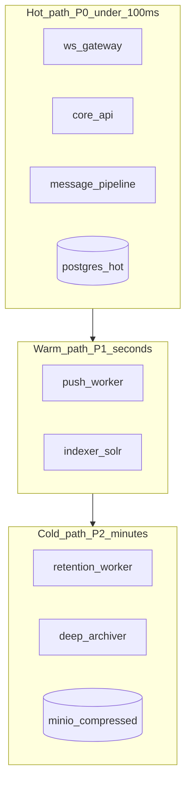

# Design: оптимизация инфраструктуры Korus Messenger

**Дата:** 2026-06-15  
**Статус:** **реализовано** (spec 006, Waves 1–3, T311 guest gate green 2026-06-15)  
**Связанные документы:** [`docs/PRODUCT_PRESENTATION.md`](../PRODUCT_PRESENTATION.md) §12, §10, [`deploy/qemu/RESOURCES.md`](../../deploy/qemu/RESOURCES.md)

> Этот документ **не является backlog на код**. Он детализирует требования §12 продуктового ТЗ. Порядок волн и пересечения этапов могут уточняться до начала реализации.

## Цель

Три измеримые цели (в порядке приоритета внедрения):

1. **−Cost:** снизить RAM/CPU минимальной инсталляции без потери функций для целевого масштаба.
2. **+Throughput:** больше одновременных пользователей и msg/s на том же или меньшем железе.
3. **+Logical storage / −Physical disk:** хранить больше истории на меньшем объёме носителей.

## Архитектурная рамка



**Правило:** Pilot tier поднимает только Hot + минимум Warm; Standard добавляет Index + Retention; Enterprise — full stack + horizontal scale.

---

## Этап 1. Prod-lite compose profile (Pilot)

**ROI:** ★★★ cost | срок: 1–2 недели  
**Целевой масштаб:** до 10 000 registered users, ~750 peak online, ~8–15 msg/s peak

### 1.1 Текущая проблема

`docker-compose.full-server.yml` поднимает **17 сервисов** (~6,4 GB RAM min, таблица ТЗ ~64 GB prod). Для pilot over-provisioned: Solr+ZK (~1 GB), archive DB, 4 фоновых воркера (archiver, deep-archiver, indexer, export-replay).

### 1.2 Решение

Новый файл: **`docker/docker-compose.pilot.yml`**

| Сервис | Pilot | full-server | Примечание |
|--------|:-----:|:-----------:|------------|
| postgres-hot | ✓ | ✓ | единственная БД |
| postgres-archive | — | ✓ | включать при profile `archive` |
| redis | ✓ | ✓ | |
| nats | ✓ | ✓ | JetStream optional off для pilot |
| minio | ✓ | ✓ | файлы + будущий cold storage |
| keycloak | ✓ | ✓ | **prod mode** (см. этап 2) |
| core-api | ✓ | ✓ | без SOLR_URL / SOLR_ZK |
| ws-gateway | ✓ | ✓ | обязателен |
| message-pipeline | ✓ | ✓ | обязателен |
| push-worker | profile `push` | ✓ | опционально |
| retention-worker | profile `retention` | ✓ | при политиках TTL |
| zoo + solr | — | ✓ | SQL search fallback |
| archiver / deep / indexer / export | — | ✓ | profile `compliance` |

**Env core-api (pilot):**

```properties
# Solr intentionally unset → MessageSearchService uses SQL (ILIKE on plaintext, non-E2EE)
# SEARCH_SQL_ONLY=true  # optional explicit flag (new env, see 1.4)
DB_POOL_SIZE=15
```

**Поиск:** [`SolrClientFactory`](../../modules/core-api/src/main/java/com/avandocmsg/messenger/api/config/SolrClientFactory.java) без `SOLR_URL`/`SOLR_ZK` → SQL fallback ([`SearchResource`](../../modules/core-api/src/main/java/com/avandocmsg/messenger/api/contacts/SearchResource.java)). Ограничение: медленнее на больших чатах; E2EE plaintext не индексируется в SQL.

### 1.3 Sizing Pilot

| Метрика | full-server (ТЗ) | Pilot target |
|---------|------------------|--------------|
| RAM server VM | ~64 GB | **12–16 GB** |
| vCPU | ~32 | **8** |
| Контейнеров | 17 | **9** (+ optional profiles) |
| Пик msg/s | ~8 | ~8–15 (2× pipeline — этап 4) |

### 1.4 Задачи реализации

| ID | Задача | Файлы |
|----|--------|-------|
| 1.1 | Создать `docker-compose.pilot.yml` | `docker/` |
| 1.2 | Скрипт `scripts/pilot-stack-up.ps1` / `.sh` | `scripts/` |
| 1.3 | Smoke `scripts/smoke-pilot-stack.sh` — health + DM + WS + SQL search | `scripts/` |
| 1.4 | (Optional) `SEARCH_MODE=sql|solr` в AppConfig | `core-api` |
| 1.5 | Документировать в `deploy/qemu/RESOURCES.md` § Pilot | docs |
| 1.6 | Ansible var `korus_deploy_profile: pilot` | `deploy/ansible/` |

### 1.5 Критерии приёмки

- [ ] `docker compose -f docker/docker-compose.pilot.yml up -d` — green health
- [ ] Playwright tier `api` pass на pilot stack
- [ ] RAM guest ≤ 16 GB при idle + 50 synthetic users
- [ ] Message search returns results via SQL (no Solr containers running)

### 1.6 Риски

| Риск | Митигация |
|------|-----------|
| SQL search O(n) на больших чатах | Document limit 10k RU; migrate to Standard |
| No full-text on E2EE | Expected; document in admin |

---

## Этап 2. Keycloak prod mode + sizing

**ROI:** ★★ cost | срок: 3–5 дней  
**Зависимость:** этап 1 (pilot compose)

### 2.1 Проблема

`start-dev` в compose → ~640 MB RAM, не prod-hardening ([`RESOURCES.md`](../../deploy/qemu/RESOURCES.md)).

### 2.2 Решение

| Режим | Command | RAM target | Когда |
|-------|---------|------------|-------|
| Dev | `start-dev --import-realm` | ~640 MB | QEMU, CI |
| **Pilot prod** | `start --optimized` + import | **~384–512 MB** | ≤10k RU |
| Standard HA | 2× `start` + external DB | 2×512 MB | ≥50k RU |

**Env changes:**

```yaml
keycloak:
  command: ["start", "--optimized", "--import-realm"]
  environment:
    KC_HEALTH_ENABLED: "true"
    KC_METRICS_ENABLED: "true"
    JAVA_OPTS_KC: "-Xms256m -Xmx512m"
```

Pilot: Keycloak DB **может остаться на postgres-hot** (отдельная schema). Standard+: выделить `postgres-keycloak` или managed IdP.

### 2.3 Задачи

| ID | Задача |
|----|--------|
| 2.1 | `Dockerfile.keycloak` или compose override `docker-compose.keycloak-prod.yml` |
| 2.2 | Smoke login latency p95 < 500ms @ 50 concurrent logins |
| 2.3 | Update `RESOURCES.md` Keycloak row: dev vs prod |
| 2.4 | TZ §10 footnote: Keycloak dev ≠ prod sizing |

### 2.4 Критерии приёмки

- [ ] Keycloak RSS < 512 MB после warm-up на pilot
- [ ] Realm import + JWT validation unchanged
- [ ] `smoke-auth.sh` green

---

## Этап 3. Redis read cache

**ROI:** ★★★ throughput, ★ cost (fewer DB nodes) | срок: 2–3 недели

### 3.1 Проблема

Каждый GET `/chats`, `/users/me`, unread counts → PostgreSQL. При 100k DAU read IOPS dominates.

### 3.2 Решение

Новый слой **`ReadCachePort`** (hex) или `RedisReadCache` adapter:

| Key pattern | TTL | Invalidate on |
|-------------|-----|---------------|
| `chat:list:{userId}` | 60s | WS chat event, join/leave |
| `chat:unread:{userId}` | 30s | new message, `/read` |
| `user:profile:{userId}` | 120s | PATCH `/users/me` |
| `user:presence:{userId}` | 15s | heartbeat (optional skip) |

**Принцип:** cache-aside; miss → DB → set Redis. WS events trigger targeted invalidation (not flush-all).

### 3.3 Ожидаемый эффект

| Tier | Read IOPS reduction | Effective DAU capacity ↑ |
|------|---------------------|--------------------------|
| 10k | −25% | +15% |
| 100k | −40% | +50% |
| 500k | −45% | +60% |

Redis RAM: +256 MB (10k), +2 GB (100k) — меньше чем second API node.

### 3.4 Задачи

| ID | Задача | Модуль |
|----|--------|--------|
| 3.1 | `ReadCachePort` + `RedisReadCacheAdapter` | `core-api` hex |
| 3.2 | Integrate in `ChatApplicationService`, `UserApplicationService` | application |
| 3.3 | Invalidation hooks in WS gateway / message pipeline events | `ws-gateway`, pipeline |
| 3.4 | Env: `REDIS_READ_CACHE_ENABLED=true`, TTL overrides | `application.properties` |
| 3.5 | Metrics: `read_cache_hit_total`, `read_cache_miss_total` | Prometheus |
| 3.6 | H2 unit tests + load script comparison | tests, `scripts/profiling/` |

### 3.5 Критерии приёмки

- [ ] Hit rate ≥ 60% on chat list @ synthetic 1000 users
- [ ] No stale unread after message deliver (Playwright or smoke)
- [ ] `CoreApiBenchmarkTest` budgets unchanged

---

## Этап 4. Scale ws-gateway + message-pipeline

**ROI:** ★★★ throughput | срок: 1–2 недели  
**Зависимость:** этап 1 (pilot base)

### 4.1 Механизм (уже в архитектуре)

- **message-pipeline:** NATS queue group — N replicas share `msg.send` consumer load.
- **ws-gateway:** N replicas; nginx **ip_hash** or cookie sticky on `/ws`.

### 4.2 Compose / Ansible

```yaml
# docker-compose.scale.yml overlay
services:
  ws-gateway:
    deploy:
      replicas: 2  # compose v2 swarm OR duplicate ws-a/ws-b pattern like korus-web
  message-pipeline:
    deploy:
      replicas: 2
```

**korus-web pattern:** уже 2× web-client + nginx `least_conn` — повторить для ws-gateway pool.

**Nginx snippet:**

```nginx
upstream ws_backend {
    ip_hash;
    server ws-gateway-1:8081;
    server ws-gateway-2:8081;
}
```

### 4.3 Sizing impact

| Tier | ws replicas | pipeline replicas | Peak WS | Peak msg/s |
|------|-------------|-------------------|---------|------------|
| Pilot | 1→2 | 1→2 | 750→1500 | 8→15 |
| 100k | 3 | 3 | 4800→12000 | 57→120 |
| 500k | 6 | 4 | 15000→35000 | 182→400 |

### 4.4 Задачи

| ID | Задача |
|----|--------|
| 4.1 | `docker-compose.scale.yml` overlay |
| 4.2 | Ansible `korus_ws_replicas`, `korus_pipeline_replicas` |
| 4.3 | Document sticky WS in `korus-web/README.md` |
| 4.4 | Load test: 2× pipeline, measure msg/s ceiling |

### 4.5 Критерии приёмки

- [ ] 2× pipeline: linear fan-out throughput (±15%)
- [ ] 2× ws-gateway: 2× concurrent connections with sticky LB
- [ ] `smoke-messaging-e2e.sh` green on scaled stack

---

## Этап 5. DB pool tuning + read replica routing

**ROI:** ★★★ throughput | срок: 2–3 недели

### 5.1 Проблема

`db.pool.size=10` per core-api instance. 3 API × 10 = 30 connections; default postgres `max_connections=100` exhausts quickly.

### 5.2 Решение

**A. Pool formula (document in ops runbook):**

```
DB_POOL_SIZE = min(30, floor(max_connections * 0.7 / api_replicas))
postgres max_connections ≥ api_replicas × DB_POOL_SIZE + workers×5 + 25
```

**B. Read replica** for read-heavy endpoints:

| Endpoint | Route |
|----------|-------|
| GET `/chats/{id}/messages` | replica |
| GET `/chats` (list) | replica (+ Redis cache этап 3) |
| GET `/search/messages` | replica (SQL mode) |
| POST/PATCH/DELETE * | primary |

**Implementation:** `RoutingDataSource` or separate `ReadOnlyDataSource` port in hex layer; env `DB_READ_JDBC_URL`.

### 5.3 Задачи

| ID | Задача |
|----|--------|
| 5.1 | Env validation: warn if `api_replicas × pool > max_connections × 0.8` |
| 5.2 | `ReadOnlyJdbcAdapter` for message list, chat list |
| 5.3 | PostgreSQL replica in Standard compose (streaming replication) |
| 5.4 | Flyway **only on primary** |
| 5.5 | Load test: compare p95 GET /messages before/after |

### 5.4 Критерии приёмки

- [ ] 3× API + pool=20: no connection exhaustion @ 100 concurrent users
- [ ] Replica lag < 500ms under normal load
- [ ] Writes never routed to replica (integration test)

---

## Этап 6. zstd deep-archive chunks

**ROI:** ★★★ disk, ★ RAM cold path | срок: 1–2 недели

### 6.1 Проблема

Deep archiver stores JSON chunks in MinIO — verbose, ~2–5× vs compressed binary.

### 6.2 Решение

| Format | Compression | Expected ratio |
|--------|-------------|----------------|
| Current JSON | none | 1.0× |
| JSON + gzip | fast | ~0.25–0.35× |
| **JSON + zstd (level 3)** | fast, better | **~0.15–0.25×** |

**Wire format:** magic `KDA1` + zstd payload; reader detects legacy uncompressed by missing magic.

**Module:** `DeepArchiverWorker` + `ChunkedSnapshotWriter` in `modules/common`.

### 6.3 Env

```
DEEP_ARCHIVE_COMPRESSION=zstd   # none|gzip|zstd
DEEP_ARCHIVE_ZSTD_LEVEL=3
```

### 6.4 Задачи

| ID | Задача |
|----|--------|
| 6.1 | zstd compress/decompress in chunk writer |
| 6.2 | Backward-compatible read (legacy + compressed) |
| 6.3 | Metric: `deep_archive_bytes_saved_total` |
| 6.4 | Unit test: roundtrip + legacy fixture |

### 6.5 Disk impact (100k tier, 1 year)

| Storage | Before | After zstd |
|---------|--------|------------|
| Cold message bodies | ~150 GB | **~35–45 GB** |
| Total tier disk (ТЗ) | ~50 TB | **~35–40 TB (−20–30%)** |

Combined with hot-row purge (existing): **−40% physical disk** per TZ target.

---

## Этап 7. Batch Solr indexing

**ROI:** ★★ cost (fewer indexer CPU), ★★ throughput | срок: 3–4 недели  
**Profile:** Standard+ (requires Solr)

### 7.1 Проблема

One NATS `msg.event.index` → one Solr update per message. CPU-heavy at >50 msg/s.

### 7.2 Решение

**IndexerWorker batch mode:**

```
INDEXER_BATCH_SIZE=100
INDEXER_BATCH_FLUSH_MS=500
```

Accumulate events in memory buffer → single Solr `add` with N docs → one commit (or softCommit every batch).

**Trade-off:** search lag +500ms max (acceptable for P1).

### 7.3 Задачи

| ID | Задача |
|----|--------|
| 7.1 | Batch buffer in IndexerWorker with flush timer |
| 7.2 | Idempotent batch rebuild on partial failure |
| 7.3 | Metric: `indexer_batch_size_histogram` |
| 7.4 | Compare CPU @ 100 msg/s: batch vs single |

### 7.4 Expected effect

- Indexer CPU **−60–70%** at same msg rate
- Can run 1 indexer node instead of 2 on 100k tier → **−32 GB RAM**

---

## Этап 8. File deduplication by content-hash

**ROI:** ★★★ disk | срок: 4+ нед weeks  
**Depends:** MinIO, file upload path

### 8.1 Problem

Same file uploaded N times → N copies in MinIO.

### 8.2 Solution

1. On upload: SHA-256 stream hash.
2. `file_metadata.storage_key` → content-addressed `objects/sha256/{hash}`.
3. Reference count in `file_metadata`; delete blob only when refcount=0.

**Scope:** non-E2EE files first; E2EE blobs dedup by ciphertext hash (same file → same ciphertext only if same key).

### 8.3 Tasks

| ID | Task |
|----|------|
| 8.1 | Migration: `content_hash`, `ref_count` on `file_metadata` |
| 8.2 | Upload path: check existing hash → reuse key |
| 8.3 | Retention janitor: refcount-aware delete |
| 8.4 | Admin metric: `storage_dedup_saved_bytes` |

### 8.4 Disk impact

Attachments ~40 TB @ 100k → **~25 TB (−35%)** (aligns with TZ optimized column).

---

## Этап 9. PostgreSQL sharding by org_id (Enterprise 1M)

**ROI:** ★★★ throughput at 1M, ★ cost vs single giant PG | срок: quarter+  
**Profile:** Enterprise only

### 9.1 Strategy

- **Shard key:** `org_id` (natural tenant boundary).
- **Router:** application-level in `OrganizationRoutingDataSource` or Citus extension.
- **Phase A:** 2 shards (hot orgs / default); **Phase B:** N shards by hash(org_id).

### 9.2 What NOT to shard early

- Keycloak users (separate DB)
- NATS (already distributed)
- MinIO (already object store)
- Solr (shard by collection per org tier-2)

### 9.3 Prerequisites

- Load test proving single PG bottleneck @ 500k+
- Read replica + cache (этапы 3, 5) exhausted
- Hot-plug indexer pool (этап 7)

### 9.4 Acceptance

- [ ] 1M corp profile (250k DAU, 253 msg/s peak) on 900 GB RAM target
- [ ] Cross-org queries (admin audit) use federated read or central metadata DB

---

## Сводная таблица: было → цель

| Tier | RAM (ТЗ) | RAM (цель) | msg/s peak (ТЗ) | msg/s (цель) | Disk 1y (ТЗ) | Disk (цель) |
|------|----------|------------|-----------------|--------------|--------------|-------------|
| 10k | 64 GB | **14 GB** | ~8 | **~15** | ~8 TB | **~5 TB** |
| 100k | 256 GB | **140 GB** | ~57 | **~120** | ~50 TB | **~30 TB** |
| 500k | 768 GB | **450 GB** | ~182 | **~400** | ~180 TB | **~110 TB** |
| 1M | 1,5–2 TB | **900 GB–1,2 TB** | ~253 / 4000 | **~600 / path 4000** | ~350 TB | **~200 TB** |

---

## Порядок внедрения (ориентир при реализации — **не обязательство**)

См. §12.4 TZ: волны могут объединяться. Ниже — рекомендуемая последовательность для будущей разработки.

| Order | Этап | Blocker | Owner hint |
|-------|------|---------|------------|
| **1** | Pilot compose | — | DevOps |
| **2** | Keycloak prod | этап 1 | DevOps |
| **3** | Redis read cache | этап 1 stable | Backend |
| **4** | Scale ws + pipeline | этап 1 | DevOps |
| **5** | DB pool + replica | этап 4 | Backend + DBA |
| **6** | zstd deep-archive | retention profile | Backend worker |
| **7** | Batch Solr | Standard deploy | Backend worker |
| **8** | File dedup | — | Backend |
| **9** | PG sharding | этапы 3–7 + load test | Architecture |

---

## Validation gate (перед prod sign-off)

1. **Load test matrix:** k6/Locust @ 20% target peak for each tier.
2. **Metrics baseline:** p95 REST, p95 WS deliver, cache hit rate, PG connections, indexer lag.
3. **Update** [`docs/PRODUCT_PRESENTATION.md`](../PRODUCT_PRESENTATION.md) §10.2 with measured numbers.
4. **Smoke index:** add `smoke-pilot-stack`, `smoke-scaled-ws` to [`scripts/SMOKE_INDEX.md`](../../scripts/SMOKE_INDEX.md).

---

## Связанные изменения документации

- [x] This design doc
- [x] `docs/PRODUCT_PRESENTATION.md` §10 — profiles Pilot/Standard/Enterprise (measured §10.2 — pending load test)
- [x] `deploy/qemu/RESOURCES.md` — Pilot row
- [x] `docs/plans/README.md` — epic 11
- [x] `CHANGELOG.md` [Unreleased]

---

*Версия: 2026-06-15. Следующий шаг по ТЗ: согласование §13 с заказчиком; реализация — после отдельного решения.*
