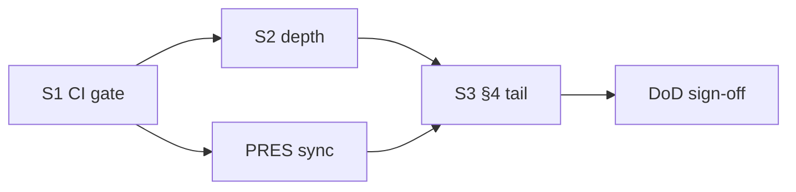

# План: кодовая безопасность + синхронизация презентации

**Дата:** 2026-06-16  
**Статус:** `active`  
**Связанные spec:** [010-presentation-gaps-closure](../../specs/010-presentation-gaps-closure/), [014-code-security-presentation](../../specs/014-code-security-presentation/), [007-platform-stage-readiness](../../specs/007-platform-stage-readiness/) (ops tail отложен)  
**Вне scope:** сертификация **ФСТЭК**, запись в **реестр ПО** — отдельный организационный трек «сильно позже»; в этом плане только честные формулировки в материалах.

---

## 1. Цель

| Контур | Цель |
|--------|------|
| **Код** | Все автоматические проверки безопасности **green**, `./gradlew buildIntegrity` и security-smokes **без предупреждений** в stdout/stderr (compile `-Werror` где применимо, тесты без JVM noise). |
| **Презентация** | `product_presentation.html`, `competitor_comparison*.html`, `product_status.py` отражают **фактическое** состояние кода; radar не обещает ФСТЭК/реестр «уже есть». |
| **Acceptance** | QEMU inner gate: security smokes + Playwright tiers green; CI: расширенный `buildIntegrity` без `continue-on-error` на security-задачах. |

**Ограничение:** stage/prod host не раньше **сентября 2026** — ops-only пункты (TLS live, VAPID prod) в презентации остаются с footnote «ops», но **инженерная** часть §24 помечается «Реализовано».

---

## 2. Текущие разрывы (baseline 2026-06-16)

### 2.1 Безопасность — что уже есть

- План `04-security-timing.md` — **completed** (headers, rate limit, WS origin, timing normalization, smokes).
- Spec 010 Phase A/C — Bot L2, TURN scaffold, BOT-6 mock HTTP test, `ui-bot` Playwright green.
- CI: `buildIntegrity` (compile + test + assemble); `benchmark` — **non-blocking** (`continue-on-error: true`).

### 2.2 Безопасность — что ломает «zero warnings»

| Источник | Пример | Действие |
|----------|--------|----------|
| `compileJava` | `uses or overrides a deprecated API` | Исправить или `-Xlint:-deprecation` только в legacy-модулях с ticket |
| JVM тесты | `sun.misc.Unsafe` / Netty | Обновить Netty или `-XX:+EnableDynamicAgentLoading` / documented JVM args |
| Playwright wrapper | `NO_COLOR` / `FORCE_COLOR` на Windows | Обёртка `playwright-dev-loop.ps1` — stderr filter или env cleanup |
| CI gap | `spotlessCheck`, `benchmark`, `npm audit` не в gate | Включить в `buildIntegrity` / `ci.yml` |
| QEMU smoke | `smoke-turn-qemu` host `:3478` | `sync-web` + hostfwd или `-GuestOnly` в inner gate manifest |
| Презентация | §24 «Частично», radar `reg:3` vs текст «в процессе» | Синхронизация статусов и FAQ |

### 2.3 Презентация — расхождения код ↔ HTML

| Блок | `product_status.py` | Нужно |
|------|---------------------|-------|
| Bot API | `partial` | `partial` с note «L2 eng ✓; prod SLA — ops» или `done` для eng-only snapshot |
| E2EE / TLS / Push | `partial` | Оставить `partial` + явный split eng vs ops |
| §24 Безопасность | «Частично» в MD | → **Реализовано** (eng): timing, headers, rate limit, WS origin |
| Radar ФСТЭК | `reg: 3` | Не поднимать до 5; footnote в methodology + brief FAQ |
| Live | `planned` | Без изменений (spec 011 backlog) |

---

## 3. Фаза S1 — Security CI gate (P0, 1–2 нед.)

**Критерий:** `./gradlew buildIntegrity` завершается **exit 0**, в логе нет `warning:` / `WARNING:` от компилятора и тестового JVM (кроме явно подавленных documented flags).

| ID | Задача | Файлы / команды | Критерий |
|----|--------|-----------------|----------|
| S1-1 | Добавить `spotlessCheck` в `buildIntegrity` | `build.gradle.kts` | Форматирование Java блокирует merge |
| S1-2 | `benchmark` → blocking в CI | `.github/workflows/ci.yml` | Убрать `continue-on-error`; `*Benchmark*` green |
| S1-3 | `npm audit --audit-level=high` для webui-build | `ci.yml`, `modules/web-client/webui-build/` | 0 high/critical; moderate — ticket или fix |
| S1-4 | `-Werror` / fix deprecation в core-api | `build.gradle.kts`, затronутые `*Resource.java` | `compileJava` без Note/Warning |
| S1-5 | JVM args для тестов (Netty/ByteBuddy) | корневой `build.gradle.kts` | Тесты без `terminally deprecated` в log |
| S1-6 | Скрипт `scripts/security-gate.ps1` | новый | Orchestrator: smokes headers + rate-limit + audit-timing + `buildIntegrity` |
| S1-7 | `SMOKE_INDEX.md` + inner tier | `playwright-tiers.json` | Tier `security` или расширить `api` |

**Smoke bundle (QEMU жив):**

```powershell
.\scripts\smoke-security-headers.ps1
.\scripts\smoke-rate-limit.ps1
.\scripts\audit-timing.ps1 -MaxDeltaRatio 0.05
.\scripts\smoke-bot-api.ps1
.\scripts\playwright-dev-loop.ps1 -Tier ui-bot
```

---

## 4. Фаза S2 — Углубление security-кода (P1, 2–4 нед.)

| ID | Задача | Обоснование |
|----|--------|-------------|
| S2-1 | Расширить `audit-timing.ps1`: `/users/{id}`, `/messages/{id}`, login fail | Закрыть перечисление beyond chat |
| S2-2 | Unit: `TimingAttackPreventionTest` — реальный delta guard (не только helper) | Сейчас trivial assert |
| S2-3 | Bot webhook: HMAC signature optional (`BOT_WEBHOOK_SECRET`) | FR-INT-05, снижение риска подмены |
| S2-4 | CSP default для prod compose (report-only → enforce) | `CSP_POLICY` в ansible template |
| S2-5 | Dependabot PR policy: auto-merge patch для GH Actions | `.github/dependabot.yml` + doc |
| S2-6 | `docs/SECURITY.md` — матрица «что в CI / что на QEMU / что ops» | Единый операторский справочник |
| S2-7 | Убрать dead code / unused imports (BotResource, filters) | Чистый compile без noise |

**Не включаем:** ФСТЭК AT, реестр Минцифры, мобильные клиенты.

---

## 5. Фаза PRES — Синхронизация презентации (P1, параллельно S1)

| ID | Задача | Артефакты |
|----|--------|-----------|
| PRES-1 | Обновить `product_status.py`: §24 eng done, bot L2 note, версия 2.5.4 | `scripts/product_status.py` |
| PRES-2 | Пересборка HTML | `python scripts/build-tz-product-html.py`, `build-competitor-comparison-html.py` |
| PRES-3 | `docs/PRODUCT_PRESENTATION.md` §4, §24: статусы + snapshot footnote «ops с сент. 2026» | MD source |
| PRES-4 | Radar: оставить `reg:3`, добавить в methodology § «не inflating scores» | `registry.json`, `COMPETITOR_COMPARISON_METHODOLOGY.md` |
| PRES-5 | Brief FAQ: «ФСТЭК позже» — без даты обещания сертификата | `competitor_comparison_brief.html` (via build script data) |
| PRES-6 | `CHANGELOG.md` [Unreleased] | Одна запись на S1+ PRES |
| PRES-7 | `specs/010/.../tasks.md` — T110 optional / security gate note | tasks.md |

**Правило customer HTML:** post-build validation — нет путей `specs/`, `deploy/`, `QEMU` в тексте для заказчика (уже в `build-tz-product-html.py`).

---

## 6. Фаза S3 — Функциональный хвост §4 (P2, без ФСТЭК)

Инженерия из spec 010, не требующая stage host:

| ID | Задача | Spec |
|----|--------|------|
| S3-1 | TURN hostfwd `:3478` на web VM или документировать `-GuestOnly` в inner gate | CALL |
| S3-2 | SSO: smoke OIDC broker на QEMU Keycloak | P2-2/3 presentation plan |
| S3-3 | Playwright tier `all-inner` green (34/34) | US9 |
| S3-4 | k6 QEMU baseline JSON → §10.2.1 «измерено» | T604 QEMU substitute |
| S3-5 | Live spec 011 — только L0/L1 (ADR + contracts), без L2 code | Phase D |

После S3-1…S3-3: в презентации можно перевести **Звонки / Bot API / §24** в «Реализовано (eng)» с ops footnote для prod.

---

## 7. Критерии завершения (Definition of Done)

### Security DoD

- [ ] `./gradlew buildIntegrity` — SUCCESS, 0 compiler warnings (или explicit `-Werror` exceptions documented)
- [ ] `./gradlew :modules:core-api:benchmark` — SUCCESS (CI blocking)
- [ ] `npm audit` — 0 high/critical в webui-build
- [ ] `scripts/security-gate.ps1` — all green на живом QEMU
- [ ] `docs/SECURITY_AUDIT.md` — delta ≤ 5% на audit-timing
- [ ] Нет `WARNING`/`WARN` от application code в smoke startup logs (spot-check `docker logs core-api` 30s)

### Presentation DoD

- [ ] `product_presentation.html` VERSION ≥ 2.5.4, snapshot совпадает с `product_status.py`
- [ ] Radar не показывает Korus `reg:5`; FAQ не обещает ФСТЭК «сегодня»
- [ ] §24 «Безопасность» → **Реализовано** (инженерия); E2EE/TLS/Push — **Частично** только ops-gate
- [ ] `python scripts/run_python_verification.py` + `./gradlew buildIntegrity` — green после правок

---

## 8. Порядок выполнения (рекомендуемый)



1. **S1** — быстрый win, блокирует регрессии.  
2. **PRES** — параллельно после S1-4 (compile clean).  
3. **S2** — по приоритету S2-1, S2-3, S2-6.  
4. **S3** — когда QEMU стабилен.

---

## 9. Явно отложено

| Тема | Когда | Примечание |
|------|-------|------------|
| ФСТЭК сертификация | 12–24+ мес. | Организационный трек, не код |
| Реестр ПО / «Росреестр» ПО | после ФСТЭК / параллельно | Не inflating radar |
| Stage TLS / VAPID prod / E2EE 8/8 signatures | сент. 2026+ | spec 007 ops |
| Live-streaming L2–L6 | 12–18 мес. | spec 011 |
| Mobile / Desktop | отдельные эпики | вне radar «Функции=5» |

---

## 10. Связанные документы

| Документ | Роль |
|----------|------|
| [`docs/plans/04-security-timing.md`](04-security-timing.md) | Baseline security epic |
| [`docs/plans/2026-06-16-presentation-gaps-implementation-plan.md`](2026-06-16-presentation-gaps-implementation-plan.md) | Предыдущий §4 план |
| [`specs/010-presentation-gaps-closure/tasks.md`](../../specs/010-presentation-gaps-closure/tasks.md) | Task IDs T101–T407 |
| [`docs/SECURITY.md`](../SECURITY.md) | Operator baseline |
| [`scripts/SMOKE_INDEX.md`](../../scripts/SMOKE_INDEX.md) | Smoke catalog |

---

*Версия: 2026-06-16 — код + презентация; ФСТЭК/реестр out of scope.*
