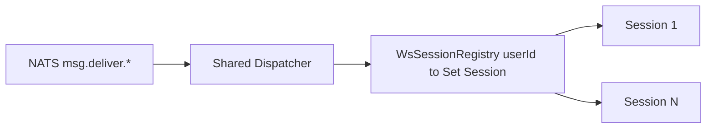

# Performance & Scalability Hardening Plan

> **For Claude:** REQUIRED SUB-SKILL: Use superpowers:executing-plans to implement this plan task-by-task.

**Goal:** Устранить узкие места по нагрузке, памяти и ресурсам сервера (code review 2026-06-16), сохранив QEMU/pilot acceptance и без регрессий Playwright.

**Architecture:** Четыре волны: (0) быстрые infra/DB guardrails, (1) hot-path WS + uploads + fan-out, (2) resilience/observability, (3) code health и нагрузочные gates. Pilot — первый контур приёмки; full-server — второй.

**Tech Stack:** Java 25 / Tomcat / Jersey, NATS, ws-gateway (JSR-356), HikariCP, MinIO SDK, Redis/Lettuce, Docker Compose, Ansible QEMU, Playwright tiers, Prometheus simpleclient.

**Связанные документы:** [`deploy/qemu/RESOURCES.md`](../../deploy/qemu/RESOURCES.md), [`docs/plans/2026-06-15-infra-optimization-design.md`](2026-06-15-infra-optimization-design.md) (Wave 1–3 closed), [`docs/review/code-review-2026-05-23.md`](../review/code-review-2026-05-23.md).

**Статус:** `not_started`  
**Теги:** `[performance]` `[memory]` `[ws-gateway]` `[core-api]` `[docker]` `[pipeline]` `[web-client]` `[ops]`

---

## Сводка приоритетов

| ID | Эпик | Приоритет | ROI | Effort | Wave |
|----|------|-----------|-----|--------|------|
| PS-0.1 | Docker `mem_limit` / JVM heap caps | **P0** | ★★★ stability | S | 0 |
| PS-0.2 | JDBC query timeout в core-api | **P0** | ★★★ tail latency | S | 0 |
| PS-0.3 | Redis read cache ON в pilot compose | **P0** | ★★☆ −DB load | XS | 0 |
| PS-0.4 | LiveSession N+1 fix | **P0** | ★★☆ −DB roundtrips | XS | 0 |
| PS-0.5 | Auth rate limit ON + prod env | **P0** | ★★★ abuse | S | 0 |
| PS-0.6 | Fail-fast secrets вне dev | **P0** | ★★★ security | S | 0 |
| PS-1.1 | WS-gateway: shared NATS dispatcher | **P0** | ★★★ scale | L | 1 |
| PS-1.2 | Streaming file upload (без full heap) | **P0** | ★★★ memory | L | 1 |
| PS-1.3 | Large-group fan-out (chat subject) | **P1** | ★★★ throughput | L | 1 |
| PS-2.1 | In-memory limiters eviction | **P2** | ★☆☆ heap leak | S | 2 |
| PS-2.2 | JetStream fan-out idempotency | **P2** | ★★☆ dup traffic | M | 2 |
| PS-2.3 | Rate limit fail-closed option | **P2** | ★★☆ security | S | 2 |
| PS-2.4 | Prometheus: WS sessions, fan-out size | **P2** | ★★☆ ops | S | 2 |
| PS-3.1 | Shared retention chunk writer → common | **P2** | ★★☆ correctness | M | 3 |
| PS-3.2 | app.js incremental split (virtual list) | **P2** | ★★☆ client perf | L | 3 |
| PS-3.3 | Repository `catch (Exception)` narrowing | **P3** | ★☆☆ maintainability | L | 3 |
| PS-4.1 | Soak/load smoke scripts | **P1** | ★★★ regression gate | M | 4 |

**Effort:** XS &lt; 0.5 d, S = 0.5–1 d, M = 2–3 d, L = 4–7 d (один инженер).

---

## Целевые метрики (acceptance)

| Метрика | Сейчас (оценка) | Target после Wave 1 |
|---------|-----------------|---------------------|
| WS RAM на 750 conn | ~750 NATS dispatchers | 1 dispatcher + session map |
| core-api heap при 10×50MB upload | до ~500MB+ буферов | streaming, peak &lt; 128MB upload path |
| Pilot idle RAM guest | ~1.6 GiB used / 9.7 GiB | без роста; limits защищают от OOM |
| list live sessions (10 rows) | 11 SQL queries | 1 query |
| Auth brute-force | rate limit off | 60/min login enforced |
| Playwright | 34/34 outer (QEMU) | green после каждой волны |

---

## Wave 0 — Guardrails (1–2 дня)

> Быстрые изменения без смены протокола. Первый PR — только infra env.

### PS-0.1 Docker resource limits + JVM

**Files:**
- Modify: `docker/docker-compose.full-server.yml`
- Modify: `docker/docker-compose.pilot-overrides.yml` (или pilot overlay)
- Modify: `docker/Dockerfile.core-api`, `docker/Dockerfile.ws-gateway`, `docker/Dockerfile.message-pipeline`
- Modify: `deploy/qemu/RESOURCES.md`

**Шаги:**
1. Добавить `mem_limit` / `cpus` по таблице RESOURCES (postgres 512m, solr 896m, core-api 768m, ws-gateway 384m, pipeline 384m, …).
2. `ENV JAVA_TOOL_OPTIONS="-XX:MaxRAMPercentage=75.0 -XX:+UseContainerSupport"` для Java-сервисов.
3. Keycloak prod уже имеет `-Xmx256m` — не трогать.
4. Документировать «рекомендуемые limits» vs «минимум».

**Критерий:** `docker stats` на pilot guest — ни один контейнер не превышает limit; OOM одного сервиса не убивает postgres.

---

### PS-0.2 JDBC query timeout (core-api)

**Files:**
- Create: `modules/core-api/src/main/java/com/avandocmsg/messenger/api/config/JdbcQuerySupport.java`
- Modify: `modules/core-api/src/main/java/com/avandocmsg/messenger/api/config/AppConfig.java`
- Modify: `modules/core-api/src/main/resources/application.properties`
- Modify: hot repositories: `MessageRepository`, `ChatRepository` (wrapper `prepareStatement` with timeout)
- Test: `modules/core-api/src/test/java/.../JdbcQuerySupportTest.java`

**Env:** `API_JDBC_QUERY_TIMEOUT_SECONDS` (default `30`, `0` = off для dev).

**Шаги:**
1. TDD: unit test на helper `applyTimeout(PreparedStatement, seconds)`.
2. Добавить env override в `AppConfig`.
3. Подключить в `MessageRepository` / `ChatRepository` (top 10 hot paths: list messages, list chats, unread).
4. Prometheus counter `jdbc_query_timeout_total` (optional, Wave 2).

**Критерий:** медленный SQL (test H2 + mock delay) → SQLException за N сек, connection возвращается в pool.

---

### PS-0.3 Redis read cache в pilot

**Files:**
- Modify: `docker/docker-compose.pilot-overrides.yml` (env core-api)
- Modify: `deploy/ansible/group_vars/` pilot inventory if needed

**Env:**
```properties
REDIS_READ_CACHE_ENABLED=true
REDIS_READ_CACHE_TTL_CHAT_LIST_SECONDS=60
REDIS_READ_CACHE_TTL_CHAT_UNREAD_SECONDS=30
```

**Критерий:** `ReadCacheMetrics` hit/miss видны в `/metrics`; Playwright tier `api` green.

---

### PS-0.4 LiveSession N+1

**Files:**
- Modify: `modules/core-api/src/main/java/com/avandocmsg/messenger/api/repository/LiveSessionRepository.java`
- Test: `LiveSessionRepositoryH2Test.java` — assert single query count (mock/spy or SQL log)

**SQL approach:** LEFT JOIN `(SELECT session_id, COUNT(*) ... WHERE left_at IS NULL GROUP BY session_id) v`.

**Критерий:** list 20 sessions = 1 roundtrip.

---

### PS-0.5 Auth rate limit production defaults

**Files:**
- Modify: pilot/full compose env: `RATE_LIMIT_AUTH_ENABLED=true`
- Modify: `application.properties` comment (default stays false for local Gradle `:run`)
- Test: existing `AuthResourceTest` + Redis ON case

**Критерий:** 61-й login/min с одного IP → 429.

---

### PS-0.6 Secrets fail-fast (non-dev)

**Files:**
- Modify: `AppConfig.java` — `validateProductionSecrets()` при `KORUS_DEPLOY_PROFILE != dev`
- Modify: Ansible/QEMU env `KORUS_DEPLOY_PROFILE=pilot|standard`

**Rule:** если profile pilot/standard и `DB_PASSWORD` / `KEYCLOAK_MASTER_PASSWORD` = dev defaults → fail startup with clear log.

**Критерий:** pilot guest стартует с vault/env secrets; local Gradle без profile — как сейчас.

---

## Wave 1 — Hot path (1–2 недели)

### PS-1.1 WS-gateway: shared NATS dispatcher

**Problem:** `MessagingWebSocket.onOpen` создаёт `createDispatcher()` + subscribe per session.

**Architecture:**



**Files:**
- Create: `modules/ws-gateway/src/main/java/com/avandocmsg/messenger/ws/WsSessionRegistry.java`
- Create: `modules/ws-gateway/src/main/java/com/avandocmsg/messenger/ws/WsNatsDeliveryHub.java`
- Modify: `MessagingWebSocket.java` — register/unregister only
- Modify: `WsGatewayApplication.java` — init hub at startup
- Test: `WsSessionRegistryTest.java`, `WsNatsDeliveryHubTest.java`

**Env:**
- `WS_MAX_CONNECTIONS_PER_USER` (default 5)
- `WS_MAX_TOTAL_CONNECTIONS` (default 10000)

**Step-by-step:**
1. Test: registry add/remove/get sessions by userId.
2. Test: hub delivers payload to all open sessions of user.
3. Implement hub with **single** dispatcher subscribing `msg.deliver.>` or per-user subject pattern per NATS capability.
4. Wire `onOpen`/`onClose` to registry; remove per-session dispatcher.
5. Add metric `ws_open_sessions`, `ws_nats_dispatchers` (must stay 1).
6. Playwright: existing WS messaging specs.

**NATS note:** если wildcard `>` недоступен для security — альтернатива: subject `msg.deliver.{userId}` + один dispatcher с manual routing через registry lookup после parse subject suffix.

**Критерий:** 100 synthetic WS connections → 1 dispatcher; memory flat vs baseline 100× dispatcher test.

---

### PS-1.2 Streaming file upload

**Problem:** `FileApplicationService.upload` → `readAllBytes()` до 50MB.

**Files:**
- Modify: `modules/core-api/src/main/java/com/avandocmsg/messenger/core/application/FileApplicationService.java`
- Modify: `modules/core-api/src/main/java/com/avandocmsg/messenger/core/adapter/storage/MinioObjectStorageAdapter.java` (if exists) or `MinioFileProxy`
- Create: `StreamingSha256InputStream.java` (digest while streaming)
- Modify: `ImageResizeService.java` — cap + stream where possible
- Test: `FileApplicationServiceTest` — upload 2MB without heap spike (optional byte[] count)

**Approach:**
1. Stream to temp file or direct MinIO `putObject` with known size from Content-Length.
2. SHA-256 for dedup: `DigestInputStream` in single pass.
3. Reject if Content-Length &gt; max before read.
4. Tomcat: document `maxPostSize` / multipart limits in `FileResource`.

**Env:** `FILE_UPLOAD_MAX_CONCURRENT` (semaphore in service, default 20).

**Критерий:** 5 parallel 20MB uploads — heap core-api &lt; 512MB (container limit 768m); Playwright file tier green.

---

### PS-1.3 Large-group fan-out (chat subject mode)

**Problem:** O(N) NATS publish per message for N chat members.

**Design:** dual mode (backward compatible):

| Chat members | Mode | NATS subject |
|--------------|------|--------------|
| ≤ `FANOUT_DIRECT_MAX` (default 256) | direct | `msg.deliver.{userId}` (as now) |
| &gt; threshold | broadcast | `msg.deliver.chat.{chatId}` |

**Files:**
- Modify: `modules/common/.../NatsSubjects.java` — add `MSG_DELIVER_CHAT_PREFIX`
- Modify: `MessagePipelineWorker.java` — branch by member count
- Modify: `WsNatsDeliveryHub.java` — subscribe chat subjects for user's chats (or subscribe on WS open per chat membership cache)
- Modify: `PipelineFanoutLogic.java` — optional member count query
- Test: unit tests both modes; integration with embedded NATS

**WS subscription strategy (recommended):**
- On WS open: load user's chat IDs (cached 60s) → subscribe `msg.deliver.chat.{id}` for large chats only.
- Direct user subject remains for DMs and small groups.

**Env:**
- `PIPELINE_FANOUT_DIRECT_MAX=256`
- `PIPELINE_FANOUT_CHAT_ENABLED=true`

**Критерий:** synthetic 2000-member chat — 1 NATS publish per message; latency p95 &lt; 100ms fan-out step (pilot guest).

**Risk:** WS must filter events by membership — add chatId to deliver envelope (already in payload).

---

## Wave 2 — Resilience & observability (3–5 дней)

### PS-2.1 In-memory limiters eviction

**Files:**
- Modify: `BotRateLimiter.java` — periodic evict idle &gt; 10 min
- Modify: `TtlStringCache.java` — max entries 10_000 + LRU touch
- Test: eviction tests

---

### PS-2.2 JetStream delivery idempotency

**Files:**
- Modify: `MessagePipelineWorker.java` — Redis/in-memory dedup `messageId+recipient` TTL 60s on fan-out
- Env: `PIPELINE_FANOUT_DEDUP_TTL_SECONDS=60`

**Критерий:** forced `nak()` → no duplicate WS delivery to client (test with mock).

---

### PS-2.3 Rate limit fail-closed

**Files:**
- Modify: `AuthRateLimiter.java`
- Env: `RATE_LIMIT_AUTH_FAIL_OPEN=false` (pilot/prod default false)

---

### PS-2.4 Prometheus metrics

| Metric | Module |
|--------|--------|
| `ws_open_sessions` | ws-gateway |
| `ws_deliver_bytes_total` | ws-gateway |
| `pipeline_fanout_recipients` histogram | message-pipeline |
| `file_upload_bytes_total` | core-api |
| `jdbc_query_timeout_total` | core-api |

Expose via existing `/metrics` pattern.

---

## Wave 3 — Code health (parallel / backlog)

### PS-3.1 Shared chunk writer

Extract from `RetentionHotBodyJanitor` + `DeepArchiverWorker` → `modules/common/.../retention/ChunkManifestWriter.java` (per review 2026-05-23).

### PS-3.2 Web client

Continue [`10-web-client-code-health-backlog.md`](10-web-client-code-health-backlog.md):
- PR: `ui-message-list.js` — virtual scroll / render window for &gt;200 bubbles
- PR: extract WS handler from `app.js`

### PS-3.3 Repository exceptions

Incremental: `ChatRepository` → typed SQL exceptions + structured log; no big-bang.

---

## Wave 4 — Load & soak gates (3–4 дня)

### PS-4.1 Scripts

**Files:**
- Create: `scripts/load-ws-soak.ps1` / `.sh` — N connections, 5 min, report RSS
- Create: `scripts/load-api-upload.ps1` — parallel uploads
- Create: `scripts/load-fanout-synthetic.sh` — run **inside server guest**

**Gate:** document in `scripts/SMOKE_INDEX.md`; optional CI nightly (Linux runner, not Windows host).

**Thresholds (pilot guest):**
- 750 WS, 5 min: ws-gateway RSS &lt; 400MB
- 50 msg/s synthetic, 2 min: pipeline CPU &lt; 80%, no NATS slow consumer

---

## Матрица ресурсов (обновить RESOURCES.md после Wave 0)

### Pilot (после limits)

| Сервис | mem_limit | JVM / notes |
|--------|-----------|-------------|
| postgres-hot | 512m | |
| redis | 128m | read cache ON |
| nats | 256m | |
| minio | 384m | |
| keycloak | 512m | existing prod overlay |
| core-api | 768m | MaxRAMPercentage=75 |
| ws-gateway | 512m | ↑ from 256 (shared hub still lighter than N dispatchers) |
| message-pipeline | 512m | |
| **Σ containers** | **~3.5 GB** | +15% headroom |
| **Guest recommended** | **12 GB** | unchanged |

### Full-server additions

| Сервис | mem_limit |
|--------|-----------|
| solr | 896m |
| zoo | 384m |
| ws-gateway | 512m |
| retention + export + indexer | 384m each |
| **Σ** | **~5.5 GB** limits sum |
| **Guest recommended** | **10 GB** min, **12 GB** stable |

### Windows host (unchanged)

| Config | RAM |
|--------|-----|
| server + web | 13 GB min |
| + integrations | 22–24 GB |

---

## Порядок PR (рекомендуемый)

```
PR-1  PS-0.1  docker limits + JVM
PR-2  PS-0.2  JDBC timeout + tests
PR-3  PS-0.3  PS-0.5  pilot env cache + rate limit
PR-4  PS-0.4  live session N+1
PR-5  PS-0.6  secrets fail-fast
PR-6  PS-1.1  ws shared dispatcher  ← largest, own PR
PR-7  PS-1.2  streaming upload
PR-8  PS-1.3  chat fan-out mode
PR-9  PS-2.*  resilience batch
PR-10 PS-4.1  soak scripts + SMOKE_INDEX
PR-11 PS-3.*  code health (optional parallel)
```

**После каждого PR:** `./gradlew buildIntegrity` + `playwright-dev-loop -Tier api` на живом QEMU.

**Перед merge в main:** outer gate `playwright-dev-loop -Tier full` once.

---

## Документация (DoD каждой волны)

| Документ | Когда |
|----------|-------|
| `CHANGELOG.md` [Unreleased] | каждый PR с поведением/env |
| `deploy/qemu/RESOURCES.md` | Wave 0, Wave 1 |
| `docs/PORTS_MATRIX.md` | если новые metrics ports |
| `modules/core-api/.../application.properties` | новые env keys |
| `scripts/SMOKE_INDEX.md` | Wave 4 |
| `AGENTS.md` Project Learnings | после PS-1.1, PS-1.2 |

---

## Риски

| Риск | Митигация |
|------|-----------|
| WS hub regression (missed messages) | Playwright WS specs + soak script |
| Chat fan-out WS over-subscription | membership cache + TTL; fallback direct mode |
| Streaming upload breaks dedup | integration test same hash → same blob |
| Docker limits too tight → OOM in dev | pilot vs full profiles; document override |
| QEMU redeploy long after Wave 1 | `qemu-dev-mode -Mode sync-api` per PR |

---

## Out of scope (отдельные эпики)

- Horizontal scale core-api replicas (spec 006 FR-OPT-04) — после PS-1.1
- Stage/prod TLS / k6 baseline (spec 007 T601+) — Sep 2026+
- Full hex migration (`08-hexagonal-refactoring.md`) — не блокирует perf
- Solr removal on full-server — ops choice, не perf fix

---

## Task checklist (для specs/tasks или GitHub)

- [ ] PS-0.1 Docker limits
- [ ] PS-0.2 JDBC timeout
- [ ] PS-0.3 Redis cache pilot
- [ ] PS-0.4 LiveSession N+1
- [ ] PS-0.5 Auth rate limit
- [ ] PS-0.6 Secrets fail-fast
- [ ] PS-1.1 WS shared dispatcher
- [ ] PS-1.2 Streaming upload
- [ ] PS-1.3 Chat fan-out
- [ ] PS-2.1 Limiter eviction
- [ ] PS-2.2 Fan-out dedup
- [ ] PS-2.3 Fail-closed rate limit
- [ ] PS-2.4 Metrics
- [ ] PS-3.1 Chunk writer common
- [ ] PS-3.2 app.js virtual list
- [ ] PS-4.1 Soak scripts
