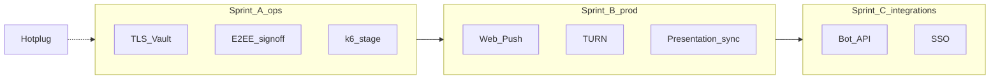

# План закрытия незавершённых блоков продуктовой презентации

**Дата:** 2026-06-16  
**Источник:** [`product_presentation.html`](../../product_presentation.html) v2.3+, [`docs/PRODUCT_PRESENTATION.md`](../PRODUCT_PRESENTATION.md)  
**Статус:** `active` — инженерный backlog после spec 007 + wave 4 (FR-OPT-08)

---

## 1. Сводка по статусам в презентации

| Метка | Смысл | Кол-во блоков (ключевые) |
|-------|--------|--------------------------|
| **Реализовано** | Доступно на QEMU / в коде | §4 core, 24 кейса КУ-01…КУ-23, Pilot/Standard |
| **Частично** | Код есть; ops / sign-off / prod config | TLS, E2EE, Push, звонки, §7, §13 GDPR, traceability |
| **Запланировано** | Нет публичной поставки | Bot API, SSO, Live HLS, mobile/desktop, FR-OPT-09 full |

**Расхождение код ↔ презентация (обновить в v2.4):**

- **FR-OPT-08 dedup** — реализован в коде (`V031`, spec wave 4); в MD/HTML ещё «Запланировано».
- **§12 в HTML** — переименован в «Интеграции»; оптимизация infra — в §9/§10 и резюме §1.

---

## 2. Блоки «Частично» — план закрытия

### P0 — Ops / stage (блокирует prod go-live)

| ID | Блок презентации | Задачи | Владелец | Артефакты / критерий |
|----|------------------|--------|----------|----------------------|
| **P0-1** | Prod HTTPS, Vault (§7, КУ-24, traceability TLS) | T601–T602, T607 spec 007 | Ops | `inventory/stage/`, `smoke-tls-redirect.ps1`, `ops-signoff-log` US1 |
| **P0-2** | E2EE prod gate (§7, КУ-20, A23–A24) | T603, T606; 8/8 checklist | Security/Product | `e2ee-security-signoff-packet`, staging MLS rows |
| **P0-3** | Hotplug governance (§8 §6.X) | T605 | Architecture/Product/Ops | `apply-hotplug-signoff.ps1` |
| **P0-4** | Formal load test (§10, §11) | T604 full k6 на stage; 20% peak soak | Ops/QA | `k6-pilot-baseline.json` → обновление §10.2.1 |

**Скрипты готовы:** `stage-readiness-checklist.ps1`, `run-k6-qemu-baseline.ps1`.

### P1 — Инженерия prod-readiness (можно в репо параллельно P0)

| ID | Блок | Задачи | Spec / план | Критерий «Реализовано» в презентации |
|----|------|--------|-------------|--------------------------------------|
| **P1-1** | Web Push prod (§4, A25, §12 Web Push) | VAPID в vault, push-worker prod compose, smoke | spec **008** или 007 tail | Playwright push tier + prod env doc |
| **P1-2** | TURN / звонки за NAT (§4, КУ-08, A21–A22) | coturn Ansible overlay, `korus-web` turn env | deploy 003 | `smoke-turn-*.ps1` green на stage |
| **P1-3** | Preview worker (traceability §16) | Добавить в prod/pilot compose profile | 003 / ops | health + smoke |
| **P1-4** | File proxy resize (traceability §15) | Hot-plug или sidecar в compose | ADR optional | resize endpoint smoke |
| **P1-5** | Security timing (§24) | Завершить `audit-timing.ps1` + headers | plan 04 | CI gate / sign-off |
| **P1-6** | GDPR export completeness (§13, КУ-21, A20) | `EXPORT_REQUIRED_FIELDS` strict + юр. пакет | plan 03 + legal | contract + admin UI indicator |

### P1b — Синхронизация презентации с кодом

| ID | Задача | Действие |
|----|--------|----------|
| **P1b-1** | FR-OPT-08 | Обновить `PRODUCT_PRESENTATION.md`, build scripts, HTML: FR-OPT-08 → **Реализовано**; §9 dedup row |
| **P1b-2** | FR-OPT-09 | Оставить **Частично** (scaffold `DB_SHARD_JDBC_URL`); full router — отдельный ADR |
| **P1b-3** | Резюме §1 | Убрать «dedup» из «Не в поставке»; добавить в «реализовано wave 4» |

---

## 3. Блоки «Запланировано» — план реализации

### P2 — Интеграции (§12, §9, КУ-25/27, A32)

| ID | Фича | MVP scope | Оценка | Зависимости |
|----|------|-----------|--------|-------------|
| **P2-1** | **Bot API** | REST: register bot, webhook URL, sendMessage, `@mention` filter; long-poll optional | 3–4 нед. | `bot_webhook_subscriptions`, `bot-delivery` worker, OpenAPI §17 |
| **P2-2** | **SSO OIDC** | Keycloak identity broker template + admin doc | 1–2 нед. | stage Keycloak, DNS |
| **P2-3** | **LDAP/AD** | Keycloak user federation playbook | 1 нед. | P2-2 |
| **P2-4** | **Batch replay** (traceability) | Довести export-replay до non-stub policy | 2 нед. | plan 03 |

**Рекомендация:** spec **008-bot-api-sso** (speckit) перед кодом P2-1.

### P3 — Медиа и клиенты (долгий горизонт)

| ID | Фича | Примечание |
|----|------|------------|
| **P3-1** | Live HLS (§28, КУ-26, A33) | Отдельный media stack; не смешивать с mesh RTC |
| **P3-2** | SFU >20 участников (§29) | coturn + SFU ADR |
| **P3-3** | Mobile iOS/Android (A34) | **Вне репозитория** — отдельный продукт |
| **P3-4** | Desktop client | **Вне репозитория** или Electron spike |

### P4 — Enterprise scale (§10 500k/1M, FR-OPT-09)

| ID | Задача | Статус |
|----|--------|--------|
| **P4-1** | Org-based PG sharding router | Scaffold ✅; Phase A: 2 shards ADR |
| **P4-2** | Load test 100k tier | После P0-4 на stage |
| **P4-3** | Citus / app router | Quarter+; Enterprise only |

---

## 4. Рекомендуемый порядок спринтов

| Спринт | Цель | Закрывает в презентации |
|--------|------|-------------------------|
| **A** (ops, 1–2 нед.) | Stage green + sign-offs | TLS, E2EE, load test baseline, hotplug |
| **B** (eng, 2–3 нед.) | Prod peripherals | Push, TURN, preview; FR-OPT-08 в HTML |
| **C** (eng, 3–4 нед.) | §12 integrations | Bot API MVP, SSO playbook |
| **D** (по запросу) | Compliance + media | GDPR strict, Live/SFU |

---

## 5. Spec-kit mapping

| Spec | Scope |
|------|-------|
| **007** (закрыт eng.) | Phase 6 ops — T601–T607 |
| **008** (предложить) | Bot API + SSO + Web Push prod |
| **009** (предложить) | FR-OPT-09 sharding Phase A |
| **004** US1/US6/US7 | Ops sign-off matrix (не дублировать) |

---

## 6. Критерий «презентация закрыта» для заказчика

1. Все строки traceability §8 — **Реализовано** или явно **Запланировано / вне репо** с датой roadmap.
2. Нет **Частично** без footnote «что осталось» и владельца (ops vs eng).
3. §1 резюме совпадает с `runtime-gate-report.md` и последним load test JSON.
4. Playwright outer gate green после каждого спринта B/C.

---

## 7. Следующий шаг (немедленно)

1. **Коммит wave 4** (FR-OPT-08, k6, stage scripts) — выполнен отдельным коммитом.
2. **Sprint A:** выделить stage host → `stage-readiness-checklist.ps1 -Strict` → deploy по README.
3. **P1b:** обновить презентацию v2.4 (FR-OPT-08, dedup в §9).
4. **`/speckit.specify`** для spec 008 (Bot + SSO + Push prod) если стартуем Sprint C раньше ops.

Связанные документы: [`2026-06-15-unfinished-development-plan.md`](2026-06-15-unfinished-development-plan.md), [`ROADMAP_EPICS.md`](../ROADMAP_EPICS.md) §8.
