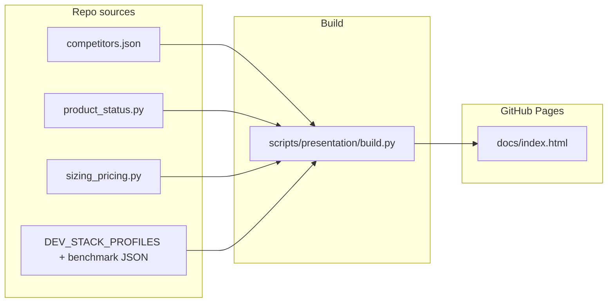
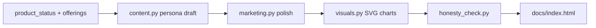
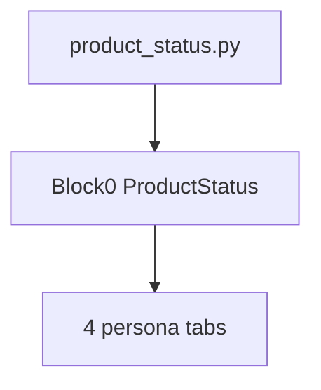
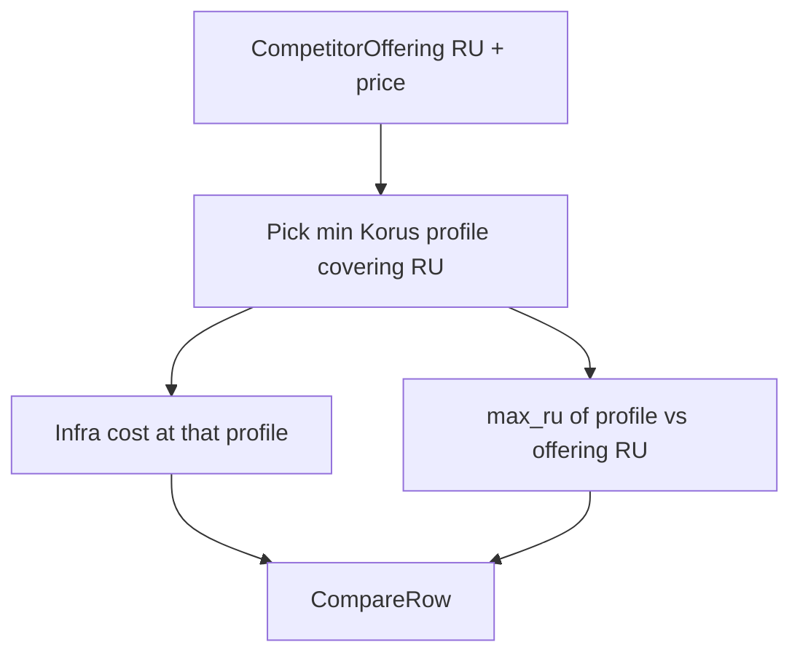

# 4-Tab Product Presentation — Implementation Plan

> **For Claude:** REQUIRED SUB-SKILL: Use superpowers:executing-plans to implement this plan task-by-task. После Task 10 — **обязательные фазы 11–15** (review → refactor → perf → commit → Pages). REQUIRED: @superpowers:verification-before-completion перед каждым «готово».

**Readiness target:** ≥95% — plan self-contained для implement без переделок.

**Definition of Done (весь цикл):**
1. `./gradlew buildIntegrity` green  
2. `python scripts/presentation/build.py` → `docs/index.html`  
3. 3 review-раунда пройдены, findings исправлены  
4. Commit + push (`.\scripts\git-push.ps1`)  
5. GitHub Pages URL работает — **ссылка сообщена пользователю**

**Goal:** Один HTML-файл — визитка Korus Messenger на GitHub Pages: **в начале — честный статус «рабочий прототип, не production»**, затем 4 независимые вкладки с 4 подразделами каждая.

**Architecture:** Гибрид для GitHub Pages: данные и логика в [`scripts/presentation/`](scripts/presentation/), артефакт — self-contained [`docs/index.html`](docs/index.html). Сравнения без якорей — по тарифам конкурентов + headroom Korus. **Цены и параметры конкурентов — только из открытых публичных источников** (§ Open sources policy). **Контент — двухпроходный pipeline:** (1) черновик от лица **профильного специалиста** → (2) **маркетинговая упаковка** (заголовки, SVG, акценты) → **honesty gate** (exit 1 при overclaim).

**Tech Stack:** Python 3 (build + CI validation), vanilla JS (tabs, calculators, wizard), inline SVG для графиков TCO/RAM, GitHub Pages (`/docs` source).

**Публикация (P0 — зафиксировано):**

| Решение | Значение |
|---------|----------|
| **Artifact** | [`docs/index.html`](docs/index.html) — единственная landing-страница GitHub Pages |
| **Pages source** | Branch `main`, folder `/docs` |
| **URL** | `https://<org>.github.io/korus_messenger/` |
| **Остальные MD в `docs/`** | Остаются в репо для разработчиков; с root README — ссылка «[Презентация продукта](docs/index.html)». Не дублировать deck в корень. |
| **Block 0 wording** | «лабораторный dev-стенд» в customer text; **QEMU** — только footnote на tech-вкладке |

**Канонический plan-doc:** [`docs/plans/2026-06-18-four-tab-presentation-deck.md`](docs/plans/2026-06-18-four-tab-presentation-deck.md) (sync с этим файлом при старте implement).

---

## P0 refinements (внесено 2026-06-18)

1. **spec 018 — обязателен** (не optional): contract `deck-acceptance.json` = source of truth для A0–A8.
2. **`competitor_offerings`:** JSON Schema + [`scripts/presentation/METRIC_POLICY.md`](scripts/presentation/METRIC_POLICY.md) — v1 только `registered_users`; concurrent — отдельная строка или skip compare.
3. **Sizing profiles ≠ comparison anchors:** `pilot`/`standard`/`enterprise` — **профили infra**, не точки сравнения; в UI не использовать labels S-10k/E-1M.
4. **Порядок implement:** см. § Execution order ниже (compare/render до marketing SVG).
5. **GitHub Pages path** — см. таблицу выше.

## P1 refinements (2026-06-18 — 95%+)

6. **A3d offerings completeness:** ≥18 rows; tier A products ≥2 `registered_users` each; source URL required.
7. **Footer metadata** from `product_status.py` (DECK_VERSION, BUILD_DATE, PRICE_AS_OF, PLAYWRIGHT).
8. **Meta/SEO** in `<head>` — prototype wording only.
9. **Honesty allowlist** for `#block-0` negation phrases.
10. **`PRICE_SOURCES[]`** in sizing_pricing + sales footnote.
11. **Responsive A9** @640px / 375px.
12. **`README.md`** runbook in `scripts/presentation/`.
13. **`smoke_deck.py`** + **`analyze_deck.py`** with warn/fail thresholds.
14. **Tasks 11–13:** 3 mandatory review rounds before commit.
15. **Task 15:** push + Pages URL to user.
16. **Open sources only:** competitor prices from public URLs; `source_url` required; no fabricated TCO.

### Execution order (canonical — implement + review + ship)

```
── BUILD ──
Task 0  spec 018 + plan-doc sync
Task 1  data layer
Task 1c offerings schema + METRIC_POLICY + README runbook
Task 1b compare_engine
Task 5  compare tables render
Task 2  calculators
Task 3  shell + Block 0 + a11y + responsive
Task 4  persona drafts (content.py)
Task 4b marketing templates + visuals + honesty (allowlist)
Task 6  calculator UI + lazy SVG optional
Task 7  build.py + meta/footer + smoke_deck
Task 8  CI + docs (README, AGENTS, CHANGELOG)
Task 9  Pages prep (workflow or settings doc)
Task 10 acceptance A0–A10

── REVIEW (минимум 3 раунда, fix-all каждый) ──
Task 11 R1: acceptance + honesty + browser smoke + visual QA
Task 12 R2: code refactor (DRY, module boundaries, tests)
Task 13 R3: perf/memory analyze_deck + fix hotspots
Task 14 rebuild + buildIntegrity + commit
Task 15 push + Pages verify + URL пользователю
```





---

## Pipeline контента: специалист → маркетолог → honesty gate

Каждый раздел (вкладка × подраздел §1–§4) генерируется **в два прохода**. Маркетолог **не меняет факты** — только подачу, структуру и визуал.

### Проход 1 — профильный специалист (черновик)

| Вкладка | «Специалист» | Тон и лексика | Ограничения |
|---------|--------------|---------------|-------------|
| **РП / аналитики** | PM / business analyst | метрики, риски, traceability, «что в scope / out of scope» | ссылки на ТЗ, без marketing hype |
| **Техническая** | DevOps + backend dev | стек, compose, порты, sizing, NFR | можно термины; acronym один раз расшифровать |
| **Продажная** | Presales / account | value, TCO, deployment, objection handling | **без** «гарантируем», «production-ready» |
| **Пользовательская** | **Офисный сотрудник** («office level») | **уровень обычного офисного работника**: короткие фразы, «вы», бытовые аналогии («как чат в телефоне, но для работы») | **запрет:** API, JWT, NATS, Solr, mesh, Keycloak, infra; **запрет:** англ. жаргон без перевода |

**Модуль:** [`scripts/presentation/content.py`](scripts/presentation/content.py) — функции `draft_pm_s1()`, `draft_user_s3()`, … возвращают plain HTML fragments из фактов (`product_status`, `compare_engine`, docs).

### Проход 2 — маркетолог (упаковка)

**Модуль:** [`scripts/presentation/marketing.py`](scripts/presentation/marketing.py) — **только layout-шаблоны** (headline wrapper, callout CSS, grid); **не генерирует новый текст** и не вызывает LLM. Весь copy — из `content.py`; marketing лишь оборачивает в `<section class="callout-*">`.

### Визуалы (маркетолог подсвечивает, данные — из engine)

**Модуль:** [`scripts/presentation/visuals.py`](scripts/presentation/visuals.py) — inline SVG, единая палитра deck.

| Место | Диаграмма | Данные | Честность |
|-------|-----------|--------|-----------|
| Block 0 | Donut «состояние функций» (done/partial/planned/out) | `FEATURES[]` | counts = facts |
| РП §1 | Timeline roadmap (eng ✅ / ops ⏸) | ROADMAP + blockers | серые зоны = не готово |
| РП §3 | **Blocker severity list** (не heatmap) | `PRODUCTION_BLOCKERS` + severity tag | без субъективных «вероятностей» |
| Tech §1 | Architecture diagram (слои) | tz_full §5–6 | подпись «логическая схема прототипа» |
| Tech §3 | RAM bar @ RU конкурента + headroom | compare_engine | footnote «оценка по профилю» |
| Sales §1 | 3 deployment cards (on-prem / Cell / pilot) | spec 011 | pilot ≠ production |
| Sales §3 | Horizontal TCO bars по offerings | compare rows | источник цены конкурента в tooltip |
| User §1 | «День с мессенджером» timeline (3–4 шага) | journey draft | без «уже в App Store» |
| User §4 | Feature icons grid + wizard steps | FEATURES done only | partial — пунктир + «скоро/частично» |

**Стиль:** современный B2B deck — generous whitespace, accent green `#22c55e` (Korus), amber для warnings; `prefers-color-scheme`; **без stock photos** (только SVG/CSS).

### Honesty gate (главное условие)

**Модуль:** [`scripts/presentation/honesty_check.py`](scripts/presentation/honesty_check.py) — вызывается из `build.py`, **exit 1** при нарушении.

**Запрещённые паттерны (regex / denylist)** — **кроме** `#block-0` с negation («**не** готов», «**не** production-ready»):

- «production-ready», «готов к промышленной эксплуатации», «enterprise-grade»
- «ФСТЭК сертифицирован», «в реестре отечественного ПО» — без `partial` footnote
- «лучший», «единственный», «№1» — без `[источник]`
- «гарантируем SLA 99.99%»
- User tab: технические токены из denylist (`JWT`, `Keycloak`, `NATS`, …)

**Обязательно в HTML:**

- Block 0 visible; `PRODUCTION_READY = false` reflected in text
- Любой `partial` feature в user/sales визuals — визуально отличим (dashed, «частично»)
- TCO/concurrent: tooltip `source` + `as_of`
- Headroom: всегда с «без изменения цены/мощностей»
- Сноски † для ops-dependent (TLS, E2EE, push)

**Test:** [`scripts/presentation/test_honesty_check.py`](scripts/presentation/test_honesty_check.py) — fixture HTML with banned phrase → fail.

---

## Блок 0 — Статус продукта (над вкладками, всегда виден)

**Расположение:** hero-секция **до** tab-bar; на всех вкладках остаётся сверху (sticky banner или collapsible «Статус» — по умолчанию **развёрнут** при первом открытии).

**Единый источник:** [`scripts/presentation/product_status.py`](scripts/presentation/product_status.py) — восстановить из git HEAD и расширить:

```python
PRODUCT_STAGE = "working_prototype"  # не production
PRODUCT_STAGE_LABEL = "Рабочий прототип"
PRODUCTION_READY = False

PRODUCTION_BLOCKERS: tuple[str, ...] = (
    "Нет промышленного stage/prod стенда (планируется с сентября 2026) — formal load test и ops sign-off отложены",
    "Prod HTTPS/TLS: поставка в Ansible есть, боевые сертификаты и vault — на контуре заказчика",
    "E2EE: инженерная приёмка пройдена; требуется sign-off ИБ перед массовым включением",
    "WebRTC: mesh из чата готов; TURN в prod-контуре — настройка IT заказчика",
    "Web Push: UI/worker готовы; боевые VAPID и проверка на стенде — ops",
    "SSO/LDAP: скрипты и runbook есть; подключение live IdP/AD — ops",
    "Мобильные клиенты iOS/Android — вне текущей поставки",
    "Live-streaming (§28) — в roadmap, не реализован",
)
# FEATURES[] — полный перечень done | partial | planned | out (как в HEAD)
```

### Содержание блока 0

| Элемент | Содержание |
|---------|------------|
| **Заголовок** | Korus Messenger — **рабочий прототип** |
| **Дисклеймер** | Продукт **не готов** к промышленной эксплуатации (production). Демонстрирует архитектуру на **лабораторном dev-стенде** (footnote: QEMU для разработчиков). |
| **Метрики доверия** | Playwright **34/34** (дата), версия deck — без overclaim «production-ready» |
| **§0.1 Блокеры production** | Маркированный список `PRODUCTION_BLOCKERS` (5–8 пунктов, plain language) |
| **§0.2 Реализовано** | Таблица `FEATURES` где `status == done` (+ краткая note) |
| **§0.3 Частично** | `status == partial` — что есть в коде + что осталось для prod |
| **§0.4 Не реализовано / вне scope** | `planned` + `out` |

**Визуал:** предупреждающий banner (`amber`/`orange`), теги статусов: Реализовано / Частично / Запланировано / Вне поставки (из `STATUS_TAG` HEAD).

**Повтор на вкладках:** в §1 каждой вкладки — **одна строка**-ссылка «↑ см. статус прототипа»; полная матрица только в блоке 0 (DRY).



---

## Структура HTML (IA)


| Вкладка              | Аудитория       | Подраздел 1                             | Подраздел 2                              | Подраздел 3                                   | Подраздел 4                                                                |
| -------------------- | --------------- | --------------------------------------- | ---------------------------------------- | --------------------------------------------- | -------------------------------------------------------------------------- |
| **РП / аналитики**   | PM, BA          | Ценность, roadmap, traceability к ТЗ    | Список 11 конкурентов (tier A/B/C)       | Сравнение по **тарифам конкурентов** + headroom Korus | **Калькулятор поддержки:** FTE/SLA × введённый RU                          |
| **Техническая**      | DevOps, dev     | Архитектура, стек, deploy profiles      | Конкуренты (фокус: on-prem, sizing, ops) | Таблица 18 критериев + sizing @ RU конкурента + headroom | **Калькулятор мощностей:** RAM/vCPU/узлы по произвольному RU               |
| **Продажная**        | Sales, presales | Value prop, deployment models, Cells    | Конкуренты (кратко + tier labels)        | TCO-таблицы: **строка = тариф конкурента**, колонки symetric @ его RU | **Калькулятор TCO:** ₽/мес и ₽/год по введённому RU                      |
| **Пользовательская** | End user        | «Зачем корп. мессенджер» простым языком | «Альтернативы» (без жаргона tier)        | Сравнение «удобство» (mobile, calls, search…) | **3 блока:** мастер сценариев + FAQ vs Telegram/WhatsApp + тур по функциям |


**UI:** верхний tab-bar (`data-testid="deck-tab-*"`), sticky sub-nav (§1–§4), hash routing, `@media print` (active tab).

**Responsive (A9):** mobile-first breakpoints; compare tables `overflow-x: auto`; tab bar wrap/stack @640px.

**Deck footer (every page):** `DECK_VERSION | BUILD_DATE | PRICE_AS_OF | offerings as_of max | Playwright N/N`.

**Meta (head):**
```html
<title>Korus Messenger — рабочий прототип</title>
<meta name="description" content="Корпоративный мессенджер, стадия рабочего прототипа. Не production.">
<meta property="og:title" content="Korus Messenger — рабочий прототип">
```

---

## Методология сравнения (без якорей)

**Принцип:** точка сравнения задаёт **конкурент**, не Korus. Якоря S-10k / S-50k / E-1M и производные графики **не используются** ни в примерах, ни в калькуляторах, ни в battle cards.

### Правила

1. **Базовая строка сравнения** = публичный тариф/пакет конкурента: `registered_users` (или concurrent, если так указано вендором), `price_rub`, период (мес/год), `deployment`, `source_url`, `as_of`.
2. **Korus в той же строке** считается ровно на **тех же RU**, что у конкурента (не округляем к «нашим» профилям).
3. **Headroom (запас ёмкости):** если формула sizing показывает, что выбранный профиль Korus на тех же мощностях/стоимости infra выдерживает **больше RU**, чем в тарифе конкурента:
   - в ячейке Korus: основное значение @ RU конкурента;
   - рядом badge: «до **N** рег. пользов. на тех же мощностях, без изменения цены/мощностей»;
   - `N` = `max_ru_at_same_infra(profile, fixed_cost)` из sizing curve.
4. **Не смешивать метрики:** если конкурент публикует concurrent users — сравниваем concurrent; если registered — registered; в footnote явно указать тип.
5. **Нет публичной цены** (КП only, нет открытого прайса) — строка **без TCO compare**; только qualitative + пометка «цена по запросу / нет публичного прайса»; **не выдумывать** цифры.

---

## Open sources policy (конкуренты — только открытые источники)

**Правило:** каждая цифра о конкуренте в deck (цена, RU, лимиты) **обязана** быть воспроизводима из **публично доступного** источника без NDA, внутренних КП и «industry estimates».

### Допустимые источники (`source_type`)

| type | Примеры | TCO compare |
|------|---------|-------------|
| `public_pricing` | Официальный прайс/тариф на сайте вендора (`express.ms`, `pachca.ru`, `loop.ru/pricing`, …) | ✅ если есть ₽ и RU/формула |
| `public_docs` | Публичная документация, FAQ, knowledge base с явной ценой | ✅ |
| `public_press` | Пресс-релиз / новость вендора с цифрами (редко) | ✅ с осторожностью + `as_of` |
| `no_public_price` | Только «по КП», enterprise sales — **нет** открытой цены | ❌ TCO; только feature row |

### Обязательные поля offering (расширение schema)

```json
{
  "source": "3 000 ₽/рег. пользов./год — Enterprise on-prem",
  "source_url": "https://express.ms/...",
  "source_type": "public_pricing",
  "source_accessed_at": "2026-06-15",
  "price_is_public": true
}
```

- **`source_url`** — HTTPS URL страницы, где читатель может **сам** проверить (CI: regex `^https://`).
- **`source`** — краткая цитата/формула **как на сайте** (не пересказ «от себя»).
- **`price_is_public: false`** → `compare_engine` **skip** TCO column; UI: «нет публичного прайса».

### Запрещено

- Оценочные TCO без пометки и без публичной формулы
- Цены «из памяти», форумов, неофициальных агрегаторов без ссылки на первоисточник
- Смешивание tier/скидок без указания условий из source
- Автоскraping в v1 (ручной JSON + `as_of`; см. Out of scope)

### Библиография для implementer

- [`specs/012-competitor-presentation-spider/research.md`](specs/012-competitor-presentation-spider/research.md) — стартовый список URL (верифицировать при Task 1)
- [`scripts/presentation/data/open_sources_bibliography.json`](scripts/presentation/data/open_sources_bibliography.json) — **новый** реестр `{ product_id, urls[], last_verified }`

### CI / honesty

```python
def test_every_offering_has_https_source_url():
    for o in load_offerings():
        assert o["source_url"].startswith("https://"), o["id"]
        if o.get("price_is_public", True):
            assert o["source_type"] in ("public_pricing", "public_docs", "public_press")

def test_no_public_price_skips_tco():
    row = build_compare_row(offering_by_id("loop-enterprise-kp"))
    assert row.competitor_total_yearly_rub is None
```

**UI:** в sales §3 каждая TCO-строка — кликабельный `source_url` + `source_accessed_at`; footnote «данные конкурентов — открытые источники, см. ссылки».

---

```json
{
  "competitor_offerings": [
    {
      "id": "express-onprem-10k",
      "product_id": "express",
      "label": "Enterprise on-prem",
      "metric": "registered_users",
      "value": 10000,
      "price_rub": 30000000,
      "price_period": "year",
      "deployment": "on_prem",
      "source": "3 000 ₽/рег. пользов./год — Enterprise on-prem",
      "source_url": "https://express.ms/pricing",
      "source_type": "public_pricing",
      "source_accessed_at": "2026-06-15",
      "price_is_public": true,
    },
    {
      "id": "loop-pro-500",
      "product_id": "loop",
      "label": "Pro",
      "metric": "registered_users",
      "value": 500,
      "price_rub": 199,
      "price_period": "month",
      "deployment": "saas",
      "source": "199 ₽/мес — тариф Pro",
      "source_url": "https://loop.ru/pricing",
      "source_type": "public_pricing",
      "source_accessed_at": "2026-06-15",
      "price_is_public": true
  ],
  "korus_sizing": {
    "profiles": [
      { "id": "pilot", "ram_gb": 14, "max_registered_users": 10000 },
      { "id": "standard", "ram_gb": 140, "max_registered_users": 100000 },
      { "id": "enterprise", "ram_gb": 450, "max_registered_users": 500000 }
    ]
  }
}
```

> **Терминология:** `profiles` — **профили infra Korus** (минимальный стек для диапазона RU). Это **не** якоря сравнения. Headroom: `max_registered_users` профиля vs RU строки конкурента.

### Compare engine (новый модуль)

[`scripts/presentation/compare_engine.py`](scripts/presentation/compare_engine.py):

```python
@dataclass
class CompareRow:
    offering: CompetitorOffering
    competitor_total_yearly_rub: int
    korus_infra_yearly_rub: int
    korus_at_competitor_ru: int          # = offering.value
    korus_headroom_ru: int | None        # > offering.value if same infra
    headroom_note: str                   # «без изменения цены/мощностей»

def build_compare_row(offering: CompetitorOffering) -> CompareRow: ...
def render_headroom_badge(row: CompareRow) -> str: ...
```



### UI для headroom

- Sales tab §3: колонка Korus — «₽/год @ 10 000» + зелёный chip «до 100 000 на тех же мощностях*»
- Tech tab §3: «RAM 140 ГБ @ 10 000» + chip «до 100 000 рег. без добавления узлов*»
- Сноска * единая в methodology block внизу вкладки

### Что удалить из legacy HEAD

- `KORUS_ANCHORS`, `competitors_at_anchor()`, графики `@10k/@100k`, `render_fig_tco_s50k_svg`
- Тест `test_anchors_cover_five_tiers` → заменить на `test_compare_uses_competitor_ru`

---

## Источники данных (восстановить из HEAD)


| Файл HEAD                                                                                              | Новое место                                                                                | Назначение                                                                 |
| ------------------------------------------------------------------------------------------------------ | ------------------------------------------------------------------------------------------ | -------------------------------------------------------------------------- |
| `scripts/competitors/registry.json`                                                                    | [`scripts/presentation/data/competitors.json`](scripts/presentation/data/competitors.json) | criteria, products, pros/cons — **без** `pricing_constants` под якоря       |
| *(новое)* | [`scripts/presentation/data/competitor_offerings.json`](scripts/presentation/data/competitor_offerings.json) | Тарифы конкурентов — **только open sources** + `source_url` |
| *(новое)* | [`scripts/presentation/data/open_sources_bibliography.json`](scripts/presentation/data/open_sources_bibliography.json) | URL прайсов/доков по продуктам, `last_verified` |
| `scripts/product_status.py`                                                                            | [`scripts/presentation/product_status.py`](scripts/presentation/product_status.py)         | **Block 0:** `PRODUCTION_BLOCKERS`, `FEATURES[]`, `STATUS_TAG`, Playwright gate |
| `scripts/tz_product_pricing.py` + `tz_product_sizing.py`                                                | [`scripts/presentation/sizing_pricing.py`](scripts/presentation/sizing_pricing.py)         | Ставки infra, **profile curves** (не KORUS_ANCHORS)                        |
| [`docs/DEV_STACK_PROFILES.md`](docs/DEV_STACK_PROFILES.md)                                             | excerpt в build                                                                            | Pilot/Standard/Enterprise narrative                                        |
| [`docs/benchmarks/qemu-nt-baseline-2026-06-15.json`](docs/benchmarks/qemu-nt-baseline-2026-06-15.json) | tech tab footnote                                                                          | Lab baseline, not stage                                                    |


**Политика честности:** partial/planned + ops footnotes (как в удалённом `PRODUCT_PRESENTATION.md`); без overclaim ФСТЭК/реестр (spec 014).

---

## CI / buildIntegrity

[`scripts/run_python_verification.py`](scripts/run_python_verification.py) сейчас **сломан** (вызывает удалённый `test_competitor_products.py`). Заменить на [`scripts/presentation/test_data.py`](scripts/presentation/test_data.py): schema `competitor_offerings.json`, каждый offering имеет `value`+`price_rub`+`source`; compare_engine smoke; calculator outputs без якорей.

---

## Task 0: Spec-kit scaffold (**обязательно**)

**Files:**

- Create: [`specs/018-product-deck/spec.md`](specs/018-product-deck/spec.md), `plan.md`, `tasks.md`
- Create: [`specs/018-product-deck/contracts/deck-acceptance.json`](specs/018-product-deck/contracts/deck-acceptance.json) — mirrors A0–A8
- Create: [`docs/plans/2026-06-18-four-tab-presentation-deck.md`](docs/plans/2026-06-18-four-tab-presentation-deck.md) — sync from this plan

**Step 1:** `/speckit.specify` — 4 вкладки, Block 0, offerings policy, GitHub Pages.

**Step 2:** Commit spec + plan-doc.

---

## Task 1: Data layer (без якорей)

**Files:**

- Create: [`scripts/presentation/data/competitors.json`](scripts/presentation/data/competitors.json) — criteria + products (из HEAD, очистить anchor refs)
- Create: [`scripts/presentation/data/competitor_offerings.json`](scripts/presentation/data/competitor_offerings.json) — **новый** список тарифов
- Create: [`scripts/presentation/product_status.py`](scripts/presentation/product_status.py)
- Create: [`scripts/presentation/sizing_pricing.py`](scripts/presentation/sizing_pricing.py) — `pick_profile(ru)`, `infra_cost(profile)`, `PRICE_SOURCES[]`, `PRICE_AS_OF`
- Create: [`scripts/presentation/README.md`](scripts/presentation/README.md) — rebuild runbook (см. Task 1c)

**Step 1: Write the failing test**

```python
# scripts/presentation/test_data.py
def test_competitors_has_eleven_products():
    data = load_competitors()
    assert len(data["products"]) == 11

def test_offerings_have_competitor_stated_ru():
    offerings = load_offerings()
    assert all(o["value"] > 0 and o["source"] for o in offerings)

def test_no_anchor_ids_in_data():
    text = Path("scripts/presentation/data").read_text(encoding="utf-8")
    assert "S-10k" not in text and "KORUS_ANCHORS" not in text
```

**Step 2: Run test — expect FAIL**

**Step 3: Populate `competitor_offerings.json`** — минимум 18 строк; **каждая** с верифицированным `source_url` (открытый прайс/док):

| product | open source (verify at implement) |
|---------|-----------------------------------|
| eXpress | express.ms — публичная формула ₽/user/yr |
| Пачка | pachca.ru/pricing |
| VK Teams | teams.vk.com или актуальный прайс |
| Loop | loop.ru/pricing |
| Compass | getcompass.ru/pricing |
| TrueConf | trueconf.ru — entry server price |
| … tier B/C | public docs only if no price → `price_is_public: false` |

**Step 3b:** Fill `open_sources_bibliography.json` from spec 012 `research.md`; hand-check URLs return 200 (manual or `curl -sI` log in review-R1).

**Step 4: Run test — expect PASS**

**Step 5: Commit**

---

## Task 1c: Offerings schema + metric policy (P0)

**Files:**

- Create: [`scripts/presentation/data/competitor_offerings.schema.json`](scripts/presentation/data/competitor_offerings.schema.json)
- Create: [`scripts/presentation/METRIC_POLICY.md`](scripts/presentation/METRIC_POLICY.md)

**Schema required fields:** `id`, `product_id`, `label`, `metric`, `value`, `price_rub`, `price_period`, `deployment`, `source`, **`source_url`**, **`source_type`**, **`source_accessed_at`**, **`price_is_public`**

**METRIC_POLICY v1:**

| Правило | Действие |
|---------|----------|
| `metric == registered_users` | TCO compare + headroom **только if** `price_is_public` |
| `metric == concurrent_users` | TCO compare **запрещён** v1 |
| **`source_url` не HTTPS** | offering invalid (CI fail) |
| **`price_is_public: false`** | qualitative only; no competitor ₽ in table |
| Нет открытого источника | **не включать** offering в TCO; можно в feature matrix |
| Owner обновлений | re-verify `source_url` + bump `source_accessed_at` + CHANGELOG |

**Test:** `test_offerings_validate_against_schema()` + `test_offerings_completeness_a3d()`:

```python
def test_offerings_completeness_a3d():
    o = load_offerings()
    assert len(o) >= 18
    tier_a = {"express", "pachka", "vk_saas", "korus"}  # + others from competitors.json tier A
    for pid in tier_a:
        rows = [x for x in o if x["product_id"] == pid and x["metric"] == "registered_users"]
        assert len(rows) >= 2, pid
```

**README runbook** (`scripts/presentation/README.md`):
```text
# Rebuild deck
python scripts/presentation/build.py
python scripts/presentation/smoke_deck.py
python scripts/presentation/analyze_deck.py

When to rebuild: FEATURES change, offerings as_of, Playwright count, pricing constants.
Commit: docs/index.html + scripts/presentation/* together.
```

---

## Task 1b: Compare engine

**Files:**

- Create: [`scripts/presentation/compare_engine.py`](scripts/presentation/compare_engine.py)
- Test: [`scripts/presentation/test_compare_engine.py`](scripts/presentation/test_compare_engine.py)

**Step 1: Failing tests**

```python
def test_korus_matches_competitor_ru_not_anchor():
    offering = offering_by_id("express-onprem-10k")  # value=10000
    row = build_compare_row(offering)
    assert row.korus_at_competitor_ru == 10_000

def test_headroom_when_profile_allows_more():
    offering = offering_by_id("loop-pro-500")  # 500 users, small tier
    row = build_compare_row(offering)
    assert row.korus_headroom_ru > 500
    assert "без изменения" in row.headroom_note

def test_no_headroom_when_at_profile_cap():
    offering = offering_by_id("express-onprem-100k")
    row = build_compare_row(offering)
    assert row.korus_headroom_ru is None or row.korus_headroom_ru == 100_000
```

**Step 2–4:** Implement `pick_profile`, headroom logic, yearly normalization (month→year).

**Step 5: Commit**

---

## Task 5: Competitors — subsections 2–3 (**до Task 4/4b**)

> **P0 order:** compare tables must exist before marketing SVG (Task 4b).

**Files:**

- Modify: [`scripts/presentation/render.py`](scripts/presentation/render.py) — `render_competitor_list()`, `render_compare_table()`

**Subsection 2:** список продуктов + «публичные тарифы: N строк в offerings».

**Subsection 3:** TCO/sizing table — **одна строка на `competitor_offering`** (только `registered_users`):

| Конкурент / тариф | Их RU | Их ₽/год | Korus ₽/год @ их RU | Headroom |

- Feature matrix (18 criteria) — qualitative, без RU
- User tab — 8 plain criteria; TCO hidden or «упрощённо» без цифр

**Step:** Test each row: `korus_at_competitor_ru == offering.value`. Commit.

---

## Task 2: Calculator modules (pure Python, unit-tested)

**Files:**

- Create: `[scripts/presentation/calculators.py](scripts/presentation/calculators.py)`
- Test: `[scripts/presentation/test_calculators.py](scripts/presentation/test_calculators.py)`

**Step 1: Failing tests for 4 calculators** (ввод — **произвольный RU**, не якорь)

```python
def test_sales_tco_monthly_at_arbitrary_ru():
    r = sales_tco(registered_users=7_500, profile="auto", deployment="on_prem")
    assert r.monthly_rub > 0
    assert r.profile_picked  # min profile covering 7500

def test_tech_capacity_at_competitor_ru():
    r = tech_capacity(registered_users=500)  # e.g. Loop Pro tier
    assert r.total_ram_gb >= 14
    assert r.headroom_ru >= 500

def test_support_cost_scales_with_ru():
    r = support_cost(registered_users=12_000, sla="business", include_updates=True)
    assert r.fte_monthly > 0
```

**Step 2–4:** Implement minimal formulas (reuse constants from `sizing_pricing.py`; support model: базовые FTE коэффициенты из таблицы в plan appendix).

**Support calculator model** — непрерывная шкала по RU (без якорей):

| RU | Базовый FTE (8×5) | + updates | + SLA 24×7 multiplier |
|----|-------------------|-----------|------------------------|
| формула | `0.15 + ru/80_000` (cap 4.0) | +0.1…0.8 step | ×2.5 |

**Step 5: Commit**

---

## Task 3: HTML template + tab shell

**Files:**

- Create: `[scripts/presentation/templates/deck.html.j2](scripts/presentation/templates/deck.html.j2)` (или f-string builder без Jinja2 — YAGNI: plain Python string templates)
- Create: `[scripts/presentation/render.py](scripts/presentation/render.py)`

**Step 1:** Static HTML prototype with **Block 0 hero** + 4 tabs, empty sections, vanilla JS tab switch.

**Step 1b:** Render Block 0 from `product_status.py`:
- `render_product_status_hero()` → disclaimer + blockers + 4 feature tables
- Test: `test_hero_lists_all_features`, `test_production_ready_is_false`

**Step 2:** Manual open in browser — hero visible, tabs switch, hash updates.

**Step 3:** Embed shared CSS; **a11y:** `role="tablist"`, keyboard ←/→, focus ring, contrast ≥4.5:1.

**Step 3b:** **Responsive A9:** `@media (max-width: 640px)` — stacked/wrap tabs, `.compare-table { overflow-x: auto }`, min-height touch targets 44px.

**Step 4: Commit**

---

## Task 4: Persona drafts (§1–§3, все вкладки)

**Files:**

- Create: [`scripts/presentation/content.py`](scripts/presentation/content.py) — `PERSONA_VOICE` + `draft_*()` per tab×subsection
- Test: [`scripts/presentation/test_content.py`](scripts/presentation/test_content.py)

**Step 1: Voice tests**

```python
def test_user_tab_no_technical_jargon():
    html = draft_user_s1()
    for token in ("JWT", "Keycloak", "NATS", "Solr", "mesh"):
        assert token.lower() not in html.lower()

def test_user_tab_reading_level_short_sentences():
    html = draft_user_s1()
    assert html.count(".") >= 3  # multiple short sentences
```

**Step 2:** Draft §1–§3 for all 4 tabs from specialist POV (sources unchanged: multi-stakeholder, tz_full, spec 011).

**Step 3:** User tab — переписать все §1–§4 **для офисного сотрудника**: «написать коллеге», «найти файл», «позвонить из чата»; FAQ vs Telegram — **факты** (корп. данные, audit), не FUD.

**Step 4: Commit** `feat(presentation): persona content drafts`

---

## Task 4b: Marketing pass + visuals

**Files:**

- Create: [`scripts/presentation/marketing.py`](scripts/presentation/marketing.py) — `polish_section(draft_html, persona)`
- Create: [`scripts/presentation/visuals.py`](scripts/presentation/visuals.py) — SVG renderers listed above
- Create: [`scripts/presentation/honesty_check.py`](scripts/presentation/honesty_check.py)

**Step 1:** `wrap_section(draft_html, template_id)` — CSS/layout only.

**Step 2:** Wire visuals into `render.py` (compare data from Task 5).

**Step 3:** Run honesty_check — green (incl. allowlist `#block-0` negation).

**Step 3b (optional perf):** lazy-render SVG: `data-lazy-svg` sections render on first tab activate.

**Step 4: Commit**

---

## Task 6: Calculators UI (subsection 4)

**Files:**

- Modify: `[scripts/presentation/render.py](scripts/presentation/render.py)` — embed calculator HTML + JS
- JS reads precomputed coefficient tables from inline `<script type="application/json" id="deck-data">`

**Per tab:**

1. **Sales:** input RU (number) + deployment → ₽/мес, ₽/год; optional «сравнить с тарифом» dropdown из offerings
2. **Tech:** input RU → RAM/vCPU/nodes + headroom chip if profile max > input
3. **РП:** RU + SLA + checkboxes → FTE + ₽/мес
4. **User:** wizard + FAQ + tour (без TCO)

**Step:** Manual test all 4 calculators in browser. Commit.

---

## Task 7: Build script + output

**Files:**

- Create: [`scripts/presentation/build.py`](scripts/presentation/build.py)
- Create: [`scripts/presentation/smoke_deck.py`](scripts/presentation/smoke_deck.py)
- Create: [`scripts/presentation/analyze_deck.py`](scripts/presentation/analyze_deck.py)
- Output: [`docs/index.html`](docs/index.html)

**Step 1:**

```powershell
python scripts/presentation/build.py
python scripts/presentation/smoke_deck.py
python scripts/presentation/analyze_deck.py
```

**build.py emits:** meta tags, footer from `product_status.py`, inline `#deck-data` JSON.

**Post-build checks:**
1. `honesty_check.py` — exit 0 (allowlist block-0)
2. «рабочий прототип» present
3. `html_size_mb` — warn >1.5 MB, **fail >3 MB**
4. User tab jargon denylist
5. Schema-validate `#deck-data`
6. `smoke_deck.py` — exit 0

**analyze_deck.py thresholds:**

| Metric | Warn | Fail |
|--------|------|------|
| file_size_mb | 1.5 | 3.0 |
| inline_svg_count | 25 | 40 |
| deck-data bytes | 200 KB | 500 KB |
| estimated_dom_nodes | 8000 | 15000 |

**Step 2: Commit** generated HTML + scripts.

---

## Task 7b: Agent self-review checklist (Task 10b)

**Before Task 11**, agent fills (in commit message body or `docs/plans/deck-review-R1.md`):

- [ ] Block 0: прототип, не production — visible above fold
- [ ] User tab: прочитать вслух §1 — понятно non-dev?
- [ ] Sales §3: каждая TCO row has source tooltip
- [ ] Headroom chips have «без изменения цены/мощностей»
- [ ] Mobile 375px: tabs usable (screenshot or browser note)
- [ ] No banned phrases outside block-0 negation

---

## Task 8: CI gate + docs cleanup

**Files:**

- Modify: [`scripts/run_python_verification.py`](scripts/run_python_verification.py) — all `scripts/presentation/test_*.py` + smoke (fast parse only)
- Modify: [`docs/DEV_STACK_PROFILES.md`](docs/DEV_STACK_PROFILES.md), [`docs/ROADMAP_EPICS.md`](docs/ROADMAP_EPICS.md)
- Modify: [`README.md`](README.md) — badge/link «Презентация продукта» → Pages URL placeholder
- Modify: [`AGENTS.md`](AGENTS.md) — rebuild deck command + `scripts/presentation/README.md`
- Modify: [`CHANGELOG.md`](CHANGELOG.md)
- Modify: specs 010/012/014 README one-liner → `docs/index.html` or archived

**Step:**

```powershell
./gradlew buildIntegrity
```

Expected: PASS (Python tests + existing gates).

**Commit.**

---

## Task 9: GitHub Pages enablement

**Files:**

- Create: [`.github/workflows/pages-deck.yml`](.github/workflows/pages-deck.yml) — optional smoke on push when `docs/index.html` changes

**Settings:** Repo → Pages → Branch `main`, folder `/docs`

**URL:** `https://<github_owner>.github.io/korus_messenger/` (owner from `git remote get-url origin` at Task 15)

---

## Task 10: Acceptance checklist (A0–A10)

| ID | Criterion |
|----|-----------|
| A0 | Block 0: прототип, не production + blockers + feature matrix |
| A0b | honesty_check green + block-0 allowlist |
| A0c | User tab office-level, no jargon denylist |
| A0d | ≥1 SVG per persona tab |
| A1 | `docs/index.html` offline, no external fetch |
| A2 | 4 tabs × 4 subsections |
| A3 | compare via offerings, no S-*/E-* anchors |
| A3b | headroom badge when profile max > competitor RU |
| A3c | offerings JSON Schema valid |
| A3d | ≥18 offerings; tier A ≥2 rows each |
| A3e | Every TCO row: `source_url` HTTPS; `price_is_public` or skip TCO |
| A4 | 4 calculators arbitrary RU |
| A5 | User wizard + FAQ + tour |
| A6 | partial/ops footnotes † |
| A7 | `buildIntegrity` green |
| A8 | Pages URL loads or enable instructions documented |
| A9 | usable @375px width |
| A10 | footer metadata matches product_status.py |

---

## Task 11: Review Round 1 — Acceptance & visual QA

**REQUIRED:** @superpowers:verification-before-completion

1. Run A0–A10; log gaps → [`docs/plans/deck-review-R1.md`](docs/plans/deck-review-R1.md)
2. Browser: all tabs, all calculators, Block 0 above fold
3. Visual: contrast, SVG, amber warnings
4. **Fix all findings** → rebuild → smoke + analyze green
5. **Gate:** R1 log empty before Task 12

---

## Task 12: Review Round 2 — Code refactor

**Checklist → [`docs/plans/deck-review-R2.md`](docs/plans/deck-review-R2.md):**

- [ ] Single source for status/pricing/offerings
- [ ] No duplicate compare logic (render vs calculators)
- [ ] `render.py` split if >400 lines
- [ ] Type hints on compare_engine, calculators public API
- [ ] `./gradlew buildIntegrity` after refactor
- [ ] **Fix all before Task 13**

---

## Task 13: Review Round 3 — Performance & memory

**Run:**
```powershell
python scripts/presentation/analyze_deck.py --verbose
python scripts/presentation/smoke_deck.py
```

**Fix if needed:** reuse SVG `<defs>`, trim `#deck-data`, lazy SVG on tab activate, defer user tour JS.

**Log → [`docs/plans/deck-review-R3.md`](docs/plans/deck-review-R3.md). Fix all before Task 14.**

---

## Task 14: Final build & commit

```powershell
python scripts/presentation/build.py
python scripts/presentation/smoke_deck.py
python scripts/presentation/analyze_deck.py
./gradlew buildIntegrity
```

```bash
git add scripts/presentation/ docs/index.html docs/plans/ specs/018-product-deck/ README.md AGENTS.md CHANGELOG.md
git commit -m "$(cat <<'EOF'
feat(presentation): 4-tab product deck for GitHub Pages

Self-contained docs/index.html with prototype status, competitor-aligned
compare, 4 persona tabs, honesty gate, and review fixes.
EOF
)"
```

---

## Task 15: Push & GitHub Pages — URL пользователю

```powershell
.\scripts\git-push.ps1
```

Verify (replace OWNER):
```powershell
curl -sI https://OWNER.github.io/korus_messenger/
```

**Deliver to user:**
- Live URL (or Settings instructions if 404)
- Local: `docs/index.html`
- Rebuild: `python scripts/presentation/build.py`

---

## Module map (implementer reference — не менять границы без ADR)

| Module | Responsibility | Must NOT |
|--------|----------------|----------|
| `product_status.py` | FEATURES, blockers, deck footer constants | pricing math |
| `sizing_pricing.py` | profiles, infra ₽, PRICE_SOURCES | HTML |
| `data/*.json` | competitors, offerings | business logic |
| `compare_engine.py` | CompareRow, headroom | HTML |
| `calculators.py` | 4 calc pure functions | HTML |
| `content.py` | persona draft copy | layout/CSS |
| `marketing.py` | wrap templates only | new facts |
| `visuals.py` | SVG from data | hardcoded numbers |
| `render.py` | assemble sections | duplicate compare math |
| `honesty_check.py` | denylist + allowlist | modify HTML |
| `build.py` | orchestrate + validate | inline business rules |

---

## Out of scope (YAGNI)

- Якоря S-10k…E-1M, `KORUS_ANCHORS`, графики «@10k/@100k»
- Восстановление 6 отдельных `competitor_comparison_*.html`
- Автопарсинг / scraping прайсов конкурентов (v1 — ручной JSON из open URLs)
- Оценочные TCO конкурентов без `price_is_public: false`
- i18n (только RU)
- Live-server ops tasks (spec 015)

## Risks

- **Broken links** in specs 010/012/014 → pointer in Task 8
- **Stale offerings** — footer `OFFERINGS_MAX_AS_OF`
- **Pages not enabled** — Task 15 fallback instructions
- **Push without Pages** — user still has `docs/index.html` local

---

## Plan readiness: **~96%**

Оставшийся 4% — runtime unknowns (GitHub owner, Pages admin access) закрываются в Task 15.

**Canonical plan:** [`docs/plans/2026-06-18-four-tab-presentation-deck.md`](docs/plans/2026-06-18-four-tab-presentation-deck.md) — sync at Task 0.

**Execute:** say **«execute»** / **«начинай»** — agent runs Tasks 0→15 in order, 3 review rounds, commit, push, Pages URL.