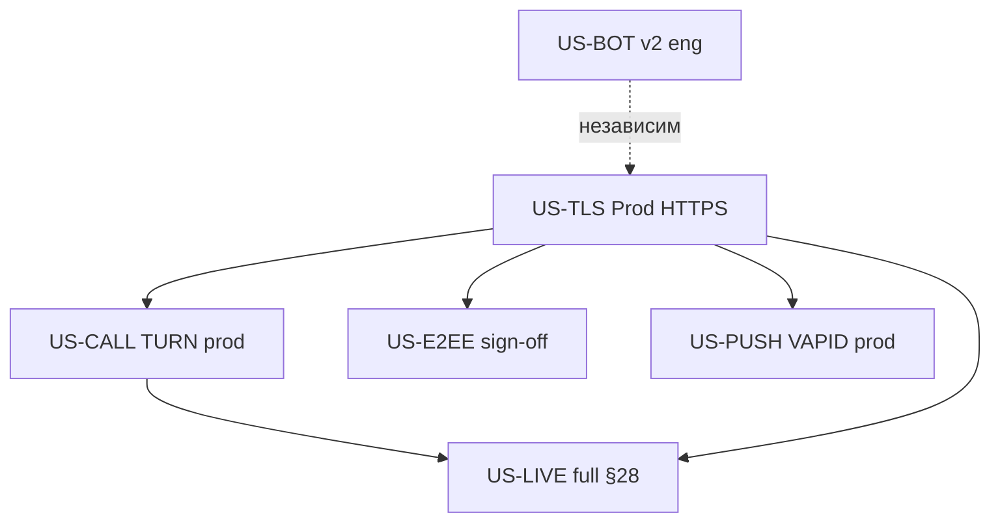
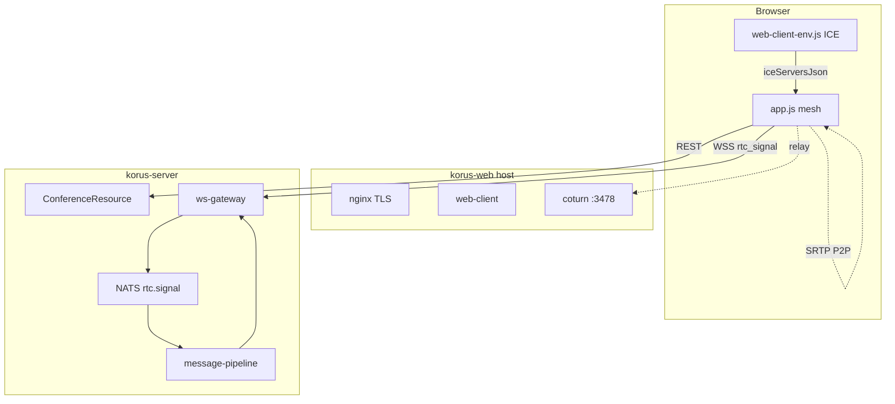
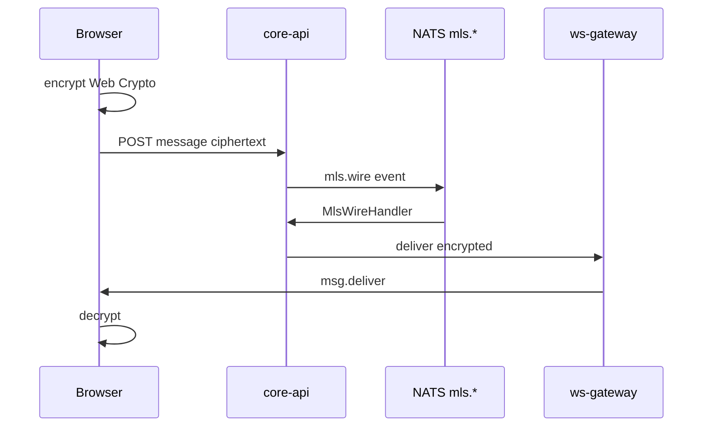
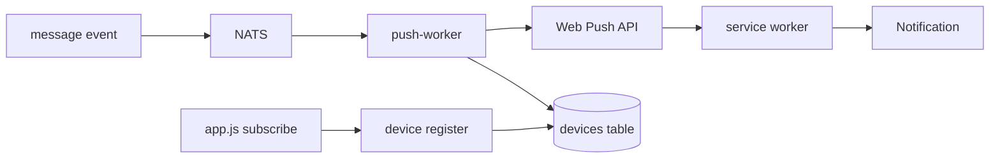
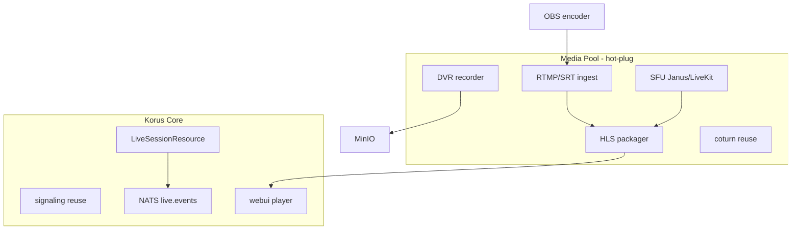

# Spec 010 — Design: Multi-Stakeholder Specification (§4 «Частично» + «Запланировано»)

**Parent spec:** [`../spec.md`](../spec.md)  
**Spec-kit ID:** `010-presentation-gaps-closure`  
**ID:** `SPEC-PRES-GAPS-001`  
**Версия:** 1.0  
**Дата:** 2026-06-16  
**Статус:** `draft` — мульти-ролевая спецификация для согласования  
**Источники:** [`docs/PRODUCT_PRESENTATION.md`](../../../docs/PRODUCT_PRESENTATION.md) §4, [`tz_full.html`](../../../tz_full.html) §7–§29, [`scripts/product_status.py`](../../../scripts/product_status.py)  
**Связанные specs:** 007 (ops TLS), 009 (Bot MVP closed), **012-competitor-presentation-spider** (sales HTML), **013-live-streaming** (US6 implementation), **011-korus-cloud-platform** (hosted Cells)  
**Plan:** [`.cursor/plans/partial_planned_features_4a58849b.plan.md`](../../../.cursor/plans/partial_planned_features_4a58849b.plan.md)

---

## 1. Цель и границы

### 1.1 Цель

Довести шесть доменов §4 продуктовой презентации до согласованного состояния:

| ID | Домен | Текущий статус | Целевой статус |
|----|-------|----------------|----------------|
| US-CALL | Звонки | Частично | Реализовано |
| US-E2EE | E2EE | Частично | Реализовано |
| US-PUSH | Push / PWA | Частично | Реализовано |
| US-BOT | Bot API | Частично | Реализовано (L2) |
| US-TLS | Prod HTTPS | Частично | Реализовано |
| US-LIVE | Live-streaming | Запланировано | Реализовано (full §28) |

### 1.2 Вне scope

- Мобильные клиенты iOS/Android (вне репозитория)
- SFU для звонков >20 участников (отдельный epic, CALL-7)
- E2EE Phase 3 (full OpenMLS, external interop)
- SSO/LDAP (отдельный roadmap §12)

### 1.3 Ограничение среды

**Stage/prod host не раньше сентября 2026.** До этого acceptance — только QEMU (`127.0.0.1:18080` / `:19088`).

### 1.4 Формат проработки по ролям

Каждый блок US-* содержит секции:

| Секция | Роль | Содержание |
|--------|------|------------|
| §A | Аналитик | Traceability, FR, AC, данные, edge cases |
| §B | Постановщик | User stories, приоритет, метрики, решения |
| §C | Архитектор | Компоненты, потоки, ADR, NFR, риски |
| §D | Программист | Tasks, файлы, API, оценки |
| §E | Тестировщик | Стратегия, smokes, Playwright, manual matrix |
| §F | Пользователь | Journey, боли, UX-требования |
| §G | Маркетолог | Messaging, limits, demo, конкуренты |

---

## 2. Глобальные зависимости



| Фаза | Срок | US-* | Владелец |
|------|------|------|----------|
| A | сейчас – авг 2026 | CALL eng, PUSH eng, BOT hardening | Engineering |
| B | сен 2026+ | TLS, E2EE ops, CALL ops, PUSH ops | Ops + Security |
| C | Q4 2026 | BOT v2 | Engineering |
| D | 12–18 мес. | LIVE full §28 | Media + Eng |

---

# US-CALL: Звонки (WebRTC mesh + TURN)

**Presentation:** §4 «Частично (TURN за NAT)» · **TZ:** §29 · **КУ:** КУ-08

---

## §A Аналитик

### Traceability

| Источник | Требование | Покрытие |
|----------|------------|----------|
| TZ §29 | 1:1 аудио/видео | ✅ mesh |
| TZ §29 | Группа до 20 | ✅ mesh limit |
| TZ §29 | Screen share 720p | ✅ getDisplayMedia |
| TZ §29 | Аудио↔видео switch | ✅ partial renegotiate |
| §4 презентация | TURN за NAT | ⏳ ops |
| КУ-08 | Звонок из группы + screen share | ⏳ NAT cases |

### Functional Requirements

- **FR-CALL-001:** Система MUST создавать конференцию из чата через REST `POST /v1/chats/{chatId}/conferences`.
- **FR-CALL-002:** Signaling MUST проходить через WS envelope `type=rtc_signal` (offer/answer/candidate/hangup).
- **FR-CALL-003:** Mesh WebRTC MUST поддерживать до 20 участников в одной комнате.
- **FR-CALL-004:** Screen share MUST передаваться отдельным video track с renegotiation.
- **FR-CALL-005:** ICE servers MUST включать STUN и TURN с time-limited credentials на prod.
- **FR-CALL-006:** При ICE failure UI MUST показывать локализованное сообщение с рекомендацией обратиться к IT.
- **FR-CALL-007:** Ops MUST обеспечить coturn `--external-ip` и firewall relay ports 10000–10100/udp.

### Key Entities

- **Conference:** id, chat_id, room_slug, status, created_by, started_at, ended_at
- **ConferenceParticipant:** conference_id, user_id, joined_at, left_at
- **RtcSignalEvent:** chat_id, from_user_id, signal_type, payload (SDP/ICE)

### Acceptance Criteria

| AC | Given | When | Then |
|----|-------|------|------|
| AC-CALL-1 | Два пользователя за symmetric NAT, TURN prod настроен | A звонит B из чата | Аудио/видео установлено, ICE candidate type relay |
| AC-CALL-2 | Активный mesh call | A включает screen share | B видит второй video (displaySurface) |
| AC-CALL-3 | Prod FQDN | `smoke-turn.ps1 -TurnHost <domain>` | Exit 0 |
| AC-CALL-4 | ICE failed | Timeout 30s | UI показывает i18n ошибку, не silent hang |

### Edge Cases

- Участник без камеры — только audio track
- Jitsi fallback при `callMode=jitsi` — внешний meet.jit.si (privacy concern для gov)
- 21-й участник — отказ с понятным сообщением (до SFU)
- TURN secret rotation — web redeploy для новых ICE credentials

---

## §B Постановщик

### User Stories

**US-CALL-P1 (P1):** Как сотрудник, я хочу начать видеозвонок из группового чата, чтобы обсудить вопрос без Zoom.

- **Independent test:** Playwright `conference-rtc.spec.ts` + manual 2-browser LAN
- **Priority:** P1 — core collaboration

**US-CALL-P2 (P1):** Как сотрудник за корпоративным NAT, я хочу стабильное соединение через TURN, чтобы звонок не зависал.

- **Independent test:** `smoke-turn.ps1` + manual hotspot NAT matrix
- **Priority:** P1 — блокирует «Реализовано» в §4

**US-CALL-P3 (P2):** Как участник, я хочу показать экран, чтобы продемонстрировать документ.

- **Independent test:** manual Chrome screen share
- **Priority:** P2 — уже реализовано, нужен regression

### Решения PO (требуют фиксации)

| # | Вопрос | Варианты | Рекомендация |
|---|--------|----------|--------------|
| PO-CALL-1 | Jitsi fallback после TURN prod | оставить / deprecate / self-host Jitsi | оставить как opt-in через admin config |
| PO-CALL-2 | `turns:` 5349 в MVP | да / нет | да для enterprise firewall |
| PO-CALL-3 | UX при ICE failed | toast / modal / help link | modal + ссылка на IT runbook |

### Метрики успеха

- **SC-CALL-1:** ≥95% звонков same-LAN успешны (baseline QEMU)
- **SC-CALL-2:** ≥80% звонков symmetric NAT успешны с TURN prod (manual matrix n≥20)
- **SC-CALL-3:** Time-to-first-frame p95 < 5 сек (same-LAN)

---

## §C Архитектор

### Component Diagram



### NFR

- Signaling latency p95 < 200ms (NATS fanout)
- TURN credentials TTL: 24h (coturn use-auth-secret)
- No media through core-api (constitution modular monolith)

### ADR

| ADR | Решение | Статус |
|-----|---------|--------|
| TURN placement | coturn on web host (current) | accepted |
| SFU >20 | Janus/LiveKit — отдельный ADR CALL-7 | proposed |

### Risks

| Risk | Impact | Mitigation |
|------|--------|------------|
| Firewall blocks UDP 10000–10100 | Calls fail behind NAT | Runbook + IT checklist |
| Missing external-ip | TURN useless | CALL-1 mandatory |
| Jitsi external dependency | Data leaves perimeter | Document + self-host option |

---

## §D Программист

### Task Breakdown

| Task | Описание | Файлы | Оценка |
|------|----------|-------|--------|
| CALL-1 | `--external-ip`, `--relay-ip` env in coturn prod | `korus-web/docker-compose.turn-prod.yml` | 0.5d |
| CALL-2 | Prod inventory vars | `deploy/ansible/inventory/prod/group_vars/all.yml` | 0.5d |
| CALL-3 | Firewall docs / optional UFW tasks | `stage-prod-deploy-runbook.md` | 1d ops |
| CALL-4 | Vault coturn secret | vault.yml | 0.5d ops |
| CALL-5 | turns:5349 optional overlay | compose + cert | 2d |
| CALL-6 | Relay smoke script | `scripts/smoke-turn-relay.ps1` | 2d |
| CALL-UX | i18n ICE failed message | `app.js`, `messages_ru/en` | 1d |

### API Surface (existing, no change)

- `POST /v1/chats/{chatId}/conferences`
- `GET /v1/media/capabilities` — STUN only today; optional: add turn hints
- WS: `{ type: "rtc_signal", chat_id, signal_type, payload }`

### Definition of Done

- [ ] CALL-1, CALL-2 merged
- [ ] `smoke-turn-qemu.ps1` green
- [ ] Manual NAT matrix documented in QA log
- [ ] product_status.py `calls` → `done` after ops sign-off

---

## §E Тестировщик

### Test Pyramid

| Уровень | Scope | Tool | Owner |
|---------|-------|------|-------|
| Unit | ConferenceService membership | JUnit | CI |
| Integration | rtc_signal NATS fanout | smoke-web-parity-ws.ps1 | CI/QEMU |
| E2E UI | Call panel, mock RTCPeerConnection | conference-rtc.spec.ts | Playwright |
| Smoke | TURN TCP + env string | smoke-turn-qemu.ps1 | QEMU |
| Manual | Real NAT, screen share | QA matrix | Pre-prod |

### Manual Test Matrix

| # | Topology | Browser | Expected |
|---|----------|---------|----------|
| M1 | Same LAN | Chrome+Chrome | Direct P2P, no relay |
| M2 | Symmetric NAT (4G) | Chrome+Firefox | Relay via TURN |
| M3 | Corporate proxy | Edge | STUN or TURN/TCP |
| M4 | Screen share | Chrome | Remote sees desktop |
| M5 | 20 participants | Mixed | All connected (stress) |

### Waiver

Playwright RTC without real TURN — documented in `runtime-gate-report.md` until CALL-6 or M2 pass on staging.

---

## §F Пользователь

### Journey: КУ-08

1. Открываю групповой чат проекта
2. Нажимаю иконку «Звонок» (`data-testid=call-panel-toggle`)
3. Браузер запрашивает камеру/микрофон — разрешаю
4. Вижу превью своего видео и список участников
5. Коллеги получают incoming call notification — принимают
6. Нажимаю «Поделиться экраном» — коллеги видят мой Excel
7. Завершаю звонок — все возвращаются в чат

### Pain Points (As-Is)

| Боль | Severity | Fix |
|------|----------|-----|
| «Connecting…» бесконечно за NAT | High | TURN prod + UX error |
| Непонятно, Jitsi или in-app | Medium | UI label режима |
| Нет индикатора качества связи | Low | backlog |

### UX Requirements

- **UX-CALL-1:** Кнопка звонка visible только участникам чата с permission
- **UX-CALL-2:** Incoming call — ringtone + accept/reject (`incomingRtcCall`)
- **UX-CALL-3:** ICE failed — modal с `L('rtc.ice_failed_help')` + не технический язык

---

## §G Маркетолог

### Positioning

**Headline:** «Видеозвонки и демонстрация экрана — прямо из корпоративного чата»

**Subline:** «До 20 участников без установки ПО. Для сложных корпоративных сетей — TURN-сервер в поставке»

### Do / Don't

| ✅ Можно | ❌ Нельзя |
|----------|-----------|
| Mesh WebRTC из браузера | «Замена Zoom на 500 человек» |
| Screen share | «Запись звонков» (нет в scope) |
| On-premise TURN | «Работает везде без настройки IT» |

### Demo Script (3 min)

1. Два браузера — групповой чат
2. Start call → video on
3. Screen share документ
4. «Для NAT — coturn на вашем web-сервере, см. runbook»

### Competitive Note

Parity: Mattermost/Element calls. Gap: SFU large meetings (roadmap).

---

# US-E2EE: Hybrid MLS

**Presentation:** §4 «Частично (prod gate)» · **TZ:** §7 · **КУ:** КУ-20 · **Contract:** `e2ee-mls-contract.md`

---

## §A Аналитик

### Traceability

| Источник | Требование | Статус |
|----------|------------|--------|
| ADR hybrid MLS | Server KMLS + browser Web Crypto | ✅ eng |
| Contract | key-packages, session, wire codec | ✅ |
| US7 8/8 checklist | sign-off matrix | ⏳ 3/8 human/ops |
| TZ | E2EE для calls ≤200 live | partial (calls separate) |

### Functional Requirements

- **FR-E2EE-001:** При `mls_status=active` сервер MUST NOT отдавать plaintext через `/plaintext-preview`.
- **FR-E2EE-002:** Browser MUST encrypt outbound и decrypt inbound для `e2ee_scheme=mls`.
- **FR-E2EE-003:** Admin MUST иметь `POST /admin/e2ee/migrate-batch` для перевода чатов legacy→MLS.
- **FR-E2EE-004:** Admin dashboard MUST показывать `/admin/e2ee/status` metrics.
- **FR-E2EE-005:** Legacy `e2ee_scheme=legacy` MUST remain functional без регрессии.
- **FR-E2EE-006:** Product + Security MUST подписать ADR перед prod `MLS_STATUS=active`.

### Acceptance Criteria (8/8 gate)

| # | AC | Owner | Status |
|---|-----|-------|--------|
| 1 | ADR signed Product+Eng | Product | ⏳ |
| 2 | plaintext-preview 403 when MLS active | QA auto | ✅ |
| 3 | Client skips preview | Playwright | ✅ |
| 4 | NATS mls.* consumer 24h staging | Ops | ⏳ |
| 5 | migrate-batch on staging | Ops | ⏳ |
| 6 | admin status sane | Ops | ⏳ |
| 7 | legacy unchanged | Unit | ✅ |
| 8 | Playwright formal HTTPS staging | QA | ⏳ |

### Edge Cases

- Mixed chat (legacy + MLS members) — migration required
- MLS message in Solr — must not index body
- Key package exhaustion — rotate flow
- Browser without Web Crypto — fallback message

---

## §B Постановщик

### User Stories

**US-E2EE-P1:** Как сотрудник с чувствительной перепиской, я хочу E2EE чат, чтобы сервер не видел текст.

**US-E2EE-P2:** Как CISO, я хочу formal sign-off перед включением MLS в prod.

**US-E2EE-P3:** Как sysadmin, я хочу мигрировать org на MLS batch-ом без даунтайма.

### Rollout Strategy (PO decision)

| Phase | Scope | Flag |
|-------|-------|------|
| Pilot | 1 org, 10 chats | `MLS_STATUS=active` per org |
| Expand | All new chats default MLS | org policy |
| Global | migrate-batch legacy | admin action |

**Recommendation:** pilot org first (PO-E2EE-1)

### Metrics

- **SC-E2EE-1:** 0 plaintext leaks in Solr/logs audit (staging)
- **SC-E2EE-2:** Playwright roundtrip 100% on staging HTTPS
- **SC-E2EE-3:** migrate-batch 1000 chats < 10 min

---

## §C Архитектор

### Data Flow (MLS message)



### Threat Model Summary

| Asset | Protection |
|-------|------------|
| Message plaintext | Client encrypt; server stores ciphertext |
| Keys | Key packages via `/e2ee/key-packages` |
| Preview | Blocked when MLS active |
| Indexer | Must skip encrypted body |

### Dependencies

- **Hard:** US-TLS (staging HTTPS for row 8)
- **Soft:** Keycloak session, WS gateway

---

## §D Программист

### Tasks

| Task | Type | Estimate |
|------|------|----------|
| E2EE-UX | Admin migration progress UI | 2d eng |
| E2EE-CRON | Optional scheduled migrate-batch | 3d eng (Phase 3) |
| E2EE-OPS | Run smokes on staging | ops |

**No core MLS code changes expected** for gate closure.

### Files Reference

- `MlsService.java`, `MlsWireHandler.java`, `ui-e2ee-mls.js`, `korus-mls-wasm.js`
- `e2ee-capabilities.spec.ts`, `e2ee-browser-roundtrip.spec.ts`
- `smoke-e2ee-staging.ps1`

---

## §E Тестировщик

### Test Plan

| Layer | Command / artifact |
|-------|-------------------|
| Unit | `./gradlew :modules:core-api:test --tests "*Mls*"` |
| Playwright QEMU | `e2ee-capabilities.spec.ts`, `e2ee-browser-roundtrip.spec.ts` |
| Staging | `smoke-e2ee-staging.ps1` + checklist rows 4–6 |
| Security | Grep Solr/MinIO/logs for known plaintext test string |
| Formal | T606 `playwright-staging-gate.ps1` |

### Sign-off Artifact

Complete all rows in `e2ee-security-signoff-packet-2026-06-15.md` with signatures + dates.

---

## §F Пользователь

### Journey: КУ-20

1. Создаю чат с включённым E2EE (или org policy)
2. Вижу иконку замка на чате
3. Отправляю сообщение — у собеседника расшифровывается
4. Новый участник — получает key package flow
5. Не вижу plaintext preview в link unfurl

### Pain Points

- Неочевидно «зашифровано» vs обычный чат — нужен persistent badge
- Ошибка decrypt — технический текст — нужен friendly i18n

### UX Requirements

- **UX-E2EE-1:** Lock icon on chat list + header for MLS chats
- **UX-E2EE-2:** On decrypt fail: «Не удалось расшифровать. Попробуйте перезайти.»

---

## §G Маркетолог

### Messaging

**Headline:** «Сквозное шифрование переписки в браузере»

**Qualifier:** «Hybrid MLS — инженерная приёмка пройдена; промышленное включение после согласования службы безопасности»

### Don't

- «Signal-grade» / «OpenMLS certified» до Phase 3
- «Все чаты зашифрованы по умолчанию» до rollout policy

### Enablement

1. Security review meeting → sign ADR
2. Pilot org case study (anonymized)
3. Admin dashboard screenshot for CISO deck

---

# US-PUSH: Web Push / PWA

**Presentation:** §4 «Частично» · **TZ:** §18 (web scope) · **КУ:** implicit in realtime UX

---

## §A Аналитик

### Functional Requirements

- **FR-PUSH-001:** Web app MUST register service worker (`sw.js`) on supported browsers.
- **FR-PUSH-002:** User MUST opt-in via PushManager permission before subscription.
- **FR-PUSH-003:** Device register API MUST accept `push_token` + `push_provider=web`.
- **FR-PUSH-004:** push-worker MUST deliver Web Push via VAPID when message arrives.
- **FR-PUSH-005:** Notification click MUST focus/open app and navigate to chat if payload contains chat_id.
- **FR-PUSH-006:** VAPID keys MUST NOT be in git; prod keys in Ansible vault.
- **FR-PUSH-007:** PWA manifest MUST allow install (`display: standalone`).

### Acceptance Criteria

| AC | Given | When | Then |
|----|-------|------|------|
| AC-PUSH-1 | push-worker running | GET :9194/health | 200 OK |
| AC-PUSH-2 | User subscribed, tab background | New message | OS notification shown |
| AC-PUSH-3 | Notification visible | User clicks | App opens target chat |
| AC-PUSH-4 | Prod deploy | vault VAPID | keys not in repo |

### Edge Cases

- Permission denied — graceful degrade, settings link
- Subscription expired — re-subscribe on next login
- E2EE chat — preview text generic (no plaintext leak)
- iOS Safari PWA — limited push; document limitation

---

## §B Постановщик

### User Stories

**US-PUSH-P1 (P1):** Получать уведомление о сообщении при закрытой вкладке.

**US-PUSH-P2 (P2):** Установить приложение на рабочий стол (PWA install).

**US-PUSH-P3 (out of scope):** Offline messaging — backlog PUSH-5.

### Metrics

- **SC-PUSH-1:** push-worker health 100% uptime prod
- **SC-PUSH-2:** Delivery latency p95 < 10 sec (message→notification)
- **SC-PUSH-3:** Click-through opens correct chat 100% manual sample

---

## §C Архитектор



### Secrets Topology

| Secret | Where |
|--------|-------|
| VAPID public | `web-client-env.js` |
| VAPID private | push-worker env, vault |
| push_token | PG devices.push_token |

---

## §D Программист

| Task | Files | Est. |
|------|-------|------|
| PUSH-2 | compose profile audit `docker-compose.full-server.yml` | 1d |
| PUSH-UX | onboarding tooltip notifications | `ui-pwa-settings-utils.js`, i18n | 1d |
| PUSH-OPS | generate-vapid → vault → ansible | runbook | ops |

---

## §E Тестировщик

- Smoke: `smoke-push-worker-qemu.ps1`
- Manual: Chrome/Edge/Firefox permission flows
- Playwright: `profile-settings.spec.ts` device API (CI sufficient)
- Prod: real notification on HTTPS — manual sign-off row

---

## §F Пользователь

### Journey

1. Первый вход — баннер «Включите уведомления»
2. Разрешаю в браузере
3. Закрываю вкладку
4. Коллега пишет — вижу push «Новое сообщение от Иван»
5. Кликаю — открывается чат

### Pain: permission prompt без контекста → fix onboarding copy

---

## §G Маркетолог

**Message:** «Установите как приложение + push — не пропускайте сообщения»

**Limit:** «Native iOS/Android push — отдельные клиенты (planned)»

**Demo:** PWA install → background tab → notification

---

# US-BOT: Bot API

**Presentation:** §4 «Частично» · **TZ:** §17 · **КУ:** КУ-25 · **Spec 009:** closed (MVP)

---

## §A Аналитик

### MVP vs L2 Gap

| Capability | MVP (009) | L2 (010-v2) |
|------------|-----------|-------------|
| POST /v1/bots register | ✅ | ✅ |
| PUT webhook | ✅ | ✅ |
| POST /v1/bot/send | ✅ | ✅ |
| subscribe chat | ✅ | ✅ |
| listen_mode MENTIONS_ONLY/READ_ALL | ✅ | ✅ |
| GET /v1/bot/updates long-poll | ❌ | ✅ |
| deleteMessage as bot | ❌ | ✅ |
| pin/ban/mute as bot | ❌ | ✅ |
| token rotation | ❌ | ✅ |
| rate limits | ❌ | ✅ |

### Functional Requirements (L2 additions)

- **FR-BOT-001:** `GET /v1/bot/updates?offset=&timeout=30` MUST return pending events or hold connection.
- **FR-BOT-002:** Bot MUST delete own messages via `DELETE /v1/bot/messages/{id}`.
- **FR-BOT-003:** Bot with moderator role MAY pin via `POST /v1/bot/chats/{id}/pin/{msgId}`.
- **FR-BOT-004:** `POST /v1/bots/{id}/token/rotate` MUST invalidate old token, return new once.
- **FR-BOT-005:** Rate limit MUST default 30 req/min per bot_id (configurable).

### Acceptance Criteria

| AC | Scenario |
|----|----------|
| AC-BOT-1 | Register → subscribe → send → message in history (smoke) |
| AC-BOT-2 | Webhook receives POST on @mention (mock server test) |
| AC-BOT-3 | Long-poll returns event within 30s of message |
| AC-BOT-4 | Playwright bot-api tier green |

---

## §B Постановщик

### User Stories

**US-BOT-P1 (done):** Интегратор регистрирует бота с webhook (MVP).

**US-BOT-P2 (P2):** Интегратор без публичного HTTPS использует long-poll.

**US-BOT-P3 (P2):** Service Desk бот отвечает на @mention в группе (КУ-25).

**US-BOT-P4 (P3):** Mod bot pin/ban по команде.

### Priority

L1 MVP — hardening only (Phase A). L2 — spec 010 + 3–4 weeks eng (Phase C).

---

## §C Архитектор

### Long-poll Design

```
GET /v1/bot/updates?offset=<cursor>&timeout=30
Authorization: Bearer kbt_...

Response 200:
{ "ok": true, "updates": [...], "next_offset": "..." }
```

- Cursor store: Redis `bot:updates:{bot_id}` list или PG `bot_event_queue`
- Dedup: `event_id` (already in webhook worker)
- Max events per response: 100

### Auth

- `BotTokenAuthFilter` — existing
- Rotation: new hash in `bots.token_hash`, audit log entry

---

## §D Программист

### Phase A (hardening)

| Task | Est. |
|------|------|
| BOT-5 Playwright `bot-api.spec.ts` | 3d |
| BOT-6 webhook mock integration test | 3d |

### Phase C (L2)

| Task | Est. |
|------|------|
| BOT-1 long-poll endpoint + queue | 5d |
| BOT-2 deleteMessage | 2d |
| BOT-3 pin/ban wrappers | 5d |
| BOT-4 token rotate | 2d |
| BOT-7 rate limit filter | 3d |

**Total L2:** ~3–4 weeks

---

## §E Тестировщик

- Existing: `smoke-bot-api.ps1`, unit tests
- Add: Playwright tier in `playwright-tiers.json`
- Security: webhook URL SSRF validation, token in logs grep, READ_ALL audit

---

## §F Пользователь

### Journey КУ-25

1. Пишу `@helpdesk_bot не работает принтер`
2. Бот отвечает в треде: «Заявка #12345 создана»
3. Получаю обновление когда заявка закрыта

### Pain MVP

- Без long-poll нужен свой HTTPS сервер — барьер для малых интеграторов

---

## §G Маркетолог

**Now:** «Bot API MVP: webhook-интеграции для Service Desk и автоматизации»

**Roadmap Q4 2026:** long-poll + moderation APIs

**Honest gap:** «Не Telegram Bot API — enterprise webhook-first»

---

# US-TLS: Prod HTTPS

**Presentation:** §4 «Частично» · **TZ:** §25, §7 · **КУ:** КУ-24 · **Spec 007:** T601–T607

---

## §A Аналитик

### Functional Requirements

- **FR-TLS-001:** All user HTTP MUST redirect 301 to HTTPS.
- **FR-TLS-002:** WSS MUST work on same cert as HTTPS.
- **FR-TLS-003:** Secrets MUST be in Ansible vault on prod/stage.
- **FR-TLS-004:** Cert renewal MUST be documented (certbot or BYO).
- **FR-TLS-005:** Keycloak MUST use HTTPS URLs in prod inventory.

### Ops Task Mapping

| Task | FR | Deliverable |
|------|-----|-------------|
| T601 | FR-TLS-003,005 | site.yml deploy |
| T602 | FR-TLS-001,002 | stage-tls-smoke.ps1 |
| T607 | FR-TLS-001 | prod tls_smoke tag |

---

## §B Постановщик

**Critical path blocker** for US-E2EE, US-PUSH, US-CALL prod validation.

**Timeline:** Sprint A immediately when host available (Sep 2026+).

**Success:** US1 rows 1–5 signed in ops-signoff-log.

---

## §C Архитектор

- nginx TLS termination on web host
- certbot HTTP-01 or BYO PEM in vault
- Env cascade: `KORUS_WEB_PUBLIC_URL`, `wss://`, CORS origins
- Unblocks: coturn turns:, VAPID same-origin, staging Playwright

---

## §D Программист

**Eng support only** — fix template/smoke failures. No feature code.

Files: `deploy/ansible/roles/tls/`, `preflight-stage-deploy.ps1`, `stage-tls-smoke.ps1`

---

## §E Тестировщик

**Gate sequence:**
1. `preflight-stage-deploy.ps1`
2. `ansible-playbook site.yml`
3. `stage-tls-smoke.ps1`
4. `playwright-staging-gate.ps1`
5. prod `--tags tls_smoke`

Checklist: `tls-deploy-contract.md` all rows.

---

## §F Пользователь

### Journey КУ-24

Открываю `https://messenger.company.ru` — замок, нет mixed content warnings, WS realtime works.

---

## §G Маркетолог

**Message:** «Промышленная поставка включает автоматизацию TLS и защиту секретов»

**Trust slide for CISO:** vault, no secrets in git, HTTPS/WSS mandatory

---

# US-LIVE: Live-streaming (full §28)

**Presentation:** §4 «Запланировано» · **TZ:** §28 full · **КУ:** КУ-26 · **Horizon:** 12–18 months

---

## §A Аналитик

### Requirements Decomposition (full §28)

| ID | Requirement | Priority | Phase |
|----|-------------|----------|-------|
| REQ-L1 | ≤200 viewers WebRTC + E2EE | Must | L2 |
| REQ-L2 | >200 viewers HLS TLS-only, ≤10k | Must | L4 |
| REQ-L3 | RTMP + SRT ingest, unified stream key | Must | L3 |
| REQ-L4 | Up to 5 hosts split-screen | Should | L2/L4 |
| REQ-L5 | DVR + client-side encryption | Should | L5 |
| REQ-L6 | Moderation §28.5 (stop/kick/ban/slow mode/reports) | Must | L5 |
| REQ-L7 | HLS latency 2–5 sec | Must | L4 |
| REQ-L8 | TCP-only networks TURN/TCP/TLS 443 | Should | L4 |
| REQ-L9 | Media metrics (viewers, bitrate, segment errors) | Must | L6 |

### Functional Requirements (selected)

- **FR-LIVE-001:** Admin/host MUST start live session distinct from mesh call UI.
- **FR-LIVE-002:** System MUST auto-switch mode at 200 viewer threshold per TZ (block growth or mirror stream).
- **FR-LIVE-003:** External encoder MUST publish via RTMP or SRT with auto-generated stream key.
- **FR-LIVE-004:** Viewers >200 MUST consume HLS playlist via web player.
- **FR-LIVE-005:** Moderator MUST stop stream, kick viewer, slow mode chat.
- **FR-LIVE-006:** DVR MUST record when policy+role enabled; encryption key per recording.

### Key Entities

- **LiveSession:** id, chat_id, mode (webrtc|hls), status, host_ids[], viewer_count, stream_key
- **StreamKey:** session_id, rtmp_url, srt_url, revoked_at
- **LiveRecording:** session_id, minio_path, encryption_key_ref, public_link_policy
- **LiveModerationAction:** session_id, actor_id, action_type, target_id

### Acceptance Criteria

| AC | Scenario |
|----|----------|
| AC-LIVE-1 | 50 viewers WebRTC live with E2EE in org pilot |
| AC-LIVE-2 | 500 viewers HLS, p95 latency ≤5 sec |
| AC-LIVE-3 | OBS RTMP publish → viewers see stream within 10 sec |
| AC-LIVE-4 | Admin stops stream → all players show «ended» |
| AC-LIVE-5 | 2-hour soak on stage without ingest drop |

---

## §B Постановщик

### User Stories

**US-LIVE-P1:** Как руководитель, я хочу all-hands на 500+ сотрудников через HLS (КУ-26).

**US-LIVE-P2:** Как ведущий, я хочу стримить с OBS через RTMP.

**US-LIVE-P3:** Как модератор, я хочу остановить эфир и забанить нарушителя.

**US-LIVE-P4:** Как зритель на iPad, я хочу смотреть без установки приложения.

### PO Decision (fixed)

**Full §28 scope** — no HLS-only shortcut. 12–18 month program.

### Phase Gates

| Gate | Exit criteria |
|------|---------------|
| L0 | ADR media stack approved |
| L1 | spec 013-live-streaming + contracts |
| L2 | 200 WebRTC live POC on QEMU |
| L3 | RTMP ingest smoke |
| L4 | 500 HLS viewers load test |
| L5 | DVR + moderation MVP |
| L6 | 10k viewer soak |

---

## §C Архитектор

### Media Pool (separate from core monolith)



### ADR Options (L0)

| Option | Fit full §28 | Recommendation |
|--------|--------------|----------------|
| A mediamtx only | Weak WebRTC ≤200 | ❌ |
| B Janus + nginx-rtmp | Good | ✅ candidate |
| C LiveKit self-hosted | Good | ✅ candidate |

### Hot-plug

Per `ADR-hotplug-deployment-split.md` — live ingest/HLS as peripheral workers.

### Risks

| Risk | Mitigation |
|------|------------|
| Conflate with mesh calls | Separate UI entry «Эфир» vs «Звонок» |
| E2EE at scale | WebRTC ≤200 only; HLS TLS-only >200 per TZ |
| 10k CDN | nginx edge caching + sizing §26 |

---

## §D Программист

### No code until L1 spec approved

### Rough LOE by phase

| Phase | Team | Duration |
|-------|------|----------|
| L0 ADR | Architect + PO | 2–3 weeks |
| L1 spec-kit | Analyst + Eng | 1–2 weeks |
| L2 WebRTC live | 2 backend + 1 frontend + media | 4–6 weeks |
| L3 Ingest | 1 backend + media | 3–4 weeks |
| L4 HLS + player | 2 eng + 1 frontend | 4–6 weeks |
| L5 DVR + mod | 2 backend + 1 frontend | 4–6 weeks |
| L6 Scale | QA + Ops + media | 2–4 weeks |

**Total:** 12–18 months calendar

### Reuse

- Conference signaling patterns (`rtc.signal` or new `live.signal`)
- TURN prod (US-CALL)
- MinIO, admin audit, Keycloak auth

---

## §E Тестировщик

### Future Test Strategy

| Type | Tool |
|------|------|
| Ingest smoke | ffmpeg RTMP publish → verify HLS manifest |
| Load | k6 + custom HLS client; 500 / 10k tiers |
| Playwright | `ui-live` tier — player load, viewer count |
| Soak | 2-hour stream monitoring segment errors |
| Moderation | scripted kick/ban API |

### Metrics to assert

- time-to-first-frame
- HLS segment error rate < 0.1%
- viewer count accuracy ±2%

---

## §F Пользователь

### Journey КУ-26

1. Гендиректор открывает «Новый эфир» (не «Звонок»!)
2. Копирует stream key в OBS / или ведёт с камеры браузера
3. 500 сотрудников получают ссылку в корпоративном чате
4. Смотрят HLS в браузере, задержка ~3 сек
5. Модератор закрывает чат slow mode при spam
6. Эфир завершается — запись доступна если policy enabled

### Critical UX

- **Separate entry points:** «Звонок» (mesh, ≤20) vs «Эфир» (live, масштаб)
- Viewer UI: minimal — play/pause, quality, viewer count
- Mobile browser HLS — must work Safari iOS

---

## §G Маркетолог

### Now (2026)

**Message:** «Планируется 2027: корпоративные трансляции all-hands до 10 000 зрителей on-premise»

**Don't:** demo, pilot promises, «уже есть как Zoom Webinar»

### Future (post-delivery)

**Headline:** «All-hands и обучение без Zoom — данные на ваших серверах»

**Differentiator:** on-prem HLS + gov compliance; not consumer Twitch model

---

## 3. Сводные таблицы

### 3.1 RACI

| US | Accountable | Responsible | Consulted | Informed |
|----|-------------|-------------|-----------|----------|
| CALL | Tech Lead | Backend/DevOps | QA, Architect | PO, Marketing |
| E2EE | CISO/Product | Ops + Security | Eng, Legal | All users |
| PUSH | Tech Lead | Backend/DevOps | QA | PO |
| BOT | PO | Backend | Integrators | QA, Marketing |
| TLS | Ops Lead | Ops | Eng, Security | PO |
| LIVE | PO + Architect | Media team | Security, Ops | All |

### 3.2 Marketing × Status

| US | Say now | Don't say | After done |
|----|---------|-----------|------------|
| CALL | Mesh + screen share ready | Zoom-scale 500 | + TURN on-prem |
| E2EE | Eng tested hybrid MLS | Signal-grade | + Security signed |
| PUSH | PWA + worker in box | iOS native push | + prod push demo |
| BOT | Webhook MVP | Telegram parity | + long-poll |
| TLS | TLS automation included | «Already on your domain» | + customer ref |
| LIVE | Roadmap 2027 | Demo/pilot | Launch case study |

### 3.3 Spec-kit Roadmap

| Spec | US | When |
|------|-----|------|
| 007 (existing) | TLS, E2EE ops | Ops Sep 2026 |
| 010-bot-api-v2 | BOT L2 | Phase C |
| 013-live-streaming | LIVE full §28 | Phase D L1 |
| 012-competitor-presentation-spider | Sales HTML spider-web | parallel track |
| 011-korus-cloud-platform | Hosted Cells / private cloud | Platform |

---

## 4. Success Criteria (program level)

- **SC-PROG-1:** Five «Частично» rows in §4 → **Реализовано** with documented footnotes
- **SC-PROG-2:** `product_status.py` synced; `product_presentation.html` rebuilt
- **SC-PROG-3:** Playwright outer gate green after each eng phase
- **SC-PROG-4:** ops-signoff-log US1/US7 complete for partial→done blocks
- **SC-PROG-5:** spec 013 approved before any LIVE code (draft → active)

---

## 5. Open Decisions Log

| ID | Question | Owner | Due |
|----|----------|-------|-----|
| OD-1 | Jitsi fallback fate post-TURN | PO | Phase A |
| OD-2 | turns:5349 in CALL MVP | PO + Ops | Phase A |
| OD-3 | E2EE rollout pilot org vs global | PO + CISO | Phase B |
| OD-4 | Janus vs LiveKit for LIVE L0 | Architect | Phase D L0 |
| OD-5 | Bot rate limit defaults | PO | spec 010 |

---

## 6. Next Steps

1. **Review:** согласование spec v1.0 заинтересованными сторонами
2. **Phase A execution:** CALL-1/2, PUSH-2, BOT-5/6 (по команде «execute»)
3. **Speckit:** spec **012** — competitor presentation spider-web; spec **013** — live-streaming; spec **011** — Korus Cloud platform
4. **Ops calendar:** T601–T607 в sprint A при появлении host (сентябрь 2026)

---

*Документ является канонической мульти-ролевой спецификацией для закрытия §4 презентации. Implementation tasks — в plan file и будущих specs/010+, specs/011+.*
