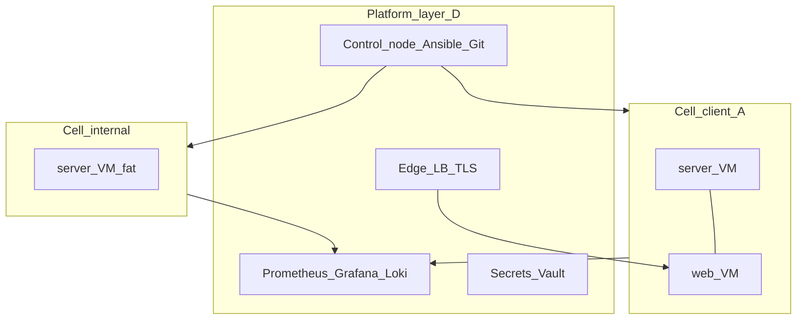
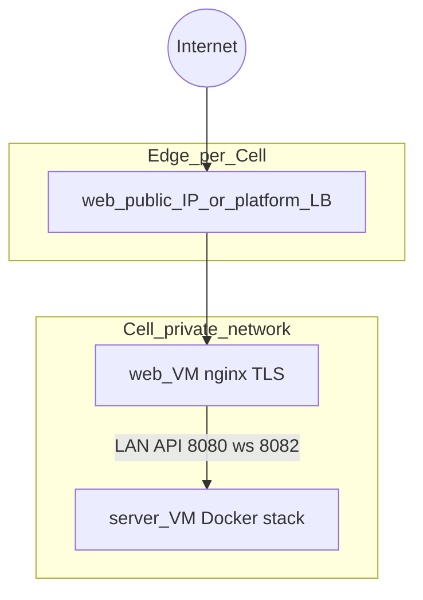
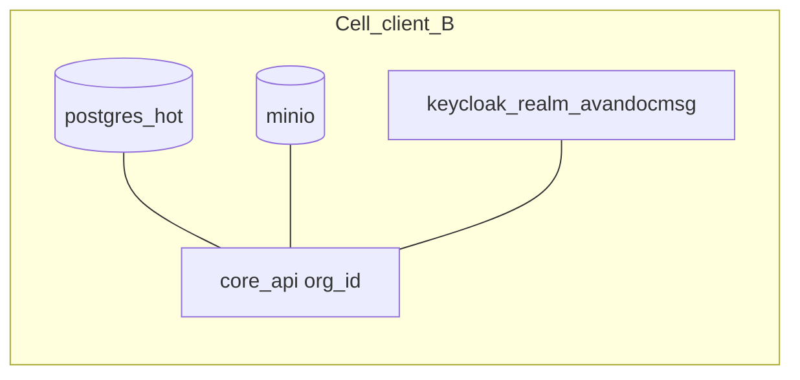
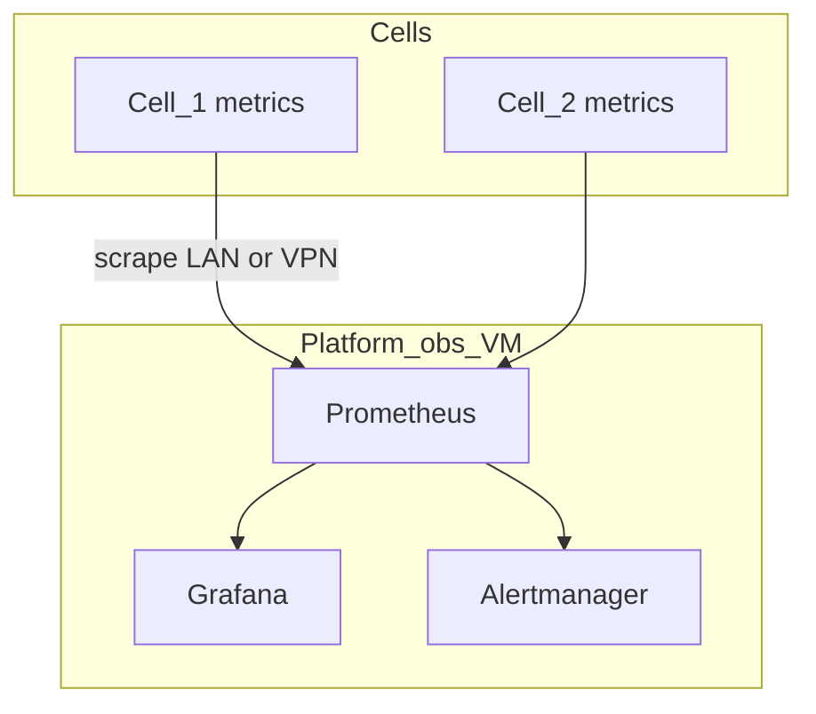
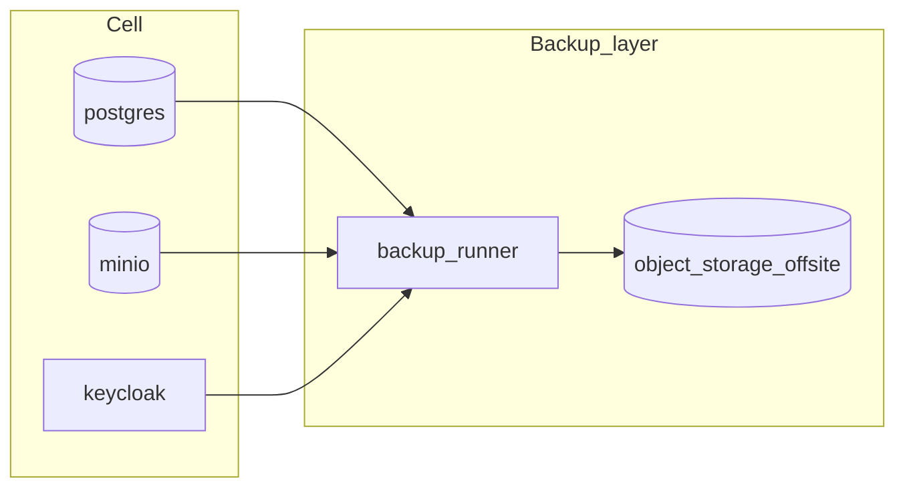
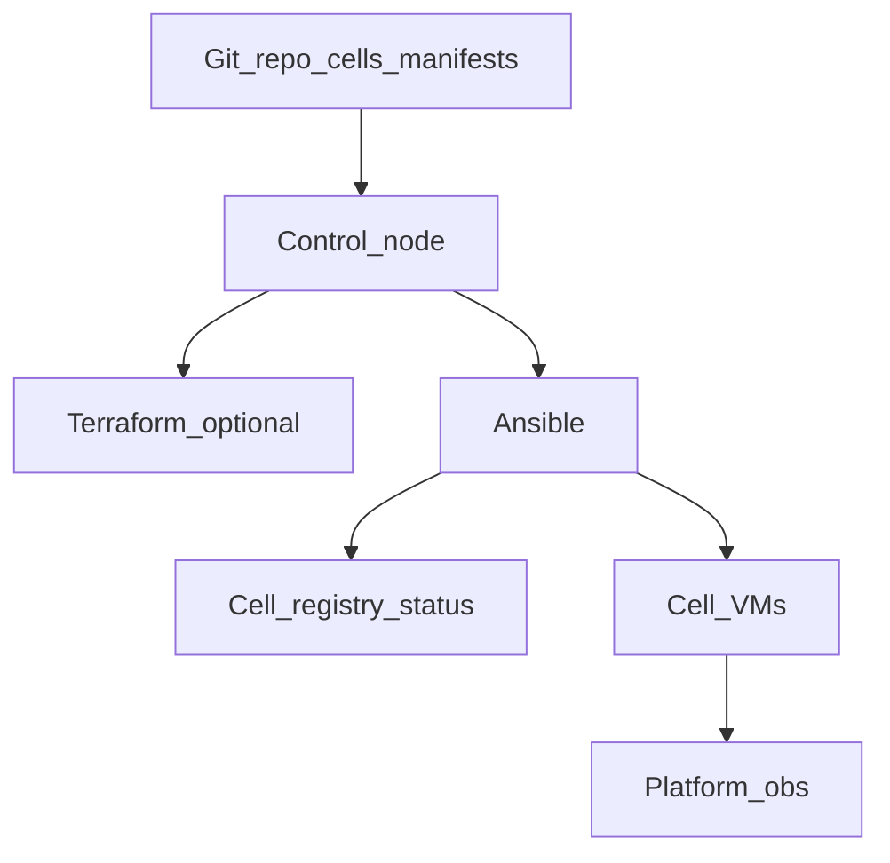

# Design: платформа «Korus Cloud» (своё облако на базе проекта)

**Spec:** [`../spec.md`](../spec.md) · **Plan:** [`../plan.md`](../plan.md)  
**Дата:** 2026-06-15  
**Статус:** **design approved** (секции 1–6 согласованы)  
**Охват целей:** A (managed SaaS) · B (dedicated hosted) · C (private cloud) · D (infra platform)

**Связанные документы:** [`docs/DEV_STACK_PROFILES.md`](../DEV_STACK_PROFILES.md), [`deploy/ansible/README.md`](../../deploy/ansible/README.md), [`docs/plans/2026-06-15-infra-optimization-design.md`](2026-06-15-infra-optimization-design.md)

---

## 0. Стратегическая рамка (утверждено)

Четыре цели — **четыре слоя одной платформы**, не четыре продукта:

| Слой | Цель | Порядок |
|------|------|---------|
| **D** | Infra platform (compute, obs, backup, TLS) | 1 — фундамент |
| **C** | Private cloud (internal / холдинг) | 2 — dogfood |
| **B** | Dedicated hosted (1 клиент = 1 Cell) | 3 — первый коммерческий SKU |
| **A** | Managed SaaS (shared Cell, onboarding) | 4 — после опыта B |

**Cell** — атом платформы: server stack + web stack, деплой через Ansible (`site.yml`), профиль `pilot` / `standard` / `enterprise`.

---

## 1. Compute: VM vs Kubernetes

### 1.1 Контекст проекта

| Факт | Следствие для облака |
|------|---------------------|
| Production path = **Docker Compose + Ansible** | Cell уже описан в репо; не выбрасываем |
| Hot-plug workers (ADR) без оркестратора | K8s не обязателен для масштабирования воркеров |
| `inventory/two-host`, `stage`, `prod` | Модель «2 VM на Cell» проверена |
| K8s/Helm в репо **нет** | Вход в K8s = новый стек сопровождения |

### 1.2 Три подхода

#### Подход 1 — VM + Docker (рекомендуется для фаз 0–2)

**Суть:** каждый Cell — 1–2 Linux VM (Proxmox, OpenStack, VMware, bare metal). На VM — Docker Engine, `full-stack-up.sh` / `korus-web-up.sh`, Ansible из control node.

| Плюсы | Минусы |
|-------|--------|
| 100% parity с QEMU/stage/prod | Ручной или semi-auto sizing VM |
| Быстрый time-to-market B/C | Меньше «эластичности» per-pod |
| Проще для аудита ИБ (граница = VM) | Density ниже, чем у K8s |
| Не нужна команда K8s | |

**Топологии Cell на VM:**

| SKU | VM layout | Когда |
|-----|-----------|-------|
| **Pilot Cell** | 1 VM (all-in-one) | POC, sandbox, &lt;10k RU |
| **Standard Cell** | 2 VM: `korus_server` + `korus_web` | 10k–100k RU, типовой B/C |
| **Enterprise Cell** | 2–4 VM: server + web + optional read-replica / Solr node | 100k–1M RU |

#### Подход 2 — Kubernetes с первого дня

**Суть:** Helm chart оборачивает compose-сервисы; Cell = namespace или cluster.

| Плюсы | Минусы |
|-------|--------|
| Авто-healing, HPA | Переписывание deploy pipeline |
| Единый стиль для multi-service | Hot-plug ADR требует пересмотра |
| Привычно для cloud-native команд | **6–12 мес** до stable parity с compose |

**Вердикт:** отложить до фазы 3+, когда есть команда platform SRE и ≥10 Cells на VM.

#### Подход 3 — Гибрид (VM Cell + managed PaaS для платформы)

**Суть:** Cells остаются на VM; только **платформенные** сервисы — в K8s или managed (Loki, Prometheus, Vault).

| Плюсы | Минусы |
|-------|--------|
| Без миграции app stack | Два класса инфраструктуры |
| Obs/backup централизованы | Интеграция сети VM ↔ K8s |

**Вердикт:** опционально для obs (фаза 1), Cells на VM.

### 1.3 Рекомендация

**Фазы 0–2: только Подход 1 (VM + Docker).**  
**Фаза 3+:** оценить Подход 3 для obs; K8s для **app Cell** — только при ADR и отдельной команде.

**Выбор заказчика (2026-06-15):** гипервisor/облако **ещё не выбрано** → закладываем **абстракцию Terraform-модулей** (см. §1.9), первый провайдер — `generic` (ручные VM + generated inventory).

### 1.9 Terraform abstraction (provider-agnostic)

```
deploy/cloud/
  modules/
    cell-network/     # private LAN, firewall rules (abstract outputs)
    cell-vm/          # router: var.provider → submodule
  providers/
    generic/          # phase 0: no cloud API; outputs from tfvars/manual
    proxmox/          # phase 1+ optional
    openstack/        # phase 1+ optional
    cloud-vm/         # phase 1+ optional (Yandex/VK/Selectel API via unified interface)
  cells/
    _template/        # main.tf + terraform.tfvars.example
    <cell_id>/        # one state per Cell (isolated blast radius)
```

**Контракт модуля `cell-vm` (outputs → Ansible):**

| Output | Назначение |
|--------|------------|
| `server_private_ip` | `korus_server_lan_ip` |
| `web_private_ip` | `korus_web_lan_ip` |
| `web_public_ip` | DNS A-record, UFW |
| `cell_id` | registry key |

**Phase 0 без API:** `provider=generic`, IP вносятся в `terraform.tfvars`; Terraform только генерирует `inventory/cells/<cell_id>/hosts.yml` из template — parity с `inventory/two-host`.

**Phase 1+:** подключается реальный provider submodule без смены Cell manifest и Ansible playbooks.

### 1.4 Compute reference architecture (VM)



### 1.5 Sizing VM (стартовые ориентиры)

Согласовано с [`docs/DEV_STACK_PROFILES.md`](../DEV_STACK_PROFILES.md) и якорями TCO:

| Profile | Server VM (min) | Web VM (min) | Примечание |
|---------|-----------------|--------------|------------|
| `pilot` | 8 vCPU, 32 GB RAM, 500 GB SSD | — (all-in-one) | compose pilot profile |
| `standard` @10k | 16 vCPU, 64 GB RAM, 2 TB | 4 vCPU, 8 GB, 100 GB | two-host |
| `standard` @100k | 32 vCPU, 128 GB RAM, 10 TB | 4 vCPU, 8 GB | + Solr/MinIO growth |
| `enterprise` | scale.yml: 2× API, 2× ws-gateway | 2× web replica | sticky WS на lb |

**Overhead platform (не в Cell):** control 2 vCPU / 4 GB; obs stack 4 vCPU / 16 GB на ~20 Cells.

### 1.6 Provisioning flow (compute)

1. **Manifest** `cells/<cell_id>.yaml`: profile, domain, vm_sku, deploy_profile.  
2. **IaC (optional):** Terraform/OpenTofu → 1–2 VM + DNS + firewall rules.  
3. **Ansible:** `playbooks/cell-provision.yml` → `common` + `korus_server` + `korus_web` + `tls`.  
4. **Smoke:** `scripts/smoke-deploy-acceptance.sh` с URL Cell.  
5. **Registry:** статус `active` + версия образов.

### 1.7 Acceptance criteria (compute)

- [ ] Pilot Cell поднимается на **1 VM** за &lt;30 мин (Ansible, без ручных правок compose).
- [ ] Standard Cell — **two-host** по `inventory/two-host` pattern, TLS optional.
- [ ] Upgrade Cell (новый tag образов) — playbook + smoke green.
- [ ] Нет зависимости от Kubernetes для production Cells.

### 1.8 Открытые решения (следующая секция)

- [x] **Секция 1:** compute — VM-first, Terraform abstraction, provider TBD  
- [x] **Секция 2:** сеть, edge E1, DNS C (platform + customer CNAME)  
- [x] **Секция 3:** изоляция — B v1, A hybrid PG (RLS &lt;10k / schema or Cell &gt;10k)  
- [x] **Секция 4:** obs, backup DR — hybrid backup configurable per manifest  
- [x] **Секция 5:** control plane, GitOps (registry v1: git-only)  
- [x] **Секция 6:** SKU — `billing_model` **обязателен в manifest**, default нет (sales per deal)  

---

## 2. Сеть, edge LB, TLS

### 2.1 Контекст проекта

| Уже есть | Используем в облаке |
|----------|---------------------|
| Two-host LAN (`korus_server_lan_ip` / `korus_web_lan_ip`) | Private network **внутри** каждого Cell |
| `roles/tls` + nginx reverse proxy | TLS termination на **web VM** |
| `korus_tls_proxy_api: true` | Единый HTTPS origin для UI + `/api` |
| `CORS_ALLOWED_ORIGINS` | Per-Cell origin из manifest |
| `korus-web` sticky WS (`ip_hash` на `/ws`) | Enterprise Cell с 2× web replica |
| UFW в `roles/common` | Firewall baseline per VM |

### 2.2 Сетевая модель Cell



**Правила:**

1. **Server VM** — без публичного IP (ideal) или только admin bastion SSH.  
2. **Web VM** — единственная точка ingress для HTTPS/WSS.  
3. **Между VM Cell** — private /24 (напр. `10.0.<cell>.0/24`), уникальный octet из registry.  
4. **Между Cells** — **нет** L2/L3 peering по умолчанию (blast radius).

### 2.3 Два режима edge (выбор per deployment)

| Режим | Суть | Когда |
|-------|------|-------|
| **E1 — Direct** | A-record → public IP web VM, nginx TLS на VM | Фазы 0–2, B dedicated, мало Cells |
| **E2 — Platform LB** | Shared LB (HAProxy/cloud LB) → backend pool web VMs | Много Cells, единый anycast IP, WAF |

**Рекомендация:** старт **E1** (reuse `roles/tls` без новых компонентов). **E2** — когда &gt;15 Cells или нужен central WAF/rate-limit.

**Terraform abstraction (provider-agnostic):**

```hcl
# modules/cell-network/variables.tf
variable "edge_mode" { type = string } # "direct" | "platform_lb"
variable "provider"   { type = string } # generic | proxmox | openstack | ...
```

Outputs одинаковы для Ansible независимо от `edge_mode` и `provider`.

### 2.4 DNS

| Тип | Пример | Владелец |
|-----|--------|----------|
| **Platform subdomain** | `{cell_id}.messenger.cloud.example.com` | Вы (wildcard cert) |
| **Customer CNAME** | `chat.client.ru` → platform subdomain | Клиент (B enterprise) |

**Manifest поля (v1 — оба режима с первого дня):**

```yaml
cell_id: acme-prod
dns:
  mode: platform_subdomain   # platform_subdomain | customer_cname
  fqdn: acme-prod.messenger.cloud.example.com
  customer_hostname: chat.acme.ru   # required when mode=customer_cname
  platform_backend: acme-prod.messenger.cloud.example.com  # CNAME target
```

| `dns.mode` | Публичный URL для пользователя | TLS cert | Типичный клиент |
|------------|-------------------------------|----------|-----------------|
| `platform_subdomain` | `https://{cell_id}.cloud.korus.ru` | Wildcard platform | SMB, pilot |
| `customer_cname` | `https://chat.bank.ru` | LE на FQDN или BYO клиента | Банк, enterprise B |

**Выбор (2026-06-15):** **C — оба режима** в manifest с первого коммерческого SKU; Ansible/Terraform ветвятся по `dns.mode`, Cell stack одинаковый.

**Phase 0:** ручной DNS + `korus_tls_domain` в inventory.  
**Phase 1+:** Terraform `dns_record` module (Cloudflare/Yandex DNS/provider-agnostic interface).

### 2.5 TLS

Переиспользуем [`deploy/ansible/roles/tls`](../../deploy/ansible/roles/tls) и checklist из [`deploy/ansible/README.md`](../../deploy/ansible/README.md):

| Сценарий | `korus_tls_use_letsencrypt` | Примечание |
|----------|----------------------------|------------|
| Platform wildcard `*.messenger.cloud.example.com` | `false` (BYO) | Один cert на platform LB или per-Cell SAN |
| Per-Cell LE | `true` | HTTP-01 на web VM :80 |
| Bank / BYO cert клиента | `false` | Paths в vault |

**Обязательные vars per Cell** (как `inventory/stage/group_vars/all.yml`):

```yaml
korus_tls_enabled: true
korus_tls_domain: "<fqdn>"
korus_tls_proxy_api: true
korus_cors_allowed_origins: "https://<fqdn>"
korus_browser_ws_host: "<fqdn>"   # → wss://<fqdn>/ws
```

**TURN/WebRTC:** при `korus_web_turn_prod: true` — `korus_turn_host` = public FQDN (stage pattern).

### 2.6 Firewall matrix (UFW baseline)

| Host | Inbound | Source |
|------|---------|--------|
| web VM | 443, 80 (LE) | Internet |
| web VM | 22 | bastion / admin CIDR |
| server VM | 8080, 8082 | web VM private IP only |
| server VM | 22 | bastion |
| platform obs | 9090 | internal only |

Terraform `cell-network` module emits `security_group_rules` list; Ansible `common` role applies UFW on VM.

### 2.7 Enterprise: sticky WebSocket

При `enterprise` + 2× web replica — **не менять** edge без sticky:

- nginx `ip_hash` на `/ws` (см. `korus-web/README.md`)  
- E2 Platform LB: `balance source` / cookie stickiness on `/ws`

### 2.8 Acceptance criteria (network/TLS)

- [ ] Standard Cell: server **не** доступен с Internet; UI/API только через HTTPS FQDN.  
- [ ] `smoke-deploy-acceptance.sh` green через `https://<fqdn>`.  
- [ ] WS connect: `wss://<fqdn>/ws` (parity QEMU wsUrl check).  
- [ ] CORS: login + API с browser origin = FQDN.  
- [ ] Terraform `generic` provider генерирует inventory с LAN IP без cloud API.  
- [ ] Документирован upgrade path E1 → E2 без смены Cell manifest.

### 2.9 Решения

- [x] **Edge v1:** E1 (direct)  
- [x] **DNS v1:** **C — platform subdomain + customer CNAME** (`dns.mode` в manifest)  
- [ ] **Секция 3:** изоляция данных B vs A  

---

## 3. Изоляция данных: Dedicated (B) vs Shared SaaS (A)

### 3.1 Принцип

| Модель | Граница изоляции | Доверие «шумного соседа» |
|--------|------------------|--------------------------|
| **B — dedicated Cell** | **VM + volume + network** | Не требуется — физическая/separate stack |
| **C — private cloud** | Cell internal; **org_id** внутри | Доверенные BU одного холдинга |
| **A — shared SaaS** | **Logical** (realm, prefix, RLS) + audit | Требует hardening; только после опыта B |

**Правило:** commercial v1 = **B (1 клиент = 1 Cell)**. **A** — отдельный **Shared Cell** pool, не смешивать с B без ADR.

### 3.2 Матрица ресурсов

| Ресурс | B / C (dedicated Cell) | A phase 1 (shared Cell) | A phase 2 (scale) |
|--------|------------------------|---------------------------|-------------------|
| **PostgreSQL** | `postgres-hot` + `archive` **на Cell** | Один PG; **`org_id`** на всех tenant-таблицах; **RLS** (новый слой) | `OrganizationShardRouter` + 2+ PG shard |
| **MinIO** | Бакеты Cell (`files`, retention, export) | Prefix `{tenant_id}/` + bucket policy | Dedicated bucket для enterprise tenant |
| **Keycloak** | 1 realm **`avandocmsg`** на Cell (B); несколько org в PG (C) | **1 realm per tenant** (`tenant-{id}`) | Federation / IdP клиента (OIDC) |
| **Solr** | Core/collection на Cell | Shared core + **`tenant_id` filter** | Collection per large tenant |
| **NATS** | JetStream streams на Cell | Subject prefix `tenant.{id}.*` | Dedicated stream per tenant |
| **Redis** | Instance на Cell | Key prefix `t:{id}:` | Redis DB index per tenant (optional) |
| **Secrets** | Ansible vault **per Cell** | Vault path `tenants/{id}/` | HSM / external KMS для bank |

### 3.3 Dedicated Cell (B) — без доработки app

Текущий compose уже **изолирован per Cell**:



- **Один заказчик** → один Cell → один Keycloak realm → много **`organizations`** (org_id) если холдинг.  
- **DNS:** `dns.mode=customer_cname` для банка; `platform_subdomain` для SMB.  
- **Compliance narrative:** «ваши данные на выделенных VM, отдельные тома PG/MinIO».

**Acceptance:** pentest scope = один Cell; backup/restore = один Cell; delete client = destroy Cell + volumes.

### 3.4 Private cloud (C) — несколько org, один Cell

- Тот же stack, что B, но **владелец платформы = вы**.  
- Несколько **`organizations`** в одном PG (уже поддержано).  
- Admin console: org-shard routing (scaffold `OrganizationShardRouter`).  
- **Не** смешивать с внешними paying clients в одном Cell на v1.

### 3.5 Shared SaaS (A) — phased isolation

#### Phase A1 (6+ мес после первых B Cells)

**Shared Cell «pool-s»** для малых tenant (&lt;1k RU):

| Компонент | Изоляция |
|-----------|----------|
| Keycloak | Realm **`tenant-{uuid}`** per signup |
| PG | Shared schema; **RLS policies** on `org_id` / `tenant_id` (migration + audit) |
| MinIO | `files/{tenant_id}/…` |
| Domain | `tenant-slug.cloud.korus.ru` (platform_subdomain only) |
| Billing | Metering RU per tenant |

**Кодовые работы (до A1):**

1. Flyway: `tenant_id` column where missing + RLS policies.  
2. Keycloak: realm provisioning API / script.  
3. Onboarding: create org + realm + admin user (control plane).  
4. Pen-test: cross-tenant read/write must fail.

#### Phase A2 (enterprise tenants on shared platform)

- Large tenant → **promote to dedicated Cell** (B) — export/import playbook.  
- Or dedicated MinIO bucket + PG schema (middle ground).

### 3.6 DNS mode × isolation

| dns.mode | B | A |
|----------|---|---|
| `platform_subdomain` | `{cell_id}.cloud…` | `{tenant-slug}.cloud…` |
| `customer_cname` | **Да** (bank SKU) | **Нет v1** (cert + SNI complexity); revisit A2 |

**Согласовано с выбором DNS C:** оба режима для **B**; **A v1** — только platform subdomain.

### 3.7 Data residency & delete

| Event | B Cell | A tenant |
|-------|--------|----------|
| **Export compliance** | Cell-wide export job | Per-tenant export (filter org_id) |
| **Right to erasure** | Destroy Cell volumes | Delete tenant realm + PG rows + MinIO prefix |
| **Legal hold** | Per org (existing) | Per org, tenant-scoped admin |

### 3.8 Acceptance criteria (isolation)

- [ ] B: два Cells на одной platform — **нет** сетевого/DB доступа между ними.  
- [ ] B: restore backup Cell A не затрагивает Cell B.  
- [ ] C: 2+ org в internal Cell — admin A не видит чаты org B (API enforcement).  
- [ ] A1 (future): automated test — tenant A JWT **не** читает tenant B message.  
- [ ] Promote A→B: documented playbook, RTO &lt; 8h maintenance window.

### 3.9 Решения

- [x] **A1 PostgreSQL (shared SaaS):** **C — гибрид**  
  - малые tenant (&lt;10k RU): **RLS** на `org_id` / `tenant_id` в общей schema  
  - promote / &gt;10k RU: **отдельная schema** или **dedicated Cell (B)**  

---

*Секция 3 — утверждено.*

## 4. Observability, backup, DR

### 4.1 Контекст проекта

| Уже есть | Роль в облаке |
|----------|---------------|
| `deploy/observability/docker-compose.observability.yml` | Platform obs stack |
| `playbooks/observability-only.yml` | Центральный Prometheus/Grafana |
| Prometheus scrape: core-api, workers | Per-Cell targets + labels |
| `/health`, `/ready`, worker metrics | SLA / alerting |
| PRODUCT_PRESENTATION §14.5 | Backup tiers Pilot/Standard/Enterprise |

**Принцип:** observability и backup — **слой D** (platform), но **данные и политики** — **per Cell** (B) или **per tenant** (A).

### 4.2 Observability architecture



#### 4.2.1 Scrape model (provider-agnostic)

| Вариант | Суть | v1 |
|---------|------|-----|
| **Pull from platform** | Prometheus на obs VM scrape private IP Cells (VPN/bastion) | ✅ рекомендуется |
| **Push gateway** | Cells push через `remote_write` | fallback если нет L3 к Cells |
| **Agent per Cell** | `prometheus-agent` → central | фаза 2, many Cells |

**Labels (обязательные):**

```yaml
cell_id: acme-prod
deploy_profile: standard
customer_tier: b_dedicated   # b_dedicated | c_internal | a_shared
dns_fqdn: chat.acme.ru
```

**Targets per Cell** (reuse existing paths):

| job | Path | Port (internal) |
|-----|------|-----------------|
| `korus-core-api` | `/api/v1/metrics/prometheus` | 8080 |
| `korus-retention-worker` | `/metrics` | 9192 |
| `korus-export-replay-worker` | `/metrics` | 9193 |
| `korus-ws-gateway` | `/metrics` | 8082 |
| node_exporter | — | 9100 (optional, on VM) |

**Terraform/Ansible:** template `prometheus/cells/<cell_id>.yml` генерируется при provision; reload Prometheus.

#### 4.2.2 Grafana

| Dashboard | Аудитория |
|-----------|-----------|
| **Platform overview** | SRE: все Cells, alert count |
| **Cell detail** | Ops + support: один клиент |
| **Export/retention** | Compliance: queue depth, failures |

Reuse `grafana-export-dashboard.json`; переменная `$cell_id`.

#### 4.2.3 Logs (phase 1.5)

| Phase | Stack |
|-------|-------|
| v1 | journald on VM + `docker logs` via SSH (runbook) |
| v1.5 | **Loki** + promtail per Cell → central (optional VM) |
| v2 | SIEM export для bank SKU |

#### 4.2.4 Alerting

| Alert | Severity | Action |
|-------|----------|--------|
| core-api down | P0 | Pager + customer comms template |
| PG disk &gt;85% | P1 | Scale / cleanup |
| export-replay backlog | P2 | Compliance ticket |
| cert expiry &lt;14d | P1 | certbot / BYO renew |

Alertmanager routes: `cell_id` → on-call rotation (internal) vs customer notify (B SLA).

### 4.3 Backup architecture



**Per-Cell backup job** (Ansible role `cell_backup` — новая, не трогает app):

| Объект | Метод | RPO (Standard) |
|--------|-------|----------------|
| **postgres-hot** | `pg_dump` daily + WAL archive (WAL-G optional Enterprise) | 24h / PITR Enterprise |
| **postgres-archive** | weekly full | 7d |
| **MinIO** | `mc mirror` incremental daily | 24h |
| **Keycloak realm** | Admin REST export JSON | daily |
| **Solr** | snapshot API (Enterprise) | weekly |
| **Manifest + inventory** | git + vault snapshot | each change |

**Offsite store (provider-agnostic):**

```yaml
backup:
  provider: generic          # generic | s3 | minio_replica
  endpoint: https://backup.cloud.example.com
  bucket: korus-cells
  prefix: "{cell_id}/"
  retention_days: 90         # pilot: 30; enterprise: 365
```

**Terraform `generic`:** credentials in vault; no cloud API.

#### 4.3.1 Profile matrix (из PRODUCT_PRESENTATION §14.5)

| Profile | PG | MinIO | Restore test |
|---------|-----|-------|--------------|
| **pilot** | daily dump | weekly | ежеквартально |
| **standard** | daily + optional WAL | daily mirror | ежеквартально |
| **enterprise** | PITR (WAL-G) | daily + versioning | ежемесячно |

#### 4.3.2 Shared SaaS (A) — hybrid PG backup

| Tenant size | Backup unit |
|-------------|-------------|
| RLS (small) | Logical export per `tenant_id` + full PG base |
| Schema-isolated | `pg_dump -n tenant_{id}` |
| Promoted to B | Switch to Cell backup (§4.3) |

### 4.4 Disaster recovery

| Scenario | RTO target | RPO target | Playbook |
|----------|------------|------------|----------|
| **Web VM failure** | &lt;1h | 0 | Redeploy web VM from Ansible |
| **Server VM failure** | &lt;4h | last backup | Restore PG+MinIO to new VM |
| **Full Cell loss** | &lt;8h | Standard 24h | `cell-restore.yml` + DNS unchanged |
| **Platform obs loss** | &lt;2h | metrics gap OK | Redeploy obs compose |
| **Region loss** | &lt;24h | Enterprise geo | Second region Cell (phase 3) |

**DR test (acceptance):**

- [ ] Ежеквартально: restore **one non-prod Cell** from backup to staging manifest.  
- [ ] Smoke green после restore.  
- [ ] Documented RTO measured &lt; target.

### 4.5 Security & compliance (backup/obs)

- Backup buckets: **encryption at rest**, separate credentials per Cell prefix.  
- Prometheus/Grafana: **no public IP**; VPN/bastion only.  
- Bank SKU (customer CNAME): опционально **dedicated backup bucket** + no shared obs admin.

### 4.6 Acceptance criteria (obs/backup/DR)

- [ ] Platform Prometheus scrapes ≥1 pilot Cell with `cell_id` label.  
- [ ] Alert fires on stopped core-api (test in staging).  
- [ ] Backup job writes to offsite prefix `{cell_id}/`.  
- [ ] Restore playbook documented in `docs/runbooks/cell-restore.md` (TBD).  
- [ ] Quarterly restore drill logged.

### 4.7 Решения

- [x] **Offsite backup:** **C — гибрид, настраиваемо per Cell**  

#### 4.7.1 Backup policy в manifest (настраиваемо)

Каждый Cell задаёт политику в `cells/<cell_id>.yaml`; Ansible role `cell_backup` читает без смены кода.

```yaml
cell_id: acme-prod
backup:
  enabled: true
  profile: standard              # pilot | standard | enterprise
  targets:
    - id: s3_daily
      provider: s3               # s3 | minio | filesystem
      endpoint: https://s3.example.com
      bucket: korus-cells
      prefix: "acme-prod/daily/"
      schedule: "0 2 * * *"      # cron UTC
      include: [postgres_hot, minio, keycloak_realm]
      retention_days: 90
    - id: airgap_weekly
      provider: filesystem       # offline mount / tape gateway
      path: /mnt/airgap/acme-prod/
      schedule: "0 3 * * 0"      # weekly Sunday
      include: [postgres_hot_full, minio_full]
      retention_weeks: 52
      when: customer_tier == bank # optional predicate
  encryption:
    at_rest: true
    kms_key_ref: vault:cells/acme-prod/backup-key
  restore:
    rto_hours: 8
    drill_quarterly: true
```

| Preset | `targets` | Типичный SKU |
|--------|-----------|--------------|
| **default** | `s3_daily` only | SMB, platform subdomain |
| **bank** | `s3_daily` + `airgap_weekly` | customer CNAME, compliance |
| **pilot** | `s3_daily`, retention 30d | sandbox |
| **enterprise** | + WAL-G target, minutely WAL | dedicated Cell large |

**Provider `generic`:** endpoint/credentials из vault; Terraform не обязателен для backup bucket.

---

*Секция 4 — утверждено (obs central, backup hybrid configurable).*

## 5. Control plane и GitOps

### 5.1 Назначение

Control plane — **не runtime** мессенджера, а система управления жизненным циклом Cells:

| Функция | v1 (manual/semi-auto) | v2 (automation) |
|---------|----------------------|-----------------|
| Registry Cells | git `cells/*.yaml` | API + DB |
| Provision | Ansible `cell-provision.yml` | + Terraform VM |
| Upgrade | Ansible + image tag bump | Canary per Cell |
| Backup | `cell_backup` role (§4.7) | Scheduled + alerting |
| Decommission | `cell-destroy.yml` | GDPR erase workflow |
| Onboarding tenant (A) | — | self-service portal |

**YAGNI v1:** git + Ansible + Makefile/ps1 facades; без Kubernetes, без custom portal.

### 5.2 Компоненты



| Компонент | Расположение | Артефакты |
|-----------|--------------|-----------|
| **Cell manifests** | `deploy/cloud/cells/<id>.yaml` | dns, backup, profile, provider |
| **Generated inventory** | `deploy/ansible/inventory/cells/<id>/` | gitignored или committed |
| **Terraform state** | `deploy/cloud/cells/<id>/terraform.tfstate` | remote backend optional |
| **Secrets** | Ansible Vault `vault/cells/<id>.yml` | per Cell |
| **Registry** | `deploy/cloud/registry.yaml` | id, status, version, fqdn |

### 5.3 GitOps workflow

#### 5.3.1 Provision new Cell (B)

```
1. PR: add deploy/cloud/cells/acme-prod.yaml + registry entry (status: planned)
2. Review: sizing, dns.mode, backup preset
3. Merge → CI: validate manifest schema (jsonschema)
4. Ops: terraform apply -chdir=cells/acme-prod  (or generic: skip)
5. Ops: ansible-playbook cell-provision.yml -e cell_id=acme-prod
6. Smoke: scripts/smoke-deploy-acceptance.sh against fqdn
7. PR: registry status → active, record image tag + date
```

#### 5.3.2 Upgrade Cell

```
1. CI builds + publishes docker images (existing Gradle/CI)
2. PR: bump korus_image_tag in registry or cell manifest
3. ansible-playbook cell-upgrade.yml -e cell_id=... -l cell_acme_prod
4. Rolling: web first, then server workers (document order)
5. Smoke + rollback tag documented
```

#### 5.3.3 Decommission

```
1. Final backup (force full)
2. Export compliance if contract requires
3. ansible-playbook cell-destroy.yml (volumes wipe flag)
4. DNS remove, registry status: decommissioned
5. Vault secrets archived
```

### 5.4 CI integration (reuse repo)

| Stage | Existing | Cloud extension |
|-------|----------|-----------------|
| Build images | `.github/workflows/ci.yml` | unchanged |
| Manifest validate | — | `scripts/validate-cell-manifest.py` |
| Deploy smoke | `ci-local.yml` | template for cell smoke |
| Registry lint | — | check unique cell_id, fqdn |

**Не блокируем v1 на CI:** validate script + manual checklist достаточно.

### 5.5 Control node

| v1 | v2 |
|----|-----|
| Ops laptop / bastion с Ansible + Terraform | Dedicated VM `control.korus.internal` |
| SSH jump to Cell VMs | VPN mesh |

Requirements: access to Cell private IPs, vault decrypt, git pull.

### 5.6 RBAC (who can what)

| Role | Permissions |
|------|-------------|
| **Platform admin** | provision, destroy, all vaults |
| **Support L2** | upgrade, restart, read-only obs |
| **Customer admin (B)** | org/users in their Cell only — **не** platform |
| **Auditor** | read registry + backup logs |

Keycloak на Cell — **customer** admins; platform RBAC — **outside** app (git + vault ACL).

### 5.7 Manifest schema (единый контракт)

Объединяет решения §1–§4:

```yaml
cell_id: acme-prod
status: active                    # planned | provisioning | active | maintenance | decommissioned
commercial:
  model: b_dedicated              # b_dedicated | c_internal | a_shared
  sku: standard                   # pilot | standard | enterprise
compute:
  provider: generic               # generic | proxmox | openstack | ...
  deploy_profile: standard        # pilot | standard | enterprise
  server_private_ip: 10.0.42.10
  web_private_ip: 10.0.42.20
  web_public_ip: 203.0.113.10
dns:
  mode: customer_cname            # platform_subdomain | customer_cname
  fqdn: chat.acme.ru
  platform_backend: acme-prod.messenger.cloud.example.com
tls:
  use_letsencrypt: false
  cert_ref: vault:cells/acme-prod/tls
backup:
  preset: bank                    # default | bank | pilot | enterprise | custom
  # ... или полный блок targets (§4.7.1)
observability:
  scrape_enabled: true
  labels:
    customer_tier: bank
images:
  tag: "2026.06.15-abc123"        # sync with registry after upgrade
```

**Настраиваемость:** любой блок optional с defaults; `preset` разворачивается в полный конфиг (`scripts/cell-manifest-expand.py`).

### 5.8 Acceptance criteria (control plane)

- [ ] New Cell end-to-end from manifest + Ansible without hand-editing compose.  
- [ ] Registry reflects status lifecycle.  
- [ ] Upgrade one Cell without touching others.  
- [ ] Manifest schema validated in CI (or pre-commit).  
- [ ] Secrets never in manifest plaintext — vault refs only.

### 5.9 Решения

- [x] **Registry v1:** **git-only** (`registry.yaml` + `cells/*.yaml`); SQLite/API — v2 при &gt;20 Cells  

---

*Секция 5 — утверждено.*

## 6. SKU, экономика и коммерческая модель

### 6.1 Принцип ценообразования

Hosted Cell (B) = **three-line quote** (прозрачность для CFO и закупки):

| Строка КП | Содержание | Источник цифр |
|-----------|------------|---------------|
| **1. Platform fee** | Ops: provision, monitoring, backup, L1/L2, SLA | Ваша маржа |
| **2. Infra pass-through** | VM, disk, traffic — по факту или фикс по якорю | `tz_product_pricing.py` / manifest sizing |
| **3. Software license** | Korus Messenger (per deployment или per RU) | Коммерческая политика вендора |

**Настраиваемо per contract:** поле `commercial.billing_model` **обязательно** в manifest; **нет default** — sales/закупка выбирают модель под сделку (validator отклоняет manifest без явного значения).

```yaml
commercial:
  billing_model: bundled_anchor    # REQUIRED: infra_pass_through | bundled_anchor | flat_platform
  anchor_ru: 10000                 # S-10k | S-50k | S-100k
  sku: standard
  sla_tier: standard               # pilot | standard | enterprise
```

### 6.2 SKU matrix (commercial v1)

| SKU | Cell profile | RU anchor | DNS | Backup preset | SLA |
|-----|--------------|-----------|-----|---------------|-----|
| **Hosted Pilot** | `pilot`, 1 VM | &lt;10k | platform_subdomain | pilot | best-effort |
| **Hosted Standard** | `standard`, two-host | 10k–100k | platform or CNAME | default | 99.5% |
| **Hosted Enterprise** | `enterprise`, scale | 100k–1M | customer_cname | bank/enterprise | 99.9% |
| **Internal (C)** | same | internal | internal | default | internal |

**Не продаём A (shared SaaS)** до отдельного price list и pen-test.

### 6.3 Billing models (настраиваемо)

| Model | Когда | Формула |
|-------|-------|---------|
| **`infra_pass_through`** | Bank, transparent tender | platform fee + actual VM invoice + license |
| **`bundled_anchor`** | SMB, simple pitch | фикс ₽/мес @ S-10k / S-100k (infra + platform + license bundle) |
| **`flat_platform`** | Partner MSP | platform fee only; client owns VM (BYO compute) |

Align с [`competitor_comparison.html`](../competitor_comparison.html): Korus OPEX infra @ якоре + platform fee vs eXpress license dominance.

### 6.4 Unit economics (ориентир)

| SKU @ S-10k | Cost side (platform) | Revenue side |
|-------------|---------------------|--------------|
| Hosted Standard | 2 VM + obs share + backup S3 + ops hours | bundled_anchor или pass-through + margin |
| Margin target | — | platform fee covers 24×7 on-call share |

**Ops hours budget (v1 manual):**

| Cells count | FTE platform ops |
|-------------|------------------|
| 1–5 | 0.25 (part-time) |
| 5–20 | 0.5–1 |
| 20+ | dedicated SRE + automate (§5 v2) |

### 6.5 Competitive positioning (sales)

| vs | Message |
|----|---------|
| **eXpress hosted** | «Тот же контур, но TCO без 90% лицензии @10k» |
| **Пачка** | «Не наш SKU — облако; вернёмся при политике контура» |
| **DIY on-prem** | «Hosted Cell = on-prem compliance без вашего ЦОД» |

Use segment one-pagers: `competitor_comparison_segment_*.html`.

### 6.6 Contract & metering

| Meter | Billing use |
|-------|---------------|
| **Registered users (RU)** | License tier, якorь из manifest |
| **Storage (MinIO)** | Overage above anchor disk |
| **Export jobs** | Enterprise compliance pack |

Metering v1: **manual** from admin + Prometheus disk metrics; v2: automated billing export.

### 6.7 Roadmap summary (all sections)

| Phase | Deliverable | Weeks (orient.) |
|-------|-------------|-----------------|
| **0** | Manifest schema, generic TF, cell-provision playbook | 2–4 |
| **1** | Internal Cell (C) + platform obs + backup presets | 4–8 |
| **2** | First B customer, DNS C both modes, bank preset | 8–12 |
| **3** | GitOps upgrade loop, 5+ Cells | 12–20 |
| **4** | A shared pool + RLS (hybrid PG) | 20+ |

### 6.8 Acceptance criteria (commercial)

- [ ] КП генерируется из manifest anchor + pricing module без Excel-мастеров.  
- [ ] Три billing models документированы для sales.  
- [ ] SLA tier привязан к backup preset и RTO (§4).  
- [ ] Margin review после 3 Cells (retro).

### 6.9 Решения

- [x] **Billing model:** **C — per deal в manifest**, без platform-wide default; schema validation **requires** `commercial.billing_model`  
- [ ] **Phase 0 в репо:** manifest schema, `deploy/cloud/` skeleton, validate script — отдельная задача implement  

---

*Секция 6 — утверждено.*

---

## 7. Сводка принятых решений

| Тема | Решение |
|------|---------|
| Compute | VM + Docker; Terraform abstraction; provider TBD (`generic` first) |
| Edge | E1 direct (nginx на web VM) |
| DNS | Platform subdomain **и** customer CNAME (`dns.mode`) |
| Commercial v1 | Dedicated Cell (B) only |
| Isolation A (later) | Hybrid PG: RLS &lt;10k RU → schema or Cell &gt;10k |
| Backup | Hybrid S3 daily + air-gap weekly; **presets/custom per manifest** |
| Obs | Central Prometheus/Grafana; scrape per Cell |
| Control plane | Git manifests + Ansible; registry git-only v1 |
| Billing | **`billing_model` required per manifest**, no default |
| Roadmap | D→C→B→A; phase 0 ≈ 2–4 нед |

**Следующий шаг (implementation):** phase 0 — `deploy/cloud/cells/_template/`, JSON Schema manifest, `scripts/validate-cell-manifest.py`, черновик `cell-provision.yml`.
